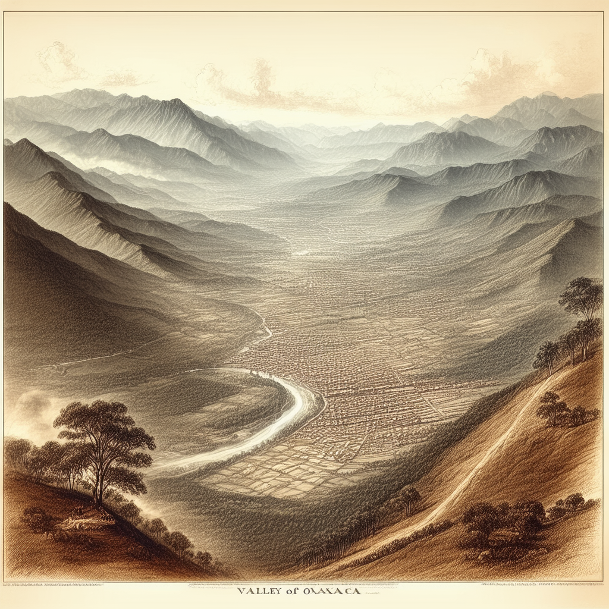
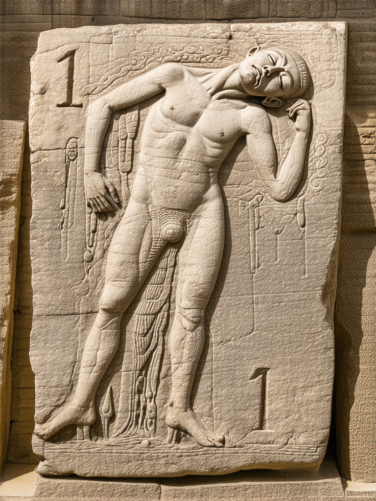
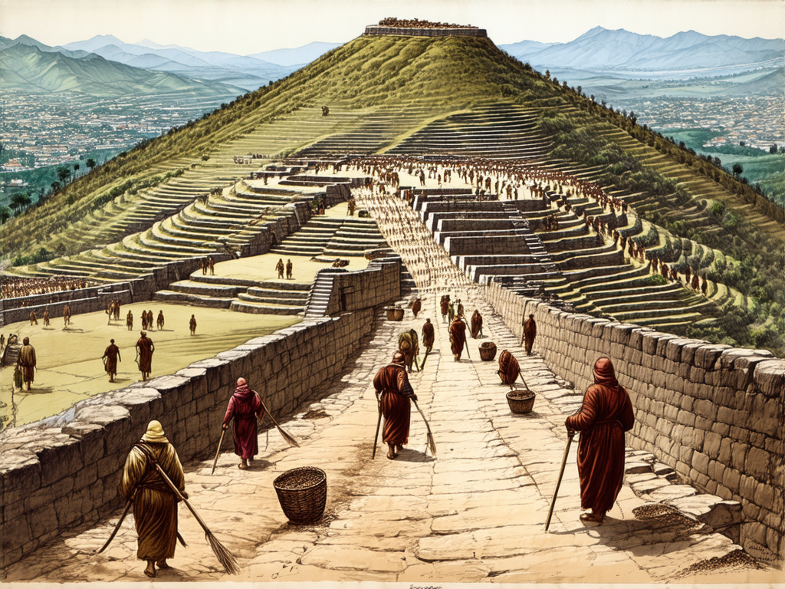
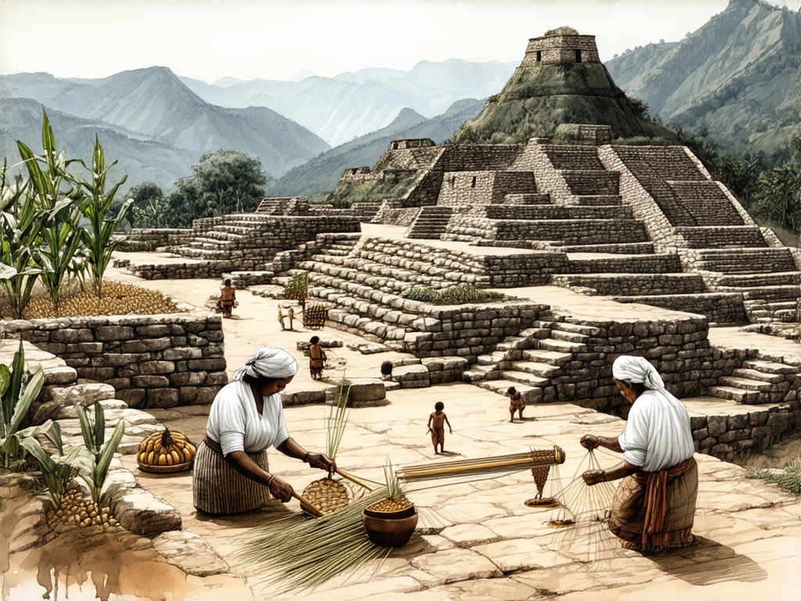

# Part One: The Sacred Mountain

## Chapter 1 — The View from Above

Imagine standing on the highest point of a mountain in southern Mexico, 400 meters above the valley floor. In every direction, the land falls away. Three valleys stretch to the horizon like the arms of a starfish — the Etla valley to the northwest, the Tlacolula valley to the east, the Zimatlán valley to the south. The air is thin and dry. There is no river up here. No spring. No lake.

And yet someone, roughly 2,500 years ago, looked at this mountaintop and decided to level it.

They sheared off the peaks and filled in the saddles. They carved terraces into the slopes — over 2,100 of them, cascading down the mountainsides like a giant staircase. At the summit, they created a flat plateau roughly 300 meters long and 200 meters wide. That is about the size of sixty American football fields. They did this without metal tools. Without wheels. Without draft animals. Every stone was carried by human hands.

On this plateau they built a city. Pyramids rose on the north and south ends. Temples and palaces lined the east and west edges. A ball court occupied the northeast corner. Tombs honeycombed the ground beneath.

The layout was not arbitrary. The buildings were oriented with geometric precision, aligned to the movements of the sun and stars. Oaxaca sits at about 17 degrees north latitude, which means that twice each year — in May and August — the sun passes directly overhead at noon, casting no shadow at all. These "zenith passages" were enormously important to Mesoamerican cultures, and several structures at Monte Albán appear to be aligned to mark them. Other buildings track the solstices — the points in June and December when the sun reaches its northern and southern extremes on the horizon. Still others may be oriented to the rising and setting points of specific stars or constellations.

The result is a city that functions as a kind of calendar written in stone. At certain times of year, the sun rises or sets in precise alignment with specific buildings, doorways, or corridors. The people who designed this city were not simply building shelters. They were encoding their understanding of the cosmos into the physical layout of their world.

The city we are talking about is called Monte Albán (MON-teh al-BAHN). It is located in the state of Oaxaca (wah-HAH-kah), in the highlands of southern Mexico, about 350 kilometers southeast of Mexico City.

But here is the first small mystery: the name "Monte Albán" is not its real name. It is Spanish, probably given by a colonial-era soldier or landowner — perhaps after the Alban Hills near Rome, perhaps after someone named Montalbán. Nobody is sure. The Zapotec people, who built and inhabited this city for over a thousand years, had their own names for it. The most commonly cited are Danipaguache (dah-nee-pah-GWAH-cheh), meaning "Sacred Mountain," and Danibaan, meaning something close to "Sacred Hill." But even these names come from oral tradition recorded centuries after the city was abandoned. The name its builders used during the twelve centuries they lived there — that name is lost.

What remains is the place itself. And the place is extraordinary.

Stand on the South Platform, the highest point, and look north across the Grand Plaza. The scale is almost impossible to process on first encounter. This is not a ruin that requires imagination to reconstruct. The platforms, staircases, walls, and plazas are still there, baking in the Oaxacan sun, precisely where they were placed when Rome was still a republic and the Buddha was a recent memory in India.

The question that hangs over everything is simple: *Why here?*

Why flatten a mountain with no water source? Why build a capital city on a summit that requires every drop of water and every kernel of corn to be carried uphill? There were perfectly good valley locations available — places with rivers, flat farmland, natural springs. The people who founded this city knew those places well. They had lived in them for a thousand years before they came up here.

Something made them climb.

## Chapter 2 — Before the Mountain

To understand why anyone would build a city on a mountaintop, you first have to understand what was in the valley below.

The Valley of Oaxaca is shaped like a crooked Y. Three sub-valleys — the Etla arm to the northwest, the Tlacolula arm to the east, and the Zimatlán or Valle Grande arm to the south — converge near the center, where Monte Albán's mountain rises. The valley floor sits at about 1,500 meters above sea level, surrounded by mountains on all sides. The climate is warm and dry, with a rainy season from June through September. The soil is good. The rivers, while not large, are reliable enough for agriculture. For thousands of years before Monte Albán existed, this was an excellent place to live.

And people did live here. For a very long time.

By 1500 BCE — about a thousand years before Monte Albán was founded — the largest settlement in the valley was a place called San José Mogote (san ho-ZAY mo-GO-teh), in the Etla arm. It was not a city in the way we might picture one. It was a cluster of villages and hamlets spread across roughly 70 hectares, with a population that may have reached 1,000 people at its height. That might not sound like much, but in Mesoamerica at that time, it was significant. San José Mogote was the dominant community in the Valley of Oaxaca for about a thousand years.

The people of San José Mogote grew corn, beans, and squash — the Mesoamerican trinity of crops that sustained civilizations across the region for thousands of years. They made pottery, some of it decorated with sophisticated designs that suggest a developing artistic tradition. They built public buildings with lime-plastered walls and floors — structures that required organized labor and community planning to construct.

And they traded. Magnetite mirrors — polished stones made from a naturally magnetic iron ore that can reflect an image like a dark glass — have been found at San José Mogote, and the nearest source of magnetite is hundreds of kilometers away in the Valley of Mexico. Obsidian, the volcanic glass used to make the sharpest cutting tools in the pre-metal Americas, arrived from sources in the highlands of Guatemala and central Mexico. Marine shell ornaments came from the Pacific coast. These were not random finds. They indicate established trade networks stretching across hundreds of kilometers of difficult mountain terrain, maintained over centuries.

San José Mogote also showed the first clear signs of social inequality in the Valley of Oaxaca. Some houses were larger and better built than others. Some burials contained more grave goods. Certain families seem to have had preferential access to the imported prestige items — the magnetite mirrors, the finest obsidian, the shell ornaments. A hierarchy was forming. And at some point, the people at the top of that hierarchy began carving things into stone.

This brings us to one of the most important objects in the story of Mesoamerican writing.

In 1975, the archaeologist Joyce Marcus and her colleague Kent Flannery were excavating at San José Mogote when they uncovered a carved stone slab set into a doorway threshold. It is called Monument 3. The stone shows a human figure lying on his back in a contorted position, his eyes closed or removed, blood flowing from his chest in carefully carved droplets. His body is limp. He is dead — almost certainly a sacrificed war captive.

Between the dead man's feet, the carvers placed a glyph: two elements that together read "1 Earthquake" or "1 Motion." This is either the man's calendrical name — in Mesoamerican tradition, people were often named for the day on which they were born — or the date of his death. Either way, it is writing. A symbol that represents a specific piece of information — a name, a date — carved into stone and placed where people would walk over it, stepping on the defeated enemy every time they entered the building.

Monument 3 dates to sometime before 500 BCE, which makes it one of the earliest examples of writing anywhere in the Americas. Some scholars argue it is *the* earliest. Others point to carvings from the Olmec region along the Gulf Coast — particularly the Cascajal Block, a serpentine tablet discovered in 1999 near the Olmec heartland, which some researchers date to before 900 BCE — and say the question is still open.

The debate over "the first writing in the Americas" is partly semantic. What counts as writing? If a single glyph representing a name or date qualifies, then Monument 3 is certainly writing, and so are the Olmec examples. If writing requires extended text — sentences, narratives, connected ideas — then both claims are harder to prove with the surviving evidence. What nobody disputes is that by the time Monument 3 was carved, the people of the Valley of Oaxaca had developed a system for recording specific, identifiable information in a permanent visual form. That alone is a remarkable achievement — one that, in the Old World, was accomplished independently only in Mesopotamia, Egypt, China, and possibly the Indus Valley.

And then something dramatic happened.

Around 500 BCE, the people of San José Mogote abandoned the settlement they had occupied for a thousand years. They did not drift away gradually over centuries. The archaeological evidence suggests a relatively rapid departure — within a generation or two at most. They left the Etla valley floor and moved to a mountaintop fifteen kilometers to the south.

What could have motivated this? The move makes no practical sense. San José Mogote had water, flat farmland, established trade connections, and a thousand years of accumulated infrastructure. The mountaintop had none of these things. Whatever drove the move, it must have been powerful enough to override every practical objection — powerful enough to convince thousands of people to abandon their homes and start over in one of the most inconvenient locations imaginable.

One clue comes from the archaeological record at San José Mogote itself. During the centuries before the move, there is evidence of increasing conflict in the valley. Burned buildings. Defensive palisades. Scattered human remains with evidence of violence. The valley was becoming dangerous. The three sub-valleys, each with its own dominant community, appear to have been drifting toward open warfare. In this context, a mountaintop — defensible, visible from all three valleys, impossible to approach without being seen — starts to make more sense. Not as a pleasant place to live, but as a safe one.

They moved to Monte Albán.

## Chapter 3 — The Founding

Why would thousands of people leave a fertile valley floor to build a new city on a waterless mountaintop?

The scholars Joyce Marcus and Kent Flannery, who have spent decades studying this question, borrowed a word from ancient Greek history to describe what happened. They called it a "synoikism" — from the Greek *synoikismos*, meaning "a bringing together of households." In the Greek world, this was the process by which scattered villages merged into a single city-state. Athens itself was supposedly formed this way.

The Monte Albán synoikism happened fast. Within the first century of the city's existence — the period archaeologists call Monte Albán Phase Ia, roughly 500 to 300 BCE — the population reached approximately 5,200 people. By 100 BCE, it had grown to around 17,200. By the time of the Common Era, Monte Albán was one of the largest cities in all of Mesoamerica.

Where did all these people come from?

Some came from San José Mogote. The ceramic styles, the architectural traditions, and the carving techniques found in early Monte Albán closely match those of the Etla valley communities. But San José Mogote alone could not have supplied 5,000 people. The other two arms of the valley contributed as well. Communities from the Tlacolula arm and the Zimatlán arm seem to have sent populations uphill — or been absorbed into the new mountaintop project.

Not everyone came willingly.

The archaeologists Charles Spencer and Elsa Redmond, working from the American Museum of Natural History in New York, have spent years studying a site called Tilcajete (til-kah-HEH-teh) in the southern arm of the valley. Their research reveals something unexpected: during the period when Monte Albán was supposedly pulling communities together into a grand alliance, Tilcajete did not shrink. It grew. It fortified itself. It appears to have actively resisted incorporation into Monte Albán's orbit.

This is important because it complicates the story. If Monte Albán's founding were simply a voluntary defensive alliance — everyone banding together on a hilltop for safety — you would expect all the major communities to participate. But Tilcajete's resistance suggests that Monte Albán's founding involved coercion as well as cooperation. Some communities were brought in by persuasion. Others may have been brought in by force.

So what was Monte Albán? A defensive alliance against outside threats? A religious movement centered on a sacred mountaintop? A political coup in which the elites of one faction consolidated power over the entire valley?

The defensive theory has real evidence behind it. The earliest phase of Monte Albán includes a massive defensive wall — over three kilometers long — along the vulnerable northwestern approach to the summit, where the slope is gentlest. This wall was built during the city's first century, which suggests that whoever founded Monte Albán expected to be attacked. You do not build a three-kilometer defensive wall as a symbolic gesture. You build it because you think someone is coming.

The religious theory also has support. Mountains were sacred in Mesoamerican cosmology — the dwelling places of rain gods, the connection points between the earth and sky. Building a city on a mountaintop was a statement about the relationship between the human world and the divine one. The elaborate astronomical alignments of the plaza reinforce this reading: this was a place designed to communicate with the heavens.

The political theory rests on geography. Marcus and Flannery emphasized that Monte Albán sits at the exact point where the three valley arms converge. No single sub-valley can claim it. In a valley divided among competing communities, this location is the one neutral spot — the one place where a new, shared capital could be established without giving any existing faction home-field advantage.

The honest answer is that we do not know for certain which motive was primary. It was probably some combination of all three, in proportions that shifted over time. The defensive wall suggests real fear. The astronomical alignments suggest religious purpose. The geography suggests political calculation. These are not mutually exclusive.

What we do know is the result. Within two or three centuries, Monte Albán had become the undisputed capital of the Valley of Oaxaca. It would remain so for over a thousand years.

The speed of this transformation is worth emphasizing. In the span of about two centuries — roughly eight to ten human generations — the Valley of Oaxaca went from a landscape of scattered villages and small chiefdoms to a unified political entity centered on a single monumental capital. By the standards of the ancient world, this was fast. It took the Romans centuries longer to unify the Italian peninsula. The Greek city-states never unified at all. Whatever forces drove the creation of Monte Albán, they were powerful enough to reshape an entire region's political geography in what amounts, on the timescale of civilizations, to the blink of an eye.

## Chapter 4 — What Kind of Place Was This?

At its peak, between roughly 300 and 700 CE, Monte Albán was home to an estimated 25,000 to 35,000 people. To put that in perspective: London in the year 500 CE had perhaps 10,000 inhabitants. Monte Albán was not a village on a hill. It was a genuine city — one of the great urban centers of the ancient Americas.

The city was organized vertically. At the top, on the main plaza and its surrounding platforms, lived the ruling elite — priests, rulers, high-ranking warriors and their families. Their homes were built of stone and plaster, with inner courtyards and painted walls. Below them, on the terraces carved into the mountainsides, lived everyone else: farmers, potters, weavers, laborers, and their families. Over 2,100 terraces have been documented, radiating outward from the summit in every direction, each one a small flat platform carved from the slope and reinforced with stone retaining walls.

The social structure was hierarchical and almost certainly theocratic — meaning that political power and religious authority were deeply intertwined. The rulers were not just administrators. They were intermediaries between the human world and the supernatural one. Their authority depended on their ability to communicate with the gods, to read the calendar, to interpret omens, and to conduct the rituals that kept the cosmos in order.

This was not unusual in the ancient world — Egyptian pharaohs, Mesopotamian priest-kings, and Chinese emperors all claimed divine authority. What makes the Zapotec version distinctive is the depth of the astronomical integration. The 260-day ritual calendar, called the *piye* (PEE-yeh) in Zapotec, combined twenty named days with thirteen numbers, creating a cycle of 260 unique day-designations. This calendar meshed with a 365-day solar calendar, and the two cycles together created a "Calendar Round" of 52 years — after which the combination of dates would repeat. The rulers who could track, predict, and ritually manage these cycles held enormous power. They literally controlled time, or appeared to.

The tombs beneath the main plaza offer a window into the elite world. Over 170 tombs have been documented at Monte Albán, many with painted murals on their interior walls showing processions of richly dressed figures, supernatural beings, and calendrical inscriptions. The dead were buried with pottery, jade ornaments, and carved bones. Some tombs have antechambers and inner rooms arranged like miniature houses — residences for the afterlife. The effort invested in these underground spaces tells us something about Zapotec beliefs: death was not an ending. It was a transition to another state of being, and the dead needed proper accommodations.

The people of Monte Albán were farmers first. They grew the same crops that had sustained valley communities for millennia: corn, beans, squash, chile peppers, and avocados. They cultivated maguey, the agave plant whose fibers made rope and whose fermented sap made pulque, a mildly alcoholic drink still consumed in Mexico today. They irrigated their terraced fields using a system of canals and reservoirs that collected rainwater during the wet season and distributed it during the dry months. Remember: there is no natural water source on the mountain. Every drop of water for drinking, cooking, bathing, and agriculture had to be either carried up from the valley below or captured from rainfall. The engineering required to sustain 25,000 people under these conditions was extraordinary — and it had to work every single year, without fail, for twelve centuries.

They ate things that would be recognizable in any Oaxacan market today. Tortillas made from ground corn that had been soaked in lime water — a process called nixtamalization (nix-tah-mah-lee-ZAY-shun) that releases nutrients locked inside the corn kernel and has been used in Mesoamerica for at least three thousand years. Black beans seasoned with epazote, a pungent herb. Chile sauces ranging from mild to incendiary. Roasted chapulines — grasshoppers — seasoned with salt and lime and garlic, eaten by the handful like popcorn. Maguey worms pulled from the hearts of agave plants, roasted on a comal and eaten in tacos. Deer and rabbit hunted in the surrounding hills. Tamales wrapped in corn husks — small bundles of corn dough stuffed with meat, beans, or chile, steamed until firm.

These are not exotic historical curiosities. Walk through the Benito Juárez market in the modern city of Oaxaca, a thirty-minute drive from Monte Albán, and you will find chapulines piled in baskets, maguey worms sold by the scoop, fresh tortillas slapped out by hand and cooked on clay griddles, and seven varieties of mole sauce that trace their roots back centuries. The food of Monte Albán is the food of Oaxaca today, largely unchanged in over two thousand years. This is one of the longest unbroken culinary traditions anywhere on Earth.

They traded, too. Monte Albán was not an isolated mountaintop fortress. Despite its dramatic location, it was connected to trade routes that stretched hundreds of kilometers in every direction. Obsidian — the volcanic glass that served as the sharpest cutting material available before metal — arrived from quarries in the highlands of central Mexico. Jade and greenstone came from as far away as Guatemala. Marine shells from both the Pacific and Gulf coasts have been found in Monte Albán's burials. Cacao beans, which functioned as both a luxury food and a form of currency across Mesoamerica, likely arrived from the tropical lowlands. This was not a city turned inward. It was a node in a continental network.

They also played the Mesoamerican ball game. The ball court at Monte Albán sits in the northeast corner of the Grand Plaza — a long, narrow, I-shaped enclosure flanked by sloping stone walls. Players used their hips to strike a heavy rubber ball, attempting to drive it through stone rings or into scoring zones at either end of the court. The game was played across Mesoamerica for over three thousand years, from the Olmecs to the Aztecs, and it was never just a sport. It was ritual, political theater, and possibly astronomical allegory — all at once. We will return to the ball game later.

But the thing that makes Monte Albán's story different from the stories of a thousand other ancient settlements — the thing that makes it a genuine mystery — is not the terraces or the temples or the food. It is the writing.

They wrote things down. On stone.

They carved symbols that recorded names, dates, conquests, and rituals. They arranged these symbols according to rules — consistent patterns that scholars can identify even if they cannot fully read them. They created one of the oldest writing systems in the Western Hemisphere.

And then they lost it.

Not because someone took it from them. Not because a foreign army burned their libraries. The Zapotec writing system died quietly, centuries before any foreign army arrived. It faded out of use, like a language with no children left to speak it.

How that happened — and whether it can be undone — is the subject of Part Two.

But before we leave the sacred mountain, consider one more thing. Today, Monte Albán is a UNESCO World Heritage Site, visited by hundreds of thousands of tourists each year. You can take a bus from the city of Oaxaca, wind up a paved road through pine and oak forest, and walk out onto the Grand Plaza in the morning light. The stones are warm. Iguanas bask on the temple steps. Hawks circle overhead. The three valleys spread out below you like an open hand.

The place still works. Twenty-five centuries after the first stone was set, the Grand Plaza still commands the landscape. The astronomical alignments still function — the sun still rises and sets in the gaps between the buildings at the appointed times. The Danzantes still stare from the walls with their closed eyes. And the glyphs still wait, carved in stone, for someone to figure out what they say.
