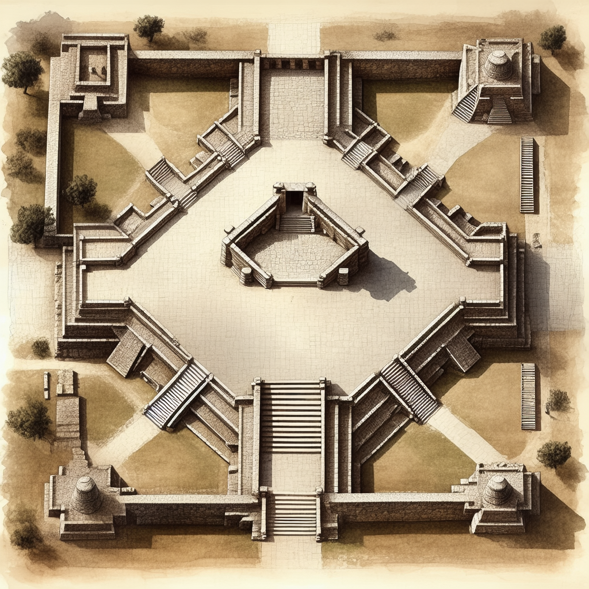
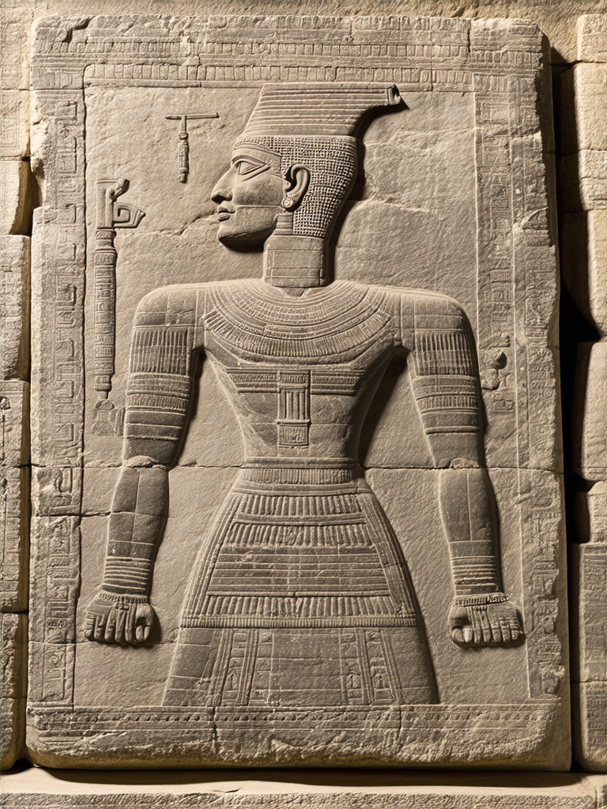

# Part Two: The Lost Script

## Chapter 5 — The Danzantes

On the western side of Monte Albán's Grand Plaza, built into the wall of an ancient platform, there are stones carved with human figures. Over three hundred of them. They show naked men in contorted positions — limbs splayed, heads tilted, mouths open. Some have their eyes closed. Some have no eyes at all, just smooth stone where eyes should be. Several show blood flowing from wounds. A number depict what appears to be genital mutilation.

When nineteenth-century European visitors first saw these carvings, they thought the figures were dancing. They called them "Los Danzantes" — the Dancers. The name stuck.

They were not dancing.

The scholarly consensus today, built over decades of careful study, is that the Danzantes depict tortured, mutilated, and killed war captives. The contorted postures are not dance moves. They are the limp positions of dead or dying bodies. The closed eyes represent death. The flowing blood and the mutilation are records of what was done to these men — records carved in stone and displayed publicly, on the wall of a building in the center of the most important city in the valley.

This was not hidden. It was architecture. The message was meant to be seen by everyone who entered the Grand Plaza — residents, visitors, potential enemies.

The figures vary in size and detail, but certain elements recur. Most are male. Most are naked — a deliberate choice that communicated humiliation and defeat. In Mesoamerican culture, to strip a person of their clothing was to strip them of their social identity. Many figures show a distinctive "scroll" element emerging from the body — sometimes from the chest, sometimes from between the legs — that scholars interpret as either blood or, in some cases, a representation of speech or life force leaving the body. A few of the Danzantes show features that may represent specific medical conditions or deformities, which led some early researchers to suggest they were anatomical studies. This interpretation has been largely abandoned.

The Danzantes are among the oldest carvings at Monte Albán, dating to Period I — roughly 500 to 100 BCE, the first centuries of the city's existence. They were originally arranged in a deliberate sequence on the Temple of the Danzantes, a platform on the west side of the plaza. The arrangement mattered. These were not random decorations. They were placed in rows and columns, and beside many of the figures, the carvers inscribed glyphs — symbols that appear to record calendar dates, personal names, and possibly descriptions of what happened to each captive.

Here is where the story gets complicated.

Centuries after the Danzantes were first carved and displayed, the Zapotecs themselves dismantled the original arrangement. They pulled stones from the Temple of the Danzantes and reused them as building material in new construction projects. Carved faces that had once looked outward at the plaza were turned around and buried in walls, used as fill, or repurposed as steps. The narrative sequence — whatever story the original arrangement was meant to tell — was scrambled by the very people who had created it.

This means that even before the writing system was "lost" in the way we usually mean — forgotten, no longer readable — its physical context had been disrupted. We have the individual stones. We can see the figures and the glyphs. But we cannot reconstruct the original order with certainty, because the people of Monte Albán themselves rearranged the pieces.

Why would they do that? One possibility is that the political message of the Danzantes — "look what we did to our enemies" — became less relevant as Monte Albán's power became established. A founding-era display of military triumph might have seemed unnecessary or even embarrassing to later generations who preferred to project their authority through different means. Another possibility is purely practical: old stones are excellent building material, and the Zapotecs were pragmatic builders.

Either way, the Danzantes give us our first clear look at the Zapotec script — and our first taste of the frustration that comes with trying to read it.

The glyphs carved alongside the figures include calendar signs that scholars can partially interpret. Day names from the 260-day Mesoamerican ritual calendar appear repeatedly. These probably identify the captives — in Mesoamerican tradition, a person's calendrical name was as real and important as any other name. "1 Earthquake." "4 Jaguar." "7 Deer." The date of your birth determined your name, your fate, and your relationship with the gods.

But beyond the calendar signs, the glyphs resist interpretation. Some appear to be place names — identifying where the captive came from. Others might describe the manner of his death or the identity of his captor. The symbols are clear enough. The system is consistent enough that you can see it *is* a system. But the specific meanings of most non-calendrical signs remain unknown.

There is also the question of who these captives were. Were they leaders of conquered communities? Ordinary warriors taken in battle? Ritual victims selected for sacrifice? The evidence is ambiguous. Some of the Danzantes appear to be old men — their faces show wrinkles, sagging flesh, the marks of age. Others appear young. A few show what may be ethnic markers — hairstyles or facial features that differ from the Zapotec norm — suggesting they came from outside the Valley of Oaxaca. If the Danzantes represent the enemies Monte Albán defeated during its founding period, they may include captives from the Mixteca, the Gulf Coast, or the Cañada region — the same areas whose place glyphs appear on Building J's conquest slabs a few centuries later.

One researcher, Michael Coe, noted a striking parallel between the Danzantes and the carved captive figures found at much earlier Olmec sites along the Gulf Coast. The convention of depicting defeated enemies as naked, limp, and named is not unique to the Zapotecs. It appears to be a widespread Mesoamerican practice with deep roots — a shared vocabulary of political violence that predates Monte Albán by centuries. The Zapotecs did not invent the practice. They inherited it, refined it, and scaled it up to a degree that nobody before them had attempted.

Three hundred carved stones. Three hundred dead men. Three hundred names we cannot fully read.

That is the problem with the Zapotec script in miniature.

## Chapter 6 — Building J and the Conquest Slabs

Near the center of the Grand Plaza, slightly south of the midpoint, there is a building that does not fit.

Every other major structure at Monte Albán follows the same geometric logic. The platforms, pyramids, and temples are rectangular, aligned to the cardinal directions or to each other, creating a harmonious grid of right angles and parallel walls. Building J breaks every one of these rules.

It is shaped like an arrowhead — a pentagonal structure with a pointed end aimed toward the southwest and a broad, flat back facing the northeast. Its long axis is rotated roughly 45 degrees from the alignment of everything around it. If you were to look down at the Grand Plaza from above, Building J would look like someone had dropped a compass needle into a tray of sugar cubes.

Inside, the structure is honeycombed with narrow chambers and passages, some barely wide enough for a person to walk through. These interior spaces have led some researchers to call Building J an observatory — a building designed to channel light from specific astronomical events into specific interior positions, allowing priests to track the movements of stars and planets.

The astronomical theory is plausible but not proven. One specific alignment has attracted particular attention: the stairway of Building J points toward the spot on the horizon where the bright star Capella would have set around the time the building was constructed. Capella's first appearance in the night sky, after a period of invisibility, coincided roughly with the first zenith passage of the sun in May — a date of enormous agricultural and ritual importance because it marked the traditional beginning of the rainy season. If this alignment is intentional, Building J was designed to help priests predict when the rains would come — knowledge that would have been literally vital for a mountaintop city dependent on collected rainwater.

But not all scholars accept the astronomical interpretation. Some argue that the alignments are coincidental, or that they apply only to certain features of the building. The debate continues. What is carved into the building's exterior walls, however, is much easier to discuss.

Embedded in the outer walls of Building J are more than forty large stone slabs. They date to Monte Albán Period II, roughly 100 BCE to 200 CE — several centuries after the Danzantes. Each slab is carved with a set of symbols that Alfonso Caso, the pioneering Mexican archaeologist who first systematically studied Monte Albán in the 1930s, identified as "conquest records."

The pattern on each slab is consistent. At the center is a "hill" or "place" sign — a stylized mountain shape that represents a specific location. This is a convention found across Mesoamerican writing systems: a hill glyph with distinguishing features means "this place." Above or beside the hill sign, there is often an upside-down human head with closed eyes. The meaning is stark: this place was conquered, and its leader was killed.

Additional glyphs on each slab provide what appear to be the name of the place and, in some cases, calendrical information — perhaps the date of the conquest.

Caso called these "conquest slabs," and his interpretation has largely held up over ninety years of subsequent research. Building J, in this reading, is a victory monument — a three-dimensional record of every place Monte Albán claimed to have subdued, carved in stone and displayed at the very center of the city's most important public space.

The political purpose is clear enough. A visitor arriving at Monte Albán for the first time — a trader from the coast, a diplomat from a neighboring valley, a newly conquered tributary — would have walked into the Grand Plaza and seen Building J at its center, covered with carved records of Monte Albán's military victories. The message would have been impossible to miss: this city conquers. Your community may be next. Or your community may already be on this wall.

This is propaganda in stone. And it is sophisticated propaganda. The conquest slabs do not simply boast about violence. They record specific places, with identifiable place names, on a permanent public monument. They are making a legal claim: these territories belong to us, and here is the proof. It is not so different from the boundary stelae of Egyptian pharaohs or the triumphal arches of Roman emperors — a universal impulse to record and display military achievement, expressed in a distinctly Mesoamerican visual language.

A handful of the place names on the conquest slabs have been tentatively matched to real locations. The glyph that scholars read as "Place of Song" has been identified with Cuicatlán (kwee-kaht-LAHN), a town about 80 kilometers north of Monte Albán in the Cañada region. This identification is not just a guess — archaeological excavation at Cuicatlán has confirmed that the site was indeed conquered and occupied by a Zapotec military force during exactly the period depicted on the slab. The pottery, the architecture, and the evidence of destruction all match.

Other identifications are more tentative. A glyph interpreted as "Place of the Pierced Face" may correspond to Sosola. "Hill of the Bird" may be Tututepec, a site 150 kilometers to the southwest on the Pacific coast. These identifications rely on matching ancient glyphs to modern place names, which requires assumptions about how the names were pronounced two thousand years ago and how they evolved over time. Some matches are convincing. Others are educated guesses. A few are almost certainly wrong.

This is where honest scholarship lives — in the space between "confirmed" and "unknown," where a handful of identifications are solid, many are plausible, and the majority remain open questions. The conquest slabs tell us that Monte Albán projected military power across a wide region. They tell us that the city's rulers wanted this power remembered and displayed. But they do not tell us — not yet — exactly how far that power reached or exactly which communities it touched.

## Chapter 7 — What the Script Actually Is (And Isn't)

Before we go further, we need to stop and talk about writing itself. Not the content of the Zapotec inscriptions, but the system — what kind of writing it is, how it works, and why it matters that we cannot fully read it.

Writing systems come in several types. An **alphabet** uses symbols to represent individual sounds. The letter *b* in English represents the sound "buh." The letter *a* represents "ah." String them together and you can spell any word in the language. English, Arabic, Greek, and Russian all use alphabets.

A **syllabary** uses symbols to represent syllables — combinations of consonants and vowels. Japanese hiragana is a syllabary: the symbol か represents the syllable "ka," not the individual sounds "k" and "a." Cherokee writing, invented by Sequoyah in the 1820s, is also a syllabary.

A **logographic** system uses symbols to represent whole words or concepts. Chinese characters are largely logographic: the character 山 means "mountain" regardless of what language you speak or how you pronounce it.

Most real-world writing systems are messy combinations of these types. Chinese characters include phonetic elements alongside their logographic ones. English spelling includes elements that are essentially logographic — the word "one" does not sound the way its letters suggest.

The Zapotec script, according to the model developed by the epigrapher Javier Urcid in his landmark 2001 study *Zapotec Hieroglyphic Writing*, is a **logo-syllabic** system. This means it combines logograms — symbols that stand for whole words — with syllabograms — symbols that represent syllables or sounds. The texts are read in columns, from top to bottom.

The parts of the system that scholars *can* read are the calendrical signs. The 260-day ritual calendar used across Mesoamerica — called the *piye* in Zapotec — combines twenty day names with thirteen numbers, creating 260 unique day designations. These day names and numbers appear throughout the Zapotec inscriptions and are reasonably well understood. When a stone reads "3 Monkey" or "12 Earthquake," scholars are confident in the interpretation.

Personal names, many of which are calendar names, are also partially readable. Place names — the hill glyphs on the conquest slabs — can be identified as place names even when the specific place cannot be determined.

But the phonetic values — the actual sounds that the syllabic signs represent — remain largely unknown. This is the core of the problem.

To understand why this matters, think about the difference between recognizing a pattern and reading a sentence. If you look at a Zapotec inscription, you can identify the calendrical elements (because they follow a known Mesoamerican system), you can spot the personal names (because they are formatted in a recognizable way), and you can see the place names (because they use the hill-sign convention). You can identify the *type* of information being recorded — this is a name, that is a date, this is a place. But you cannot read the connecting tissue. You cannot read the verbs, the titles, the descriptions, the explanations. You can see the nouns but not the sentences.

It is a bit like looking at a page of English text where all the nouns are in bold and everything else is in a language you do not speak. You could identify the topics — that paragraph is about a mountain, this one mentions a person named something — but you could not understand what is being said about them.

Why is the Zapotec script so much harder to crack than some other ancient writing systems?

Egyptian hieroglyphs were deciphered because the Rosetta Stone provided the same text in three scripts, including Greek, which scholars could already read. The bilingual key made it possible to work backward from the known to the unknown.

Maya glyphs were deciphered — a process that took over a century and is still ongoing — because there are thousands of surviving Maya texts, because Mayan languages are still spoken by millions of people with strong continuity from the ancient forms, and because a crucial breakthrough by the Russian linguist Yuri Knorosov in the 1950s demonstrated that the signs were largely syllabic.

The Zapotec script has none of these advantages. There is no bilingual text — no Zapotec Rosetta Stone. The number of surviving inscriptions is relatively small: Urcid has cataloged over 200, but many are fragmentary, and the total corpus is a fraction of what exists for Maya writing. And while the Zapotec language is very much alive — spoken by over 500,000 people today in more than fifty regional variants across the mountains and valleys of Oaxaca — the ancient language may differ significantly from any modern variety. Two thousand years is a long time for a language to evolve.

There is, however, one crucial piece of evidence that proves the script was definitely used to write the Zapotec language — not some other language, not a purely symbolic system divorced from spoken language.

On Stelae 12 and 13 at Monte Albán, Joyce Marcus identified a visual pun. The glyphs use a symbol that can mean either "first-born son" or "human thumb." This works as a pun — a deliberate play on words — only if the words for "first-born son" and "human thumb" sound the same. And in the Zapotec language, they do. They are homonyms.

A pun is language-specific. You cannot pun across languages. If the script contains a Zapotec pun, the script was writing Zapotec. This single observation, published by Marcus in her pioneering 1980 work, anchors the entire field. Whatever else we do not know about the Zapotec script, we know it was encoding the Zapotec language.

It is worth pausing here to appreciate what the Zapotec script is *not*, because the comparisons are instructive.

It is not like the Indus Valley script, an undeciphered writing system from ancient Pakistan and northwestern India (roughly 2600-1900 BCE), which presents an even harder puzzle: no one even knows what language the Indus people spoke, and the surviving texts are so short — most are fewer than five signs — that statistical analysis has almost nothing to work with.

It is not like Etruscan, the script of ancient Italy that preceded Roman civilization. Etruscan can actually be *read* — the alphabet is known — but the language behind it remains poorly understood because it has no close living relatives and the surviving texts are mostly short funerary inscriptions.

It is not like Linear A, the script of Minoan Crete (roughly 1800-1450 BCE), which was replaced by Linear B — a script that was deciphered in 1952 by Michael Ventris and turned out to encode an early form of Greek. Linear A, the older system, remains unread.

The Zapotec script occupies a unique position among undeciphered writing systems. Unlike the Indus script, its texts are long enough to show grammatical structure. Unlike Etruscan, the language it encodes has living descendants. Unlike Linear A, there is a substantial and growing scholarly infrastructure dedicated to cracking it. These are reasons for cautious optimism.

## Chapter 8 — How Writing Dies

Here is the fact that surprises most people when they first encounter it: the Zapotec script was not destroyed by the Spanish.

When the Spanish conquistadors arrived in the Valley of Oaxaca in the 1520s, they brought with them a systematic program of cultural destruction. They burned indigenous manuscripts. They smashed idols. They dismantled temples and built churches on top of them. They did enormous, deliberate damage to the written records of Mesoamerican civilizations.

But they did not kill the Zapotec script, because it was already dead.

Monte Albán was abandoned around 900 CE. The Spanish arrived around 1521. That is a gap of roughly six hundred years. Six centuries during which the mountaintop city sat empty, its plazas slowly filling with dirt and vegetation, its carved stones baking and cracking in the sun. By the time a Spanish soldier first climbed that mountain, the Zapotec script had been out of use for as long as the time between the fall of the Roman Empire and the Italian Renaissance.

So how does a writing system die without being killed?

The most likely explanation involves a combination of factors, and it is worth taking them one at a time, because the death of a writing system is one of the most quietly dramatic things that can happen to a civilization.

**Restricted literacy.** The Zapotec script was almost certainly not used by ordinary people. There is no evidence of casual writing — no graffiti scratched into courtyard walls, no personal letters, no merchant records etched into pottery. Every surviving inscription is formal, public, and elite: carved stone monuments commissioned by rulers, painted tomb walls prepared for the noble dead, engraved bones deposited in royal burials. This means the script was probably maintained by a small class of specialists — scribes, priests, or rulers who had been trained in its use and who trained others in turn.

Compare this with ancient Rome, where writing was everywhere: shop signs, political graffiti, love notes scratched into walls, merchant accounts on wax tablets, personal letters sent across the empire. Roman literacy was not universal, but it was widespread enough that even the destruction of every library and school would not have killed it. Too many people knew how to read. The knowledge was distributed across millions of minds.

The Zapotec situation was the opposite. The script existed in the hands and minds of perhaps dozens of specialists — maybe fewer. A writing system maintained by such a small class is inherently fragile. If the class shrinks — if there are fewer priests, fewer rulers who value the old learning, fewer young people willing to undergo what must have been years of training — the system can lose its chain of transmission in a single generation. You do not need to burn a library to destroy a script. You just need one generation that does not teach the next one how to read.

**Political fragmentation.** As Monte Albán's power declined after about 700 CE, the Valley of Oaxaca broke apart into smaller, competing states. Each valley arm produced its own local rulers, its own courts, its own political identity. There was no longer a single center of power — no single court that could maintain the scribal tradition at full scale.

This matters more than it might seem. A scribal tradition is expensive. Scribes need to be fed, housed, and trained for years before they become productive. They need materials — stone, pigment, tools. They need an audience — rulers who commission texts, priests who use calendrical calculations, a public that respects the inscriptions enough to maintain them. When you go from one major court with the resources to support all of this to a dozen minor courts scrambling for political survival, the scribal tradition is one of the first things to be cut. It is a luxury of stability, and stability was gone.

**A shift in medium and style.** Writing did not disappear from Oaxaca entirely. It evolved. Later Zapotec and Mixtec writing traditions moved away from carved stone monuments and toward painted manuscripts — the famous codices, made from prepared deerskin or bark paper, folded into accordion-style books. The Mixtec codices, several of which survive to this day, are masterpieces of visual storytelling. But they use a different system from the classic Zapotec stone inscriptions. The later tradition is more pictorial, less text-heavy, and organized differently.

The analogy is not perfect, but imagine if English-speaking civilization collapsed and was replaced, over several centuries, by a new culture that communicated through graphic novels instead of printed text. The graphic novels would be a form of writing, absolutely. But the ability to read the older printed texts might easily be lost in the transition.

**The result.** By the time the Aztec Empire was expanding across Mexico in the 1400s, the Zapotec script carved on the stones of Monte Albán was already unreadable to the Zapotec people living in the valley below. The language survived — it would continue to survive through the Spanish conquest and all the way to the present day, spoken by over half a million people across the mountains of Oaxaca. But the writing system that had once recorded that language in stone was gone.

The Zapotec language did not die. The Zapotec *script* did. They are not the same thing, and the difference matters enormously.

This distinction is one of the most important things you can understand about the history of writing. A language is a living system — it exists in the mouths and minds of the people who speak it, and as long as parents teach it to their children, it survives. A script is a technology — a set of conventions for representing language visually. Technologies can be abandoned, replaced, or forgotten, even when the language they served continues to flourish.

The Zapotec case is not unique. Many languages have outlived their original writing systems. The spoken Latin of the Roman Empire evolved into French, Spanish, Italian, and Portuguese — but almost nobody today can write in the Roman shorthand used by Cicero's secretary Tiro. The ancient Egyptians spoke a language that evolved into Coptic, which survives as a liturgical language in the Coptic Church — but the hieroglyphic script was unreadable for over a thousand years until the Rosetta Stone unlocked it.

What *is* unusual about the Zapotec case is the length of the gap. Six hundred years between the death of the script and the arrival of the Europeans who might have recorded what it said. Six hundred years during which the stones sat in the sun, perfectly legible to anyone who knew the system, and nobody did.

## Chapter 9 — The Decipherment Race

The story of trying to read the Zapotec script is really the story of a handful of brilliant, stubborn people working with very little material and very large questions. It spans nearly a century and it is not over.

**Alfonso Caso** began the modern era. A Mexican archaeologist and lawyer, Caso started excavating Monte Albán in 1931. In 1932, he opened Tomb 7 and discovered one of the most spectacular burial finds in the history of the Americas — but we will get to that later. What matters here is that Caso spent the next three decades systematically documenting the inscriptions at Monte Albán and related sites. He identified the calendar signs, distinguished the day names from the year signs, and recognized the conquest slab patterns on Building J. He also deciphered the Mixtec codices — a related but distinct achievement that gave him unparalleled insight into how Mesoamerican writing systems worked. Caso died in 1970, having laid the foundation on which everyone else would build.

**Joyce Marcus** took the next major step. A professor at the University of Michigan, Marcus published her first major work on Zapotec writing in 1980. Her key contributions were twofold. First, she demonstrated through internal linguistic evidence — including the thumb/first-born pun on Stelae 12 and 13 — that the script encoded the Zapotec language specifically. Second, she argued that the inscriptions were primarily political propaganda: records of conquests, alliances, and royal genealogies designed to legitimize the ruling elite. This interpretive framework — the script as political tool rather than religious text or historical chronicle — shaped the entire field.

Marcus and her longtime collaborator Kent Flannery published *Zapotec Civilization: How Urban Society Evolved in Mexico's Oaxaca Valley* in 1996 through Thames and Hudson. It remains one of the most comprehensive accounts of Zapotec history and is still essential reading for anyone who wants to understand the culture that produced the script.

**Javier Urcid** pushed the technical analysis further than anyone before him. Working at Brandeis University, Urcid spent years building a catalog of over 200 Zapotec inscriptions — photographing, drawing, measuring, and analyzing every legible text he could find. His 2001 monograph *Zapotec Hieroglyphic Writing*, published by Dumbarton Oaks in Washington, D.C., is the foundational reference for the field. In it, Urcid proposed the logo-syllabic model of the script, identified the reading order (columns, top to bottom), and demonstrated that the inscriptions follow consistent compositional rules — patterns in how signs are arranged relative to each other that suggest grammatical structure even where the specific readings are unknown.

Urcid's work is painstaking and technical, but his core insight is accessible: the Zapotec inscriptions are not random collections of symbols. They are structured texts, organized according to rules that the scribes learned and followed. Understanding the rules — even before you can read the words — is a major step forward.

**Nicholas P. Carter**, working more recently, published a 2017 reassessment of Monte Albán's imperial-era texts that refined our understanding of how place names (toponyms) and titles functioned in the later inscriptions. Carter's work represents the ongoing refinement that happens when younger scholars revisit established material with fresh eyes and new analytical tools.

And then there are the discoveries that keep the field moving.

In 2018, researchers from Mexico's National Institute of Anthropology and History — known by its Spanish acronym, INAH (ee-NAH) — announced the discovery of a massive stucco frieze at Atzompa (aht-SOHM-pah), a hilltop site about a kilometer northwest of Monte Albán that served as a satellite community during the city's height. The frieze stretches roughly fifteen meters — about fifty feet — and dates to between 650 and 850 CE. It features quetzal birds, jaguars, monkeys, and supernatural figures, along with Zapotec glyphs. It is one of the longest continuous examples of Zapotec writing ever found in the Oaxaca Valley.

Discoveries like the Atzompa frieze matter because they expand the corpus — the total body of material available for study. Decipherment is partly a numbers game. The more texts you have, the more patterns you can identify. The more patterns you identify, the more likely you are to crack individual signs. Maya decipherment accelerated dramatically as more inscriptions were discovered and published. The Zapotec corpus is still small by comparison, but it is growing.

There is another avenue of hope. Modern Zapotec place names — the names that communities in the Valley of Oaxaca and the surrounding mountains use today — may preserve ancient words that match the place glyphs on Monte Albán's monuments. If researchers can confidently match an ancient glyph to a modern name, they get the phonetic value of the glyph: the actual sounds it represents. Do that enough times and you start to build a syllabary — a key to the phonetic component of the script.

This is not speculation. It is an active research program. Linguists working with modern Zapotec communities, archaeologists mapping ancient sites, and epigraphers studying the glyphs are all contributing pieces to the same puzzle. Digital imaging and computational analysis offer new tools for detecting patterns that the human eye might miss. Comparative analysis with better-understood Mesoamerican scripts — particularly Maya and Mixtec — provides frameworks for testing hypotheses.

Will the Zapotec script be fully deciphered? Nobody can say with certainty. But the trend lines are encouraging. The corpus is growing. The analytical tools are improving. The living language — spoken by over half a million people — provides a potential key that few other undeciphered scripts possess.

There is also the question of what a full decipherment would actually reveal. The surviving Zapotec texts are overwhelmingly political and ritual in nature — records of rulers, conquests, ceremonies, and genealogies. We should not expect to find Zapotec poetry, philosophy, or everyday correspondence among the stone inscriptions. The medium itself — carved stone, painted tomb walls — selects for formal, official content. If the Zapotecs had a literary tradition, it was probably maintained in more perishable media — painted manuscripts, oral recitation, woven textiles — that have not survived.

But even a partial decipherment of the political texts would be transformative. It would allow scholars to reconstruct the history of the Valley of Oaxaca — the sequence of rulers, the pattern of alliances and conflicts, the rise and fall of specific communities — in the kind of detail that is currently impossible. It would give names to the nameless. It would give voice to a civilization that, for now, speaks to us only through the shapes of its buildings and the patterns on its stones.

The race is not over. It may be entering its most productive phase.
