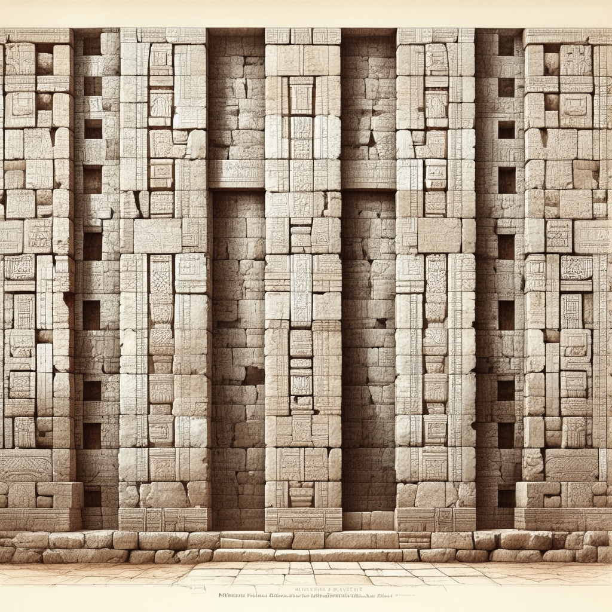

# Part Four: Echoes and Neighbors

## Chapter 13 — Mitla: The Place of the Dead

Forty kilometers east of Monte Albán, tucked into the Tlacolula arm of the Valley of Oaxaca, there is a place that looks like nothing else on Earth.

The Zapotec name for it was Lyobaa (lyoh-BAH), meaning "Place of Rest" or "Place of Repose." The Aztecs, who encountered it later, called it Mictlán (meek-TLAHN) — "Place of the Dead." The Spanish simplified that to Mitla (MEET-lah), and the name stuck.

Mitla does not have the dramatic mountaintop setting of Monte Albán. It sits on the valley floor, among dusty hills and cactus. A modern town has grown around and over the ruins, with houses and a sixteenth-century colonial church built directly on top of pre-Columbian structures. But what remains visible at Mitla is staggering.

The buildings at Mitla are covered — walls, lintels, facades — with geometric stone mosaics of breathtaking intricacy. Patterns of interlocking stepped frets, spirals, and zigzag lines cover every surface, assembled from thousands of individually cut and fitted stone pieces. No two panels are exactly alike. The pieces are fitted together without mortar, held in place purely by the precision of their cutting and the pressure of neighboring stones.

These are not painted decorations. They are not carved reliefs. Each pattern is built up from small, separate stone elements — like a three-dimensional jigsaw puzzle pressed into the surface of a wall. The precision required is extraordinary. Some of the individual pieces are only a few centimeters across, yet they fit together so tightly that a knife blade cannot be inserted between them.

The patterns have been compared to textile designs — and this comparison may be more than decorative. In many Mesoamerican cultures, woven patterns carried meaning. Specific designs identified communities, social ranks, or spiritual concepts. If the stone mosaics at Mitla encode similar information, then the walls of Mitla may be a form of communication that we cannot yet read — a visual language in stone that parallels the written language on Monte Albán's monuments.

Mitla rose in importance as Monte Albán declined. During the period after Monte Albán's abandonment, when the Valley of Oaxaca was divided among competing small states, Mitla appears to have become one of the most important religious centers in the region. Spanish colonial accounts describe it as the seat of a powerful high priest — a figure called the *Uija-tào* (wee-hah-TAH-oh), or "Great Seer" — who exercised spiritual authority across the Zapotec world even as political power fragmented.

According to these colonial reports, Mitla contained underground chambers where the Zapotec dead — or at least, their most important dead — were laid to rest. The name "Place of the Dead" was not metaphorical. The Spanish accounts describe labyrinthine passages beneath the buildings, though most of these have never been fully excavated and some may have been sealed or destroyed during the colonial period.

The colonial church that now stands at the center of the Mitla ruins is itself a remarkable artifact of this layering of civilizations. The Spanish built it in the sixteenth century, using stones pulled from the Zapotec structures around it. If you look carefully at the church walls, you can see pre-Columbian carved stones embedded in the colonial masonry — fragments of one world repurposed to build another, just as the Zapotecs themselves had repurposed the Danzante stones at Monte Albán centuries earlier.

Mitla represents the continuation of Zapotec civilization after Monte Albán. The language persisted. The religious traditions evolved. The artistic skill — as the mosaics prove — actually reached new heights in certain dimensions. What was lost was the scale, the political unity, and the writing system. Everything else adapted and survived.

This is an important point that gets overlooked in narratives focused on "collapse" and "loss." The end of Monte Albán was not the end of Zapotec civilization. It was a transformation. The Zapotec people continued to live in the Valley of Oaxaca, continued to speak their language, continued to build and create and organize their communities. They simply did it differently — in smaller, more distributed settlements, without a single dominant capital, and without the old writing system carved on stone. Whether that transformation was a loss or a liberation probably depends on whether you were one of the elites on the mountaintop or one of the farmers on the terraces below.

## Chapter 14 — The Ball Game

In the northeast corner of Monte Albán's Grand Plaza, between the massive North Platform and the eastern row of buildings, there is a long, narrow, I-shaped stone enclosure. The playing field is about 25 meters long. The sloping walls on either side are about 4 meters high at the center. This is the ball court, and it connects Monte Albán to one of the most widespread and enduring traditions in the ancient Americas.

The Mesoamerican ball game was played for over three thousand years, from at least 1400 BCE to the Spanish conquest in the 1500s, across a territory stretching from Honduras to Arizona. Ball courts have been found at sites of nearly every major Mesoamerican culture: Olmec, Maya, Zapotec, Teotihuacano, Mixtec, Toltec, Aztec. The rules varied by region and period, but the basic elements were consistent: two teams, a solid rubber ball weighing several kilograms, and a court with sloping side walls.

The ball was heavy and hard — made from the latex of the Castilla elastica tree, which is native to the tropical lowlands of Mexico and Central America. Players were not allowed to use their hands or feet. They struck the ball with their hips, sometimes with their forearms or knees, using thick protective belts and pads made from leather and cotton. The objective varied: in some versions, the ball had to be driven through a stone ring mounted high on the court wall — an extraordinarily difficult feat given that the ring was barely wider than the ball. In other versions, the game was scored by driving the ball past the opposing team's end line.

The game was physically brutal. The ball was heavy enough to cause serious injury, and colonial-era Spanish accounts describe players covered in bruises and occasionally killed by impacts. Stone yokes — carved stone replicas of the protective hip belts — have been found in burials across Mesoamerica, suggesting that the equipment itself carried ritual significance.

But the ball game was never just a sport.

In Aztec accounts recorded after the Spanish conquest, the ball game was explicitly connected to cosmology — the movement of the sun across the sky, the eternal struggle between light and darkness, day and night. The ball represented the sun. The court represented the sky or the underworld. The game was a ritual enactment of cosmic forces, and the outcome was believed to have real consequences for the balance of the universe.

In the Popol Vuh — the creation mythology of the K'iche' Maya of Guatemala — the ball game plays a central role. The Hero Twins, Hunahpu and Xbalanque, descend to the underworld to play ball against the Lords of Death. The game is a matter of cosmic survival, and the twins' eventual victory allows for the creation of the current world.

Whether the Zapotecs of Monte Albán attached similar cosmic significance to their ball game is unknown. The ball court at Monte Albán is relatively modest compared to the enormous courts found at sites like Chichén Itzá in the Maya lowlands. But its presence in the Grand Plaza — the most important public space in the city — suggests that the game was not a casual pastime. It was important enough to deserve a permanent, centrally located facility.

Some scholars have argued that ball games served a political function as well — a way to resolve disputes between communities without full-scale warfare. Two rival city-states might settle a territorial claim on the ball court rather than the battlefield. Whether this interpretation applies to Monte Albán is speculative, but the idea is consistent with what we know about how the game was used across Mesoamerica.

There is one more detail about the ball game that is too remarkable to omit. The rubber used to make the ball was produced from a tree that does not grow in the highlands of Oaxaca. It is a tropical lowland species. This means that every rubber ball used in Monte Albán's ball court had to be imported — traded or tribute from communities in the hot, humid lowlands hundreds of kilometers away. The fact that a highland mountaintop city maintained a regular supply of rubber balls tells us something about the reach and reliability of Mesoamerican trade networks. Even a ritual sport depended on long-distance connections.

The rubber ball, the sloping stone walls, the heavy hip belts, the cosmic stakes — the ball game is one of those details that brings an ancient civilization to life in a way that architecture and pottery cannot. When you stand in the ball court at Monte Albán and imagine the sound of a heavy rubber ball striking stone, the shouts of players and spectators, the weight of ritual expectation — the distance between 500 CE and today shrinks to almost nothing.

## Chapter 15 — What Was Happening Elsewhere

One of the most disorienting things about learning history is the way it is usually taught: one civilization at a time, one region at a time, as if the rest of the world paused while you studied Egypt or Rome or China. It did not. Everything was always happening at once.

Here is Monte Albán, placed in the context of the rest of the world.

**When Monte Albán was founded (~500 BCE):**

In Persia, Darius the Great was building Persepolis and administering the largest empire the world had yet seen, stretching from Egypt to India. In Greece, Athens was developing democracy — citizens were debating in the Agora and watching the first great tragedies performed at the Theater of Dionysus. In India, Siddhartha Gautama — the Buddha — had recently died, and his teachings were spreading across the subcontinent. In China, Confucius had been dead for only a few decades, and his students were compiling his sayings into the *Analerta*. The Roman Republic was young — still struggling against its Etruscan and Latin neighbors, still centuries away from becoming an empire.

None of these civilizations knew Monte Albán existed, and Monte Albán knew nothing of them. But they were contemporaries. The person who directed the leveling of Monte Albán's mountaintop was alive at the same time as Socrates. The first Danzantes were being carved while the Parthenon was being built. When the earliest conquest slabs were installed on Building J, Alexander the Great was conquering Persia.

And here is the thing that should genuinely astonish you: the Zapotecs achieved what they achieved in complete isolation from the Old World. They had no contact with Egyptian civilization, which had developed writing two thousand years earlier. They had no access to Chinese technology. They did not inherit the wheel, or metalworking, or any of the other inventions that diffused across Eurasia. Everything they built — the city, the script, the calendar, the political system — was invented from scratch, by people working with their own intelligence and their own resources. The independent invention of writing is one of the rarest achievements in human history. It happened, at most, four or five times. The Zapotecs are on that list.

**When Monte Albán was at its peak (~300-500 CE):**

The Roman Empire was splitting in two and then falling apart entirely in the west. The last Western Roman emperor was deposed in 476 CE — right in the middle of Monte Albán's golden age. In India, the Gupta Empire was producing some of the highest achievements of Indian civilization: the mathematician Aryabhata, the playwright Kalidasa, the cave paintings at Ajanta. In China, the period of division between the Han and Sui dynasties saw the spread of Buddhism and the development of Chinese landscape painting. In Mesoamerica, Teotihuacan was at its height, and the Classic Maya cities were producing their greatest art and architecture.

Monte Albán was not a backwater. It was one of the major urban centers of its time, anywhere on Earth.

**When Monte Albán was abandoned (~750-900 CE):**

In Europe, Charlemagne was crowned Holy Roman Emperor in 800 CE and was trying to reconstruct a unified Christian Europe from the ruins of Rome. In the Middle East, the Abbasid Caliphate was in its golden age — Baghdad was one of the largest and most learned cities in the world, and scholars were translating Greek philosophy into Arabic. In China, the Tang dynasty was producing some of the greatest poetry in human history: Li Bai and Du Fu were exact contemporaries of Monte Albán's final generations. In Southeast Asia, the Khmer Empire was beginning to build Angkor. In Mesoamerica, the Classic Maya were collapsing in parallel — Tikal, Copán, and Palenque were all being abandoned during exactly the same period as Monte Albán.

That last parallel is important. Monte Albán did not collapse in isolation. Across Mesoamerica, from the highlands of Oaxaca to the lowlands of Guatemala, major cities were being abandoned during the eighth and ninth centuries. Something was happening on a continental scale — some combination of drought, warfare, political instability, and environmental exhaustion — that undermined the foundations of Classic-period civilization across a vast region.

The point of these comparisons is not to rank civilizations or to argue about who was "ahead" or "behind." The point is simpler and more important: the Zapotecs who built Monte Albán were part of the human story. They were working with the same raw materials — intelligence, ambition, stone, water, language, belief — as everyone else on Earth. They produced a civilization that, during its twelve centuries of existence, was the peer of any civilization on the planet.

They built a city on a mountaintop. They invented a writing system. They organized a state. They played games and grew food and buried their dead with care. And then they walked away, and the mountain grew quiet, and the writing on the stones slowly became unreadable, and the name of the city was lost.

The mystery is not that this happened. Civilizations rise and fall everywhere. The mystery is in the details — the specific questions that remain open, the specific stones that remain unread, the specific moment when the last scribe put down his tools and the tradition ended.

Those details are what make Monte Albán worth knowing about. Not because it is exotic or distant, but because it is human.
