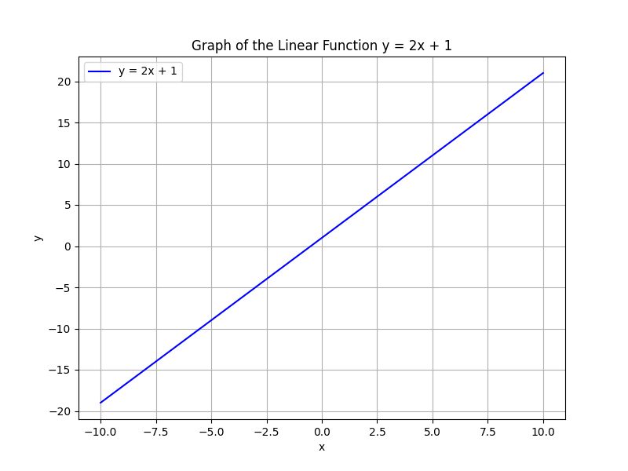

# Foundational Algebraic Concepts

This unit introduces the essential ideas of algebra. Algebra uses symbols, called variables, to represent numbers and express relationships. In this unit, you will explore how to form and simplify expressions, solve simple equations, and understand the connections between numbers and symbols.

Algebra is fundamental because it provides the tools to model and solve problems in various fields. For example, in financial budgeting, you might use an expression like $C = 2x + 5$ to represent cost, where $x$ stands for the quantity produced. Similarly, in engineering, algebra helps in designing structures by creating equations that describe relationships between forces and dimensions.

The concepts covered here include:

- **Variables:** Symbols that represent unknown or changing values. 
- **Expressions:** Combinations of numbers, variables, and operations, such as addition or multiplication, that represent a value.
- **Basic Operations:** Techniques for adding, subtracting, multiplying, and dividing, which are used to simplify expressions and solve equations.

Understanding these ideas builds a strong foundation that will help you tackle more complex topics in college-level mathematics and real-world applications. By mastering these fundamentals, you develop a systematic approach to problem-solving, making it easier to analyze and solve challenges in areas like economics, engineering design, and sports statistics.

> Algebra is the language through which the universe whispers its hidden truths.