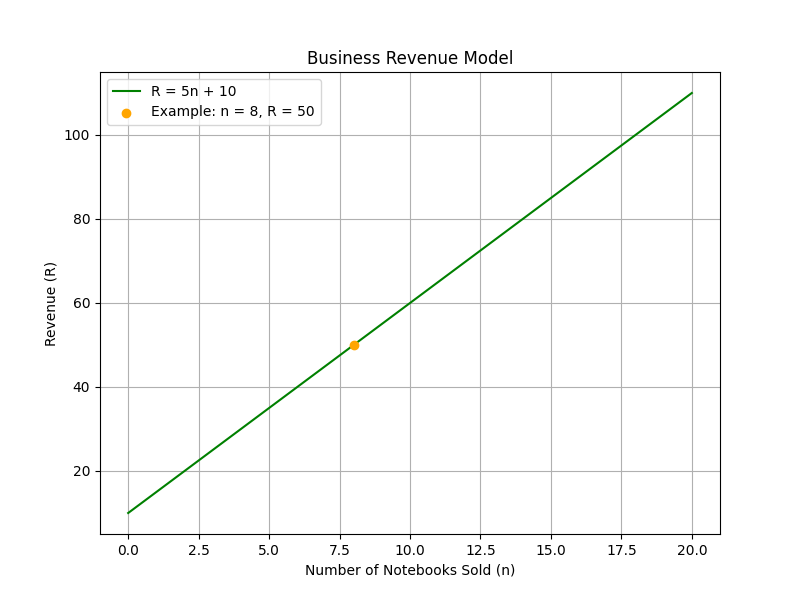
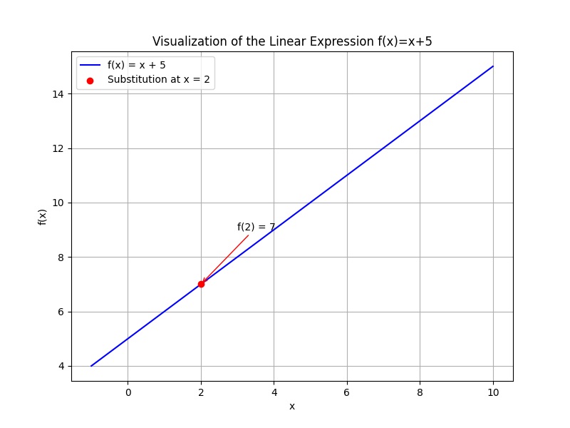
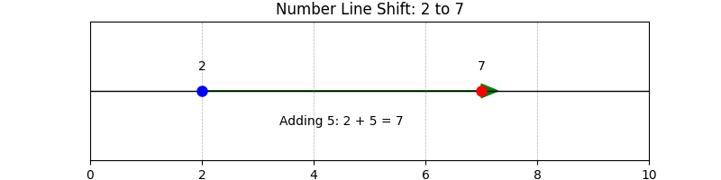

## Understanding Variables and Algebraic Expressions

This lesson introduces the foundational concepts of variables and algebraic expressions, which are essential tools for solving algebra problems and representing mathematical relationships. We will define key terms, explore different methods for working with expressions, and provide detailed, step-by-step examples grounded in real-world contexts. By the end of this lesson, you will understand how to interpret and manipulate these expressions, forming a strong base for more advanced topics.

### What Are Variables?

A variable is a symbol, typically a letter such as $x$, $y$, or $z$, used to represent an unknown or changeable number. Think of a variable as a placeholder that can accept different numerical values depending on the situation.

For example, in the expression

$$
x + 5
$$

the letter $x$ is a variable. It could represent any number, such as $1$, $10$, or $-3$. Variables allow us to write general rules and formulas that work for many cases, making them powerful tools for problem solving.

> **Intuition:** Imagine a variable as a mystery box in a game. You don’t know what’s inside until you are given a clue—a specific number. Until then, the box represents an unknown value waiting to be discovered.

### What Are Algebraic Expressions?

An algebraic expression is a combination of numbers, variables, and arithmetic operations (addition, subtraction, multiplication, and division) that represents a mathematical relationship.

For instance, consider the expression

$$
3x + 2
$$

Here, $3x$ means $3$ multiplied by the variable $x$, and then $2$ is added. This expression shows a relationship where the value of $x$ is scaled by $3$ and then increased by a constant $2$.

> **Intuition:** Think of an algebraic expression as a recipe. The variables are adjustable ingredients, while numbers are fixed measurements. The arithmetic operations tell you how to combine these ingredients to create a final result that depends on your inputs.

### Components of Algebraic Expressions

To fully understand an algebraic expression, it is useful to break it down into its fundamental parts:

1. **Coefficients:** These are numbers that multiply the variables. In the term $3x$, the number $3$ is the coefficient. It tells us by how much the variable is scaled, similar to a multiplier in everyday calculations.

2. **Constants:** These are fixed numbers that do not change and are not attached to any variable. In the expression $3x + 2$, the number $2$ is a constant, much like a fixed fee in a financial scenario.

3. **Terms:** Terms are the individual parts of an expression, separated by $+$ or $-$ signs. In $3x + 2$, there are two terms: $3x$ and $2$. Terms can be simple constants or products of coefficients and variables.

> **Intuition:** Picture an algebraic expression as a collection of packages. Each term is like a package containing a set amount—a package with multiples of a variable (with its coefficient) and another package with a fixed number (constant). Combining like packages (terms) makes the overall expression easier to manage.

### Step-by-Step Example: Evaluating an Expression

Evaluating an algebraic expression involves substituting specific numbers for the variables and then performing the arithmetic operations following the order of operations.

Consider the expression $2x + 7$ and suppose we are given $x = 3$. We evaluate the expression as follows:

1. **Substitute the value of $x$:**

   Replace $x$ with $3$:

   $$
   2(3) + 7
   $$

2. **Perform the Multiplication:**

   Multiply $2$ by $3$:

   $$
   6 + 7
   $$

3. **Add the Numbers:**

   Add $6$ and $7$ together:

   $$
   13
   $$

So, when $x = 3$, the expression $2x + 7$ evaluates to $13$.

> **Intuition:** Solving an expression is like uncovering a hidden message. You substitute the known value and process the steps in order, revealing the final result just as each clue in a mystery unravels the answer.

### Combining Like Terms

Simplifying expressions often requires combining like terms, which are terms with the same variable raised to the same power. The coefficients of these like terms can be added together.

For example, consider the expression

$$
4x + 5 + 3x - 2
$$

In this expression, the terms $4x$ and $3x$ are like terms because they both contain the variable $x$ to the first power. Combine these terms by adding their coefficients:

$$
4x + 3x = 7x
$$

Next, combine the constants:

$$
5 - 2 = 3
$$

The simplified expression is:

$$
7x + 3
$$

This process of simplification makes the expression clearer and easier to use in further calculations.

> **Intuition:** Combining like terms is like organizing a workspace. Just as you sort and group similar items to reduce clutter, you group terms with the same variable to simplify the expression.

### Real-World Application: Business Revenue

Algebraic expressions are powerful tools that can model real-life scenarios. For example, consider a small business that sells handmade notebooks. Let $n$ represent the number of notebooks sold. If each notebook is sold for $5$ and there is a fixed shipping fee of $10$, the total revenue $R$ can be expressed as:

$$
R = 5n + 10
$$

If $n = 8$, substituting into the equation gives:

$$
R = 5(8) + 10 = 40 + 10 = 50
$$

This model allows the business to quickly calculate revenue based on the number of items sold.

> **Intuition:** Think of the model as a built-in calculator. The variable $n$ adjusts for the number of notebooks sold, and the expression computes the total revenue, much like a cash register that updates with every sale.

### Additional Example: Engineering and Material Costs

Algebraic expressions also play a crucial role in engineering. Suppose an engineer needs to calculate the cost of materials for a construction project. Let $m$ represent the meters of material required per unit length of a beam. If the cost per meter is $8$ and there is a fixed setup fee of $20$, the total cost $C$ is:

$$
C = 8m + 20
$$

For example, if $m = 10$ meters are required, then:

$$
C = 8(10) + 20 = 80 + 20 = 100
$$

This formula helps in budgeting and planning, ensuring that all costs are accounted for clearly.

> **Intuition:** Think of the equation as a pricing structure in a store. The variable $m$ is like the quantity you purchase, $8$ is the unit price, and $20$ is a fixed cost, making it easy to understand how different costs add up.

### Visualizing Variables with a Number Line

Visual aids can help clarify abstract concepts. Consider the expression $x + 5$. Its value changes based on the value of $x$. Let’s visualize what happens when $x = 2$ on a number line.

Below is a number line where starting from $x = 2$, adding $5$ shifts the value 5 units to the right, landing on $7$:

In the diagram, the arrow indicates the movement from $2$ to $7$, reinforcing that the expression adjusts the starting number by a fixed amount.

### Summary of Key Steps

To work efficiently with variables and algebraic expressions, remember these steps:

- **Identify Variables:** Understand what each variable represents in the problem.

- **Recognize Components:** Break the expression into coefficients, constants, and terms to grasp its structure.

- **Substitute Known Values:** Replace variables with given numbers and evaluate the expression.

- **Combine Like Terms:** Simplify the expression by grouping terms with the same variable components.

Mastering these techniques transforms complex expressions into manageable forms, a foundational skill for finance, engineering, science, and beyond. As you progress, these concepts become building blocks for solving equations and exploring further algebraic topics.