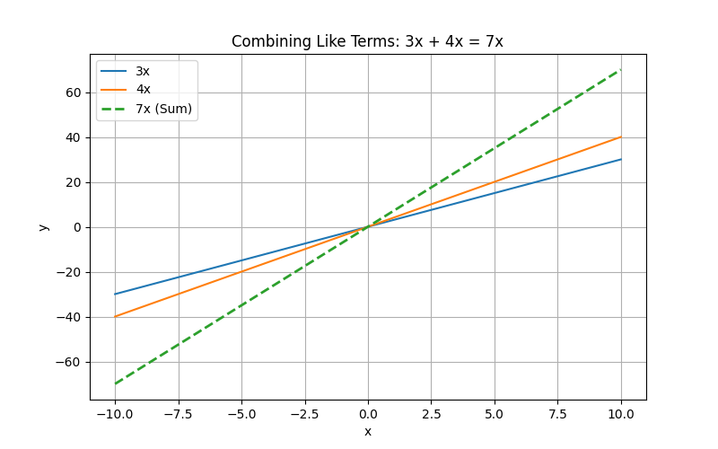
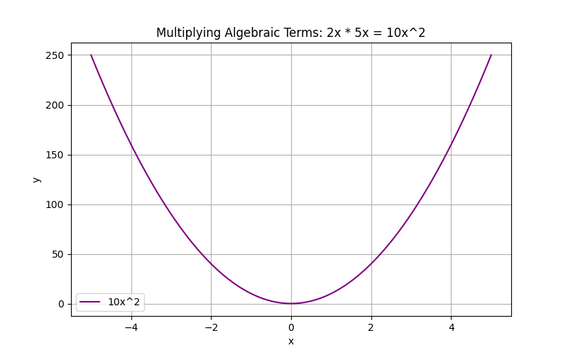

## Operations on Numbers and Algebraic Terms

This lesson explains how to perform operations on numbers and algebraic terms. We work with addition, subtraction, multiplication, and division applied to both numbers and variables. Mastering these operations is essential for solving more complex algebra problems.

> An algebraic term is a single element, which can be a constant, a variable, or a combination of both.

### Understanding Numbers and Algebraic Terms

Algebraic terms consist of numbers, variables, or both multiplied together. For example, in the term $5x$, the number $5$ is the coefficient and $x$ is the variable. A constant is a term with no variable, such as $3$ or $-7$.

### Addition and Subtraction of Numbers

Operations on plain numbers follow the familiar rules of arithmetic. For example:

$$
8 + 5 = 13
$$

Similarly, subtraction is performed by taking the difference:

$$
15 - 9 = 6
$$

These operations are used extensively in everyday calculations, like summing expenses or calculating scores in sports analytics.

### Operations on Algebraic Terms

When working with algebraic terms, it is crucial to combine like terms. Like terms have the same variable part raised to the same power. Only coefficients may differ.

For example, when adding:

$$
3x + 4x = (3+4)x = 7x
$$

Here both terms contain the variable $x$, so they can be added directly.

**Example 1: Combining Like Terms with a Constant**

Consider the expression:

$$
2 + 3 + 7
$$

Add the numbers as follows:

$$
2 + 3 = 5
$$

Then,

$$
5 + 7 = 12
$$

So, the sum is $12$.

**Example 2: Combining Like Terms with Variables**

For the expression:

$$
4y - 2y + 6
$$

First, combine the like terms:

$$
4y - 2y = 2y
$$

Then add the constant:

$$
2y + 6
$$

This expression cannot be simplified further because $2y$ and $6$ are unlike terms.

### Multiplication of Terms

Multiplying numbers and terms requires multiplying coefficients and applying the laws of exponents to variables. For instance:

$$
3 \times 4 = 12
$$

When variables are involved:

$$
2x \times 5x = (2 \times 5)(x \times x) = 10x^2
$$

This is because $x \times x$ equals $x^2$.

**Example: Multiplying a Number with an Algebraic Term**

Multiply the constant $7$ and the term $3z$:

$$
7 \times 3z = 21z
$$

### Division of Terms

Division of numbers uses similar principles. For example:

$$
20 \div 4 = 5
$$

Division with variables involves dividing the coefficients separately and subtracting the exponents when the bases are the same. For example:

$$
\frac{8a^3}{2a} = \frac{8}{2} \times a^{3-1} = 4a^2
$$

This follows the rule that when dividing powers with the same base, you subtract their exponents.

### Real-World Application

Consider a real-life scenario in financial planning. Imagine you earn a weekly allowance, represented by $w$, and receive an extra bonus of $15$ dollars. Your total earnings for the week can be expressed as:

$$
w + 15
$$

If the next week your allowance increases by $3$, and your bonus remains the same, your new total is:

$$
(w + 3) + 15 = w + 18
$$

This simple algebraic operation models how adjustments to regular income and bonuses work.

### Key Steps and Summary

1. Identify and classify numbers, variables, and constants.

2. Use arithmetic rules for direct numerical operations.

3. Combine like terms by adding or subtracting their coefficients when they have identical variable parts.

4. Multiply by multiplying coefficients and applying exponent rules.

5. Divide by operating separately on coefficients and using exponent subtraction.

Understanding these operations lays a solid foundation for solving more complex algebraic problems and is crucial for success on the College Algebra CLEP exam.

