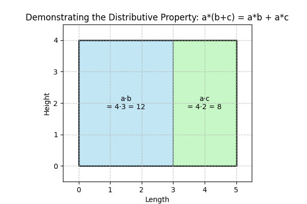

## The Distributive Property and Its Applications

The distributive property is a fundamental algebraic rule that allows you to multiply a single term by each term within parentheses. It transforms an expression of the form

$$
a(b+c)=ab+ac
$$

and similarly for subtraction:

$$
a(b-c)=ab-ac
$$

This property is essential for simplifying expressions, solving equations, and handling real-world calculations, as it breaks down complex expressions into more manageable pieces.

### What Is the Distributive Property?

The distributive property eliminates the need for parentheses by multiplying the term outside every term inside. It applies uniformly to both numbers and variables. For instance, in the expression

$$
3(x+4),
$$

you multiply $3$ by $x$ and by $4$, resulting in:

$$
3 \cdot x + 3 \cdot 4 = 3x + 12.
$$

This method is useful because it provides a systematic approach for removing parentheses and simplifying expressions.

### Step-by-Step Example 1: Simple Expansion

Consider the expression

$$
-2(3y-5).
$$

We expand as follows:

**Step 1:** Multiply $-2$ by the first term $3y$:

$$
-2 \cdot 3y = -6y.
$$

**Step 2:** Multiply $-2$ by the second term $-5$. Remember, multiplying two negatives makes a positive:

$$
-2 \cdot (-5) = 10.
$$

Thus, the expanded expression is:

$$
-6y+10.
$$

This example demonstrates the basic mechanism of the distributive property, where the multiplier outside the parentheses affects each term inside.

### Step-by-Step Example 2: Combining Multiple Terms

Now, expand and simplify the expression

$$
5(2x+3)-4(x-1).
$$

We tackle this in parts:

1. **Distribute $5$:**

   Multiply $5$ by each term inside the first set of parentheses:

   $$
   5 \cdot 2x + 5 \cdot 3 = 10x+15.
   $$

2. **Distribute $-4$:**

   Multiply $-4$ by each term in the second set of parentheses. Note the importance of the negative sign:

   $$
   -4 \cdot x + (-4) \cdot (-1) = -4x+4.
   $$

3. **Combine the Results:**

   Now, combine the two results:

   $$
   10x+15-4x+4.
   $$

   Group like terms (terms with $x$ and constants separately):

   $$
   (10x-4x) + (15+4) = 6x+19.
   $$

This example shows how to manage expressions with multiple distributive steps and underscores the importance of keeping track of signs during multiplication.

### Real-World Applications

The distributive property is not just an abstract algebraic rule—it has practical applications in everyday situations and professional fields.

1. **Financial Calculations:**

   When you buy several items, each with a base price plus tax, the total cost can be expressed using the distributive property. If $p$ represents the base price and $t$ represents the tax, then for $n$ items:

   $$
n(p+t)=np+nt.
   $$

   This formula shows how the overall cost is divided into the price and the tax components, an approach that is very useful in budgeting and accounting.

2. **Engineering and Design:**

   Consider an engineer who needs to calculate the total force applied to multiple identical components. If the force on one component is given by $(F_1+F_2)$, then for $k$ components:

   $$
k(F_1+F_2)=kF_1+kF_2.
   $$

   This simple application of the distributive property assists in designing systems where individual forces are distributed evenly across several elements.

### Practice Tips and Intuition

- **Consistent Multiplication:** Always multiply every term inside the parentheses by the term outside. Skipping a term is a common error.

- **Attention to Signs:** Carefully consider the signs (positive or negative) of each term. Multiplying negative terms correctly is key to avoiding mistakes.

- **Combine Like Terms:** After distributing, group similar terms together to simplify the expression further. This reinforces understanding of how coefficients and variables interact.

The distributive property provides a clear strategy for breaking complex expressions into smaller, more manageable steps. By ensuring each term is accounted for and properly simplified, you build a strong foundation for more advanced algebraic techniques, like factoring and solving equations.
