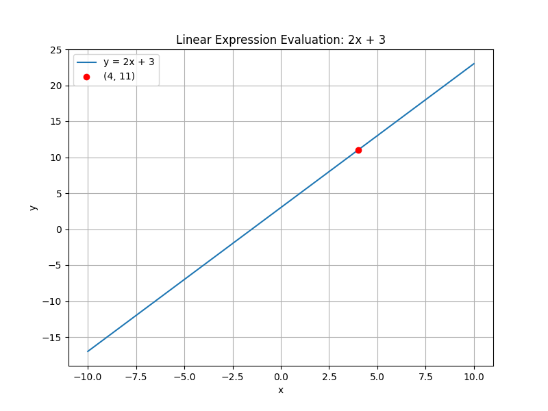
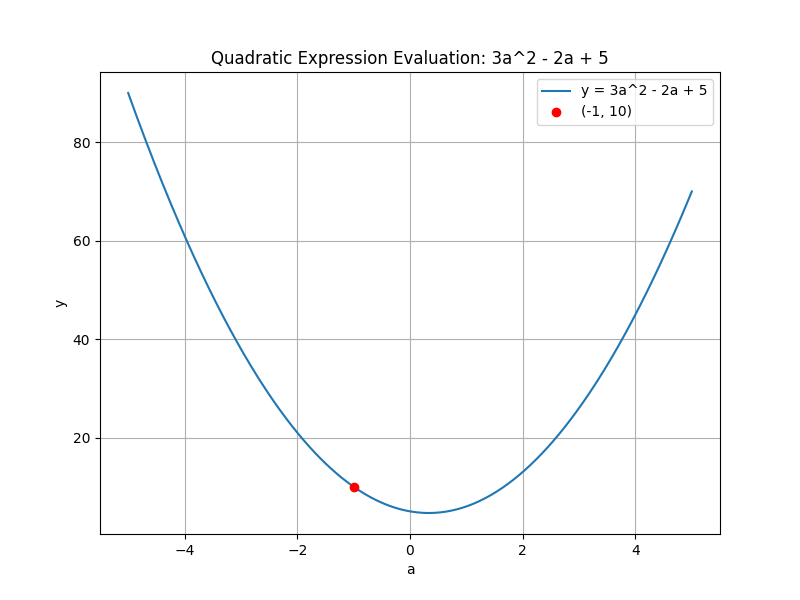

## Evaluating Algebraic Expressions

Evaluating an algebraic expression means substituting values for variables and simplifying the result using the order of operations. In practice, this skill is essential for solving real-world problems, such as calculating costs or processing data.

> The order in which you perform operations matters: always handle parentheses, exponents, multiplication and division, then addition and subtraction.

### Understanding the Process

1. Identify the variables in the expression.
2. Substitute the given value(s) into the expression.
3. Apply the order of operations: parentheses, exponents, multiplication and division, addition and subtraction (PEMDAS).

### Example 1: Basic Linear Expression

Consider the expression:

$$
2x + 3
$$

If $x = 4$, substitute the value into the expression:

$$
2(4) + 3
$$

Perform the multiplication:

$$
8 + 3
$$

Then add to get the final result:

$$
11
$$

This shows that when $x = 4$, the expression $2x + 3$ evaluates to $11$.

### Example 2: Expression with Parentheses and Multiplication

Examine the expression:

$$
5(2y - 3) + 7
$$

For $y = 5$, first substitute the value:

$$
5(2(5) - 3) + 7
$$

Start inside the parentheses by multiplying:

$$
5(10 - 3) + 7
$$

Then subtract inside the parentheses:

$$
5(7) + 7
$$

Multiply:

$$
35 + 7
$$

Finally, add:

$$
42
$$

The evaluated result is $42$ when $y = 5$.

### Example 3: Quadratic Expression

Sometimes, expressions include exponents. Consider:

$$
3a^2 - 2a + 5
$$

For $a = -1$, substitute the value:

$$
3(-1)^2 - 2(-1) + 5
$$

Evaluate the exponent first:

$$
3(1) - 2(-1) + 5
$$

Then, perform the multiplication and then the addition:

$$
3 + 2 + 5
$$

Combine the terms:

$$
10
$$

Thus, when $a = -1$, the expression evaluates to $10$.

### Real-World Application: Cost Calculation

Imagine you are buying tickets where the cost is given by the expression:

$$
C = 12n + 5
$$

Here, $n$ is the number of tickets. If you buy $3$ tickets, substitute $n = 3$:

$$
C = 12(3) + 5
$$

Multiply:

$$
36 + 5
$$

Then add:

$$
41
$$

The total cost is $41$ dollars.

### Key Steps Recap

- Replace each variable with its given number.
- Keep close attention to the order of operations.
- Simplify the expression step by step.

Evaluating algebraic expressions accurately is crucial for building a strong foundation in algebra, helping you tackle more complex problems in financial calculations, engineering, and scientific analysis.