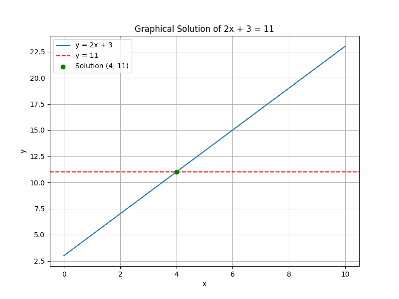
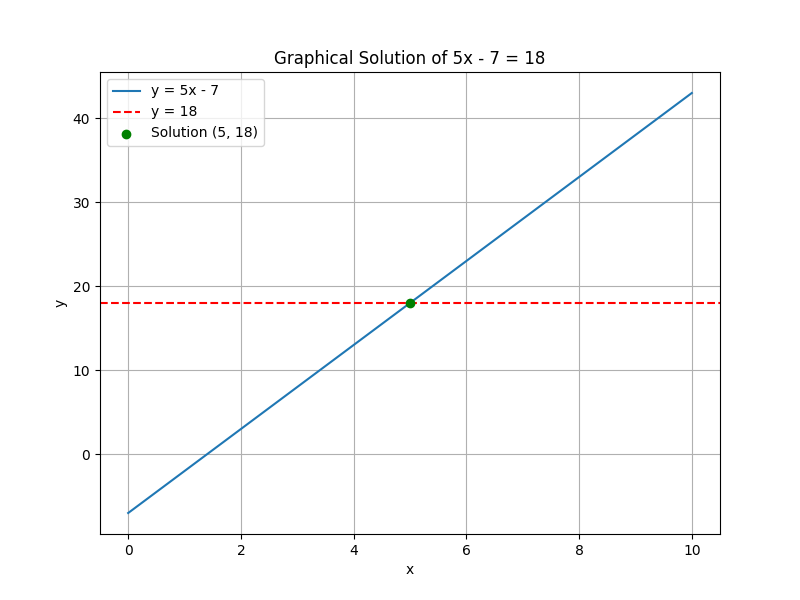

## Solving Basic Linear Equations

Linear equations are equations that have the variable to the first power and no products of variables. In these equations, we use inverse operations to isolate the variable. This lesson explains the step-by-step process to solve basic linear equations.

### Key Concepts

> A balanced equation remains true if the same operation is performed on both sides.

1. **Simplify Both Sides:** Remove any parentheses and combine like terms. 
2. **Isolate the Variable:** Use addition, subtraction, multiplication, or division to get the variable on one side of the equation.
3. **Verify the Solution:** Substitute the value back into the original equation to confirm the answer.

### Example 1: Solve $2x + 3 = 11$

Step 1. **Subtract 3 from both sides:**

$$
2x + 3 - 3 = 11 - 3
$$

This simplifies to:

$$
2x = 8
$$

Step 2. **Divide both sides by 2:**

$$
\frac{2x}{2} = \frac{8}{2}
$$

Which gives the solution:

$$
x = 4
$$

Step 3. **Verification:**

Substitute $x = 4$ into the original equation:

$$
2(4) + 3 = 8 + 3 = 11
$$

Since both sides equal 11, the solution $x = 4$ is correct.

### Example 2: Real-World Application

Suppose a manufacturer finds that the total cost for producing a specific number of widgets is given by the equation

$$
5x - 7 = 18
$$

where $x$ represents the number of widgets produced (after a fixed cost modification).

Step 1. **Add 7 to both sides:**

$$
5x - 7 + 7 = 18 + 7
$$

This reduces to:

$$
5x = 25
$$

Step 2. **Divide both sides by 5:**

$$
\frac{5x}{5} = \frac{25}{5}
$$

Resulting in:

$$
x = 5
$$

Step 3. **Interpretation:**

The manufacturer produced 5 widgets (after accounting for the fixed adjustment).

### General Steps for Solving Basic Linear Equations

1. **Eliminate Constants:** Move constant terms to the side opposite the variable using addition or subtraction.
2. **Remove Multipliers:** Divide or multiply to reverse the effect of coefficients attached to the variable.
3. **Simplify and Solve:** Reduce the equation until the variable is by itself.

These steps ensure that the value found is the unique solution that satisfies the equation.

By understanding and applying these systematic steps, you can solve any basic linear equation. Practice is key to mastering these techniques, as they are foundational for more complex algebraic problems.