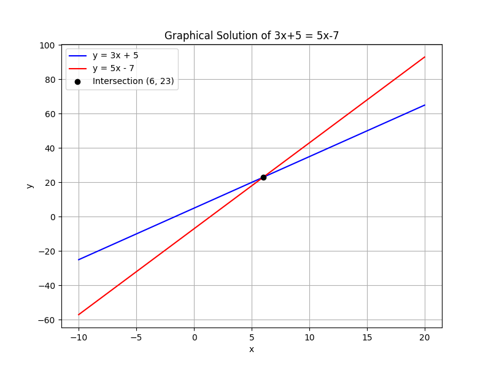
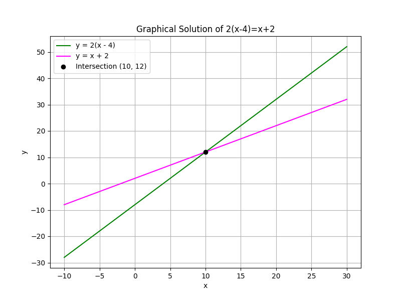

## Solving Equations with Variables on Both Sides

This lesson focuses on solving linear equations that include variables on both sides. The goal is to rearrange the equation so that all terms containing the variable are on one side and all constant terms are on the other. This process allows you to isolate the variable and solve the equation.

> Key Insight: In any equation, performing the same operation on both sides keeps the equation balanced.

### Step-by-Step Process

1. **Eliminate Variables from One Side:**

   Move all terms with the variable to one side by either adding or subtracting terms. This step clears one side of any variable terms.

2. **Gather Constants on the Other Side:**

   Transfer all constant terms to the opposite side using addition or subtraction so that one side has only the variable and the other side only the numbers.

3. **Combine Like Terms:**

   Simplify the equation by combining any similar terms on each side. This makes the equation easier to work with.

4. **Isolate the Variable:**

   Use multiplication or division to isolate the variable and solve the equation.

### Example 1: Basic Equation

Solve the equation:

$$
3x + 5 = 5x - 7
$$

**Step 1: Eliminate Variable Terms from One Side**

Start by subtracting $3x$ from both sides to remove the variable term from the left side:

$$
3x + 5 - 3x = 5x - 7 - 3x
$$

This simplifies to:

$$
5 = 2x - 7
$$

*Explanation:* By subtracting $3x$, we consolidate the variable terms on the right, making it easier to isolate $x$.

**Step 2: Isolate the Constant Terms**

Add $7$ to both sides to shift the constant term to the left side:

$$
5 + 7 = 2x - 7 + 7
$$

This gives:

$$
12 = 2x
$$

*Explanation:* Adding $7$ cancels the $-7$ on the right, leaving a clear equation in $x$.

**Step 3: Solve for $x$**

Divide both sides by $2$ to isolate $x$:

$$
\frac{12}{2} = \frac{2x}{2}
$$

Thus:

$$
x = 6
$$

*Intuition:* Each step maintains the balance of the equation. The goal is to have just $x$ on one side, which makes finding its value straightforward.

### Example 2: Equation Involving Parentheses

Consider a scenario where a small business calculates its monthly profit with the equation:

$$
2(x - 4) = x + 2
$$

In this equation, $x$ might represent the number of units sold beyond a baseline level. The steps are as follows:

**Step 1: Expand the Equation**

Distribute the $2$ on the left side:

$$
2x - 8 = x + 2
$$

*Explanation:* Distributing removes the parentheses and expresses all terms explicitly, which prepares the equation for further simplification.

**Step 2: Eliminate the Variable from One Side**

Subtract $x$ from both sides to gather like terms:

$$
2x - x - 8 = x - x + 2
$$

This simplifies to:

$$
x - 8 = 2
$$

*Explanation:* By subtracting $x$, we combine all variable terms on the left, leaving a simpler equation.

**Step 3: Isolate the Variable**

Add $8$ to both sides to solve for $x$:

$$
x - 8 + 8 = 2 + 8
$$

Which results in:

$$
x = 10
$$

*Intuition:* Clearing the variable terms on one side and constant terms on the other simplifies finding the solution. It is like clearing the clutter to focus on the unknown value.

### Real-World Application

In engineering, balancing forces is essential. For example, an engineer might model two forces acting in opposite directions with an equation like these. By methodically rearranging the terms, the engineer can determine the magnitude of the unknown force needed to maintain equilibrium.

### Summary of Key Points

- Always perform the same operation on both sides of the equation to maintain balance.
- Collect all variable terms on one side and all constant terms on the other before proceeding to isolate the variable.
- Each step should simplify the equation until the variable stands alone, ensuring mistakes are minimized.

This structured approach not only helps in solving algebraic equations but also builds a foundation for solving more complex algebraic problems encountered in real-world applications.