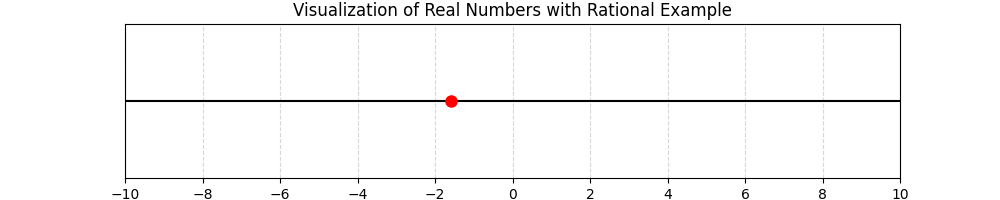

## Real Number Classifications and Properties

Real numbers form the foundation of algebra and include many different types of numbers. In this lesson, we will classify real numbers and explore their properties. Understanding these classifications helps in simplifying expressions, solving equations, and applying algebra in real-life scenarios such as engineering calculations, financial analysis, and scientific measurements.

### Classifications of Real Numbers

Real numbers can be divided into several distinct groups. Here are the key classifications:

- **Natural Numbers**: These are counting numbers such as $1, 2, 3, \dots$. They are used when counting items.

- **Whole Numbers**: Whole numbers include all natural numbers plus zero: $0, 1, 2, 3, \dots$.

- **Integers**: Integers extend whole numbers by including negative numbers: $\dots, -3, -2, -1, 0, 1, 2, 3, \dots$.

- **Rational Numbers**: A number is rational if it can be expressed as a fraction $\frac{p}{q}$, where $p$ and $q$ are integers and $q \neq 0$. Examples include $\frac{1}{2}$ and $-\frac{7}{3}$. In decimal form, rational numbers either terminate or repeat.

- **Irrational Numbers**: These numbers cannot be written as simple fractions. Their decimal representations do not terminate or repeat. Famous examples include $\pi$ and $\sqrt{2}$.

- **Real Numbers**: Combined, rational and irrational numbers make up the set of real numbers. Every point on the number line represents a real number.

> The clarity in classifying numbers is essential because each set has its own properties and rules which simplify problem solving.

### Properties of Real Numbers

Real numbers obey several key properties that make arithmetic operations predictable and consistent. Below are the main properties:

1. **Commutative Property**

   - **Addition**: $a + b = b + a$

   - **Multiplication**: $a \times b = b \times a$

   These properties mean that the order in which you add or multiply numbers does not change the result.

2. **Associative Property**

   - **Addition**: $(a + b) + c = a + (b + c)$

   - **Multiplication**: $(a \times b) \times c = a \times (b \times c)$

   Grouping of terms does not affect the sum or product.

3. **Distributive Property**

   This property connects addition and multiplication:

   $$
a(b+c)=ab+ac
   $$

   It allows you to multiply a number by a sum, making complex calculations simpler.

4. **Identity Properties**

   - **Additive Identity**: $a + 0 = a$

   - **Multiplicative Identity**: $a \times 1 = a$

5. **Inverse Properties**

   - **Additive Inverse**: For every $a$, there is a number $-a$ such that $a + (-a) = 0$

   - **Multiplicative Inverse**: For every nonzero $a$, there is $\frac{1}{a}$ such that $a \times \frac{1}{a}=1$

### Step-by-Step Example: Classifying a Number

Consider the number $-\frac{8}{5}$. Let us classify it:

1. **Is it a Natural Number?**

   No, because natural numbers are positive counting numbers.

2. **Is it a Whole Number?**

   No, whole numbers include zero and positive numbers only.

3. **Is it an Integer?**

   No, while it is a fraction, integers do not include numbers with a fractional part.

4. **Is it a Rational Number?**

   Yes. It can be expressed as a fraction with integers $-8$ (numerator) and $5$ (denominator), and the decimal representation would either terminate or repeat.

Thus, $-\frac{8}{5}$ is a rational number. Since it is rational, it is also a real number.

### Real-World Application: Finance and Measurements

Many real-world applications depend on these properties and classifications. For instance:

- **Finance**: Calculating interest rates often involves the use of fractions and decimals. Knowing that these numbers are rational makes it easier to understand and predict interest accumulations.

- **Engineering**: Measurements in construction must be precise. The distributive and associative properties are applied when combining materials of different quantities, ensuring that calculations remain consistent.

- **Science**: In experiments, continuous measurements recorded as decimals rely on the properties of real numbers to ensure that data analysis and error measurements are accurate.

### Visual Illustration

Below is a number line that helps visualize different classifications, with a focus on rational numbers:

This visualization helps confirm that every point on this line, including our example, has a clear classification in the system of real numbers.

### Summary of Key Points

- Real numbers include both rational and irrational numbers.
- Classifications help us understand different types of numbers including natural numbers, whole numbers, integers, rational numbers, and irrational numbers.
- The properties (commutative, associative, distributive, identity, and inverse) allow consistent operations and simplify algebraic expressions.
- Real-life applications in finance, engineering, and science demonstrate the importance of understanding these classifications.

By understanding these classifications and properties, learners can approach algebra problems methodically with a clearer vision of the tools at their disposal.