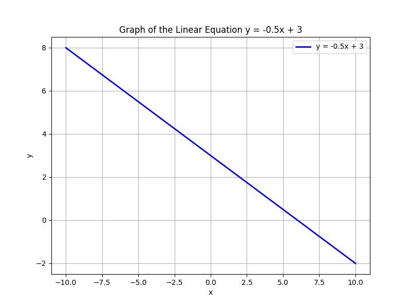
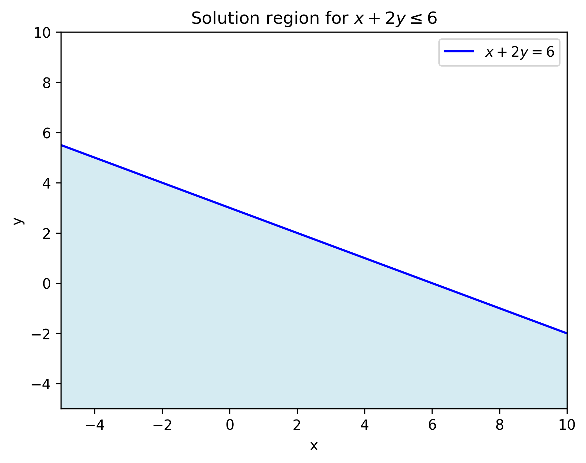

# Linear Equations and Inequalities

This unit introduces the fundamental concepts of linear equations and inequalities. A linear equation is an algebraic equation of the first degree, typically written in the form $ax + b = 0$ or in its slope-intercept form $y = mx + b$, where $m$ represents the constant rate of change (slope) and $b$ represents the $y$-intercept. These equations graph as straight lines on the coordinate plane.

A linear inequality, on the other hand, defines a region of solutions rather than a single line. For example, the inequality $x + 2y \le 6$ includes not only the boundary line but also all the points on one side of it. This helps us understand constraints in real-world situations, such as budgeting limits or safety parameters in design.

Understanding these concepts is crucial because linear equations and inequalities form the foundation for solving many types of problems in algebra. They are used to model relationships where there is a constant rate of change, such as calculating total cost with a fixed fee plus per-unit expense, or determining how variables interact under certain constraints in engineering and data analysis.

The methods involved include isolating variables, applying arithmetic operations, and graphing the solutions on number lines or coordinate planes. These step-by-step methods build the intuition necessary to transition from abstract concepts to real-life applications.

Remember, every linear model simplifies complex situations into clear, predictable relationships. This clarity makes it easier to analyze trends and make informed decisions in various fields such as finance, engineering, and science.

> In every equation and every symbol, there lies the whisper of nature’s grand design.