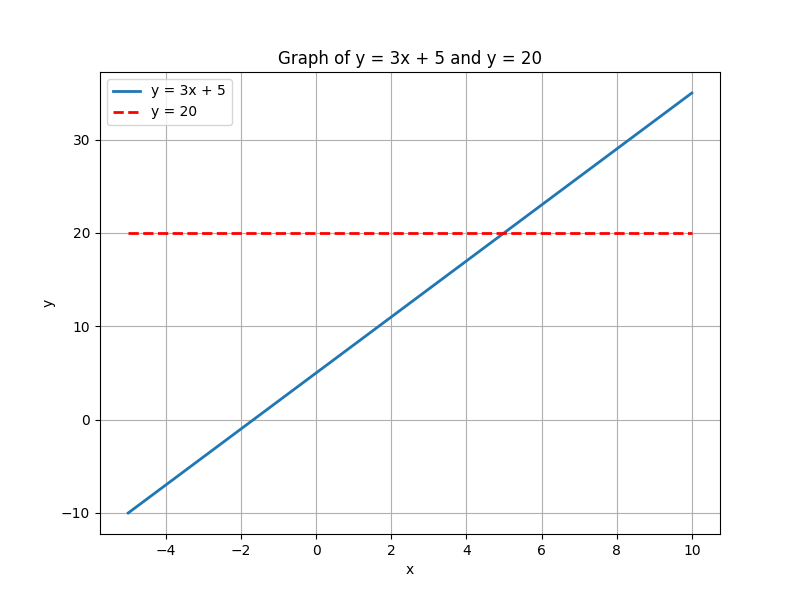
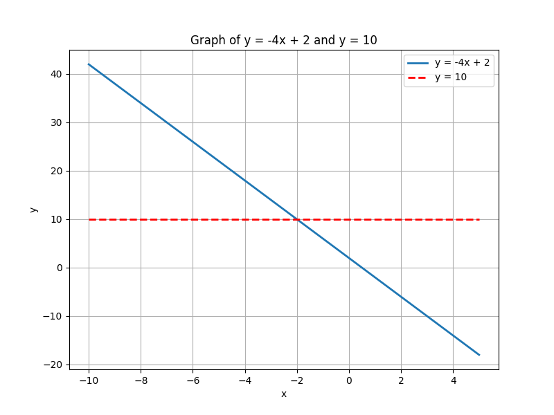
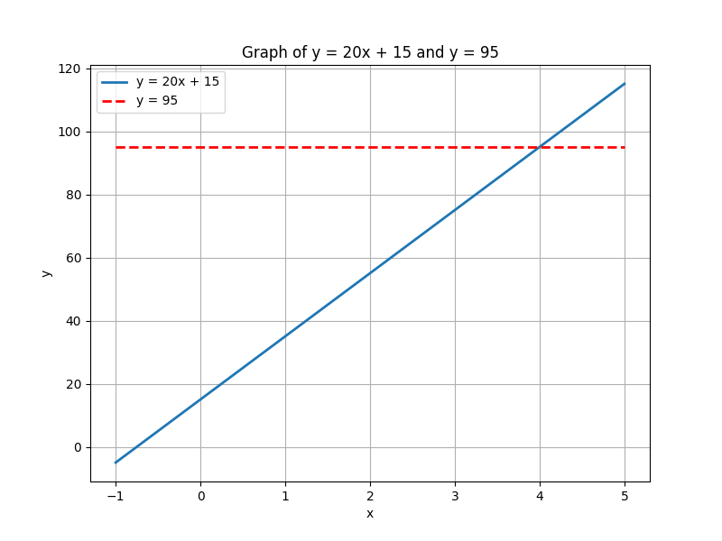

## Solving Linear Equations with a Single Variable

Linear equations with a single variable are equations in which the variable is raised only to the first power. The goal is to determine the value of the variable that makes the equation true. In these equations, constants and coefficients are combined using addition, subtraction, multiplication, or division. The method used is based on the idea of keeping the equation balanced by performing the same operation on both sides.

### Basic Concepts

A general form for a linear equation in one variable is:

$$
a x + b = c
$$

In this form:

- $a$ is the coefficient, which multiplies the variable $x$.
- $b$ is a constant term.
- $c$ is the result after combining all terms.

The main objective in solving such equations is to isolate $x$ on one side of the equation using inverse operations. This process is similar to balancing a scale: any operation performed on one side must be performed on the other side to maintain equality.

> The process of solving an equation is like balancing a scale. Whatever you do to one side, you must do to the other.

### Step-by-Step Process

To solve a linear equation, follow these steps:

1. **Simplify each side if necessary.**
   - Combine like terms and remove any grouping symbols.

2. **Remove constant terms from the side with the variable.**
   - Use addition or subtraction to shift the constant term to the other side.

3. **Isolate the variable.**
   - Use multiplication or division to undo the coefficient attached to the variable.

4. **Check the solution.**
   - Substitute the solution back into the original equation to ensure that both sides are equal.

These steps provide a systematic approach to solving linear equations, ensuring that each operation preserves the equality of the equation.

### Example 1: Solving $3x + 5 = 20$

We begin with the equation:

$$
3x + 5 = 20
$$

**Step 1: Subtract 5 from both sides.**

Subtracting 5 eliminates the constant on the side with the variable:

$$
3x + 5 - 5 = 20 - 5
$$

This simplifies to:

$$
3x = 15
$$

**Step 2: Divide both sides by 3.**

Dividing by 3 isolates the variable $x$:

$$
\frac{3x}{3} = \frac{15}{3}
$$

Which simplifies to:

$$
x = 5
$$

**Check:**

Substitute $x = 5$ back into the original equation to verify our solution:

$$
3(5) + 5 = 15 + 5 = 20
$$

Since the left side equals the right side, the solution $x = 5$ is correct.

### Example 2: Solving $-4x + 2 = 10$

For the equation:

$$
-4x + 2 = 10
$$

**Step 1: Subtract 2 from both sides.**

Moving the constant term to the right gives:

$$
-4x + 2 - 2 = 10 - 2
$$

Which simplifies to:

$$
-4x = 8
$$

**Step 2: Divide both sides by -4.**

Dividing by -4 isolates $x$:

$$
\frac{-4x}{-4} = \frac{8}{-4}
$$

This simplifies to:

$$
x = -2
$$

**Check:**

Substitute $x = -2$ into the equation to verify:

$$
-4(-2) + 2 = 8 + 2 = 10
$$

The equation balances, confirming that $x = -2$ is the correct solution.

### Real-World Application Example

Consider a scenario where you are buying concert tickets. The total cost is determined by a fixed booking fee and a cost per ticket. Suppose the cost is modeled by the equation:

$$
20x + 15 = 95
$$

Here:

- $20$ represents the cost per ticket,
- $15$ is the booking fee,
- $x$ is the number of tickets, and
- $95$ is the total cost.

**Step 1: Subtract 15 from both sides.**

Remove the booking fee to focus on the ticket cost:

$$
20x = 95 - 15
$$

Simplify to get:

$$
20x = 80
$$

**Step 2: Divide both sides by 20.**

$$
x = \frac{80}{20}
$$

Which simplifies to:

$$
x = 4
$$

The solution shows that 4 tickets were purchased.

Each of these examples uses the same logical process: first, isolate the term with the variable by removing constants, then solve for the variable through division or multiplication, and finally, verify the solution by substitution.

The underlying intuition is that every operation you perform changes the equation equally on both sides, keeping it balanced. This method provides a clear, step-by-step approach for solving any linear equation.