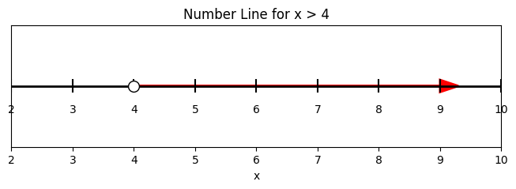
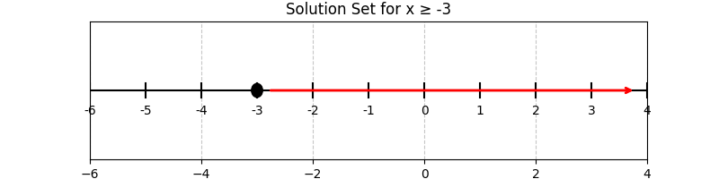

## Lesson: Solving Linear Inequalities and Graphing Solution Sets

Linear inequalities are like linear equations but use inequality symbols ($>$, $<$, $\ge$, $\le$) instead of an equal sign. This means the solution is a set of values that satisfy the inequality. One important rule is that when you multiply or divide both sides of an inequality by a negative number, you must flip the direction of the inequality.

This lesson will explain the key steps and concepts to solve a linear inequality and graph its solution set on a number line. By understanding these steps, you can correctly decide and visualize the range of possible solutions. These ideas are useful in real-world applications, for example in budgeting to determine acceptable ranges for expenses or setting safety limits in engineering designs.

### Steps to Solve a Linear Inequality

1. Isolate the term with the variable on one side.
2. Perform arithmetic operations (addition, subtraction, multiplication, or division) on both sides.
3. If you multiply or divide by a negative number, reverse the inequality symbol.
4. Write the solution in inequality form and represent the solution on a number line.

### Example 1: Solve $$2x - 5 > 3$$

We start by solving for $x$ step by step.

1. Add 5 to both sides to move the constant term:

$$
2x - 5 + 5 > 3 + 5
$$

This simplifies to:

$$
2x > 8
$$

2. Divide both sides by 2 to isolate $x$:

$$
\frac{2x}{2} > \frac{8}{2}
$$

Thus, we have:

$$
x > 4
$$

The solution means any number greater than $4$ will satisfy the inequality.

#### Graphing the Solution

To graph the inequality $x > 4$ on a number line:

- Draw an open circle at $x = 4$ to show that $4$ is not included in the solution.
- Shade the region to the right of $4$ to represent all numbers greater than $4$.

\vspace*{2em}
\begin{center}
\begin{tikzpicture}[x=0.5cm]
  % Draw number line from 2 to 10
  \draw[->] (2,0) -- (10,0) node[right] {Number Line};
  % Ticks every 1 unit
  \foreach \x in {2,3,4,5,6,7,8,9,10}
      \draw (\x,0.1) -- (\x,-0.1) node[below] {\x};
  % Open circle at 4
  \draw[fill=white, thick] (4,0) circle (0.2);
  % Shade region to the right of 4
  \draw[very thick, red, ->] (4.2,0) -- (9.8,0);
\end{tikzpicture}
\end{center}
\vspace*{2em}

### Example 2: Solve $$-3x + 7 \le 16$$

We now solve a slightly different inequality.

1. Subtract 7 from both sides to isolate the term with $x$:

$$
-3x + 7 - 7 \le 16 - 7
$$

Which simplifies to:

$$
-3x \le 9
$$

2. Divide both sides by $-3$. Remember to flip the inequality since you are dividing by a negative number:

$$
\frac{-3x}{-3} \ge \frac{9}{-3}
$$

This gives us:

$$
x \ge -3
$$

The inequality $x \ge -3$ means all numbers that are greater than or equal to $-3$ are solutions.

#### Graphing the Solution

To graph $x \ge -3$ on a number line:

- Draw a closed circle at $x = -3$ because $-3$ is included.
- Shade the region to the right of $-3$ to show all numbers that are greater than or equal to $-3$.

\vspace*{2em}
\begin{center}
\begin{tikzpicture}[x=0.5cm]
  % Draw number line from -6 to 4
  \draw[->] (-6,0) -- (4,0) node[right] {Number Line};
  % Ticks every 1 unit
  \foreach \x in {-6,-5,-4,-3,-2,-1,0,1,2,3,4}
      \draw (\x,0.1) -- (\x,-0.1) node[below] {\x};
  % Closed circle at -3
  \draw[fill=black] (-3,0) circle (0.2);
  % Shade region to the right of -3
  \draw[very thick, red, ->] (-2.8,0) -- (3.8,0);
\end{tikzpicture}
\end{center}
\vspace*{2em}

### Key Points to Remember

> When multiplying or dividing an inequality by a negative number, always reverse the inequality symbol.

> Graphing solution sets requires marking the boundary correctly—using open circles for values not included and closed circles for values that are included—and shading the area that satisfies the inequality.

These methods are essential in various practical situations, such as determining acceptable ranges in budgeting or ensuring safety in engineering designs.

