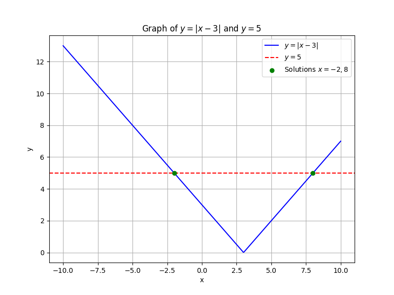
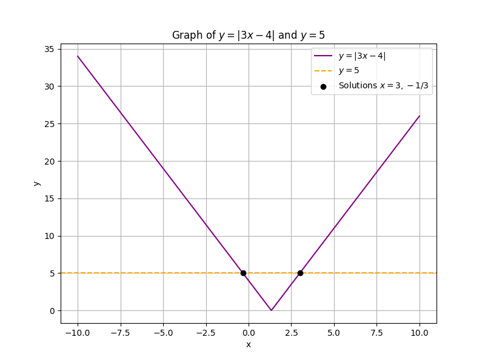

## Solving Equations with Absolute Value

Absolute value represents the distance of a number from zero, regardless of direction. In other words, $|x|$ measures how far $x$ is from $0$. In equations, the absolute value of an expression is always nonnegative. This property is essential because it means when you set an absolute value equal to a number, you must consider two scenarios.

Consider an equation of the form

$$
|ax+b| = c
$$

When $c \geq 0$, the equation implies that the expression inside the absolute value, $ax+b$, can be either equal to $c$ or equal to $-c$. That gives us two separate cases to solve:

1. $ax + b = c$

2. $ax + b = -c$

If $c < 0$, the equation has no solution because an absolute value cannot produce a negative result.

This method of splitting into two cases is a direct result of the definition of absolute value. It provides a systematic way to solve equations by breaking them into simpler, linear parts.

### Step-by-Step Example

Consider the equation:

$$
|x - 3| = 5
$$

Because the absolute value $|x-3|$ represents the distance between $x$ and $3$, setting it equal to $5$ asks: "For which values of $x$ is the distance from $3$ exactly $5$?" There are two possibilities:

**Case 1:**

Assume the expression inside the absolute value is positive. Then:

$$
x - 3 = 5
$$

Solve by adding $3$ to both sides:

$$
x = 5 + 3 = 8
$$

This means one solution is $x=8$.

**Case 2:**

Assume the expression inside the absolute value is negative. Then:

$$
x - 3 = -5
$$

Solve by adding $3$ to both sides:

$$
x = -5 + 3 = -2
$$

Thus, the equation $|x-3|=5$ has two solutions: $x=8$ and $x=-2$.

This example shows how splitting the absolute value equation into two separate cases leads to all possible solutions.

### Another Example with a Coefficient

Solve the equation:

$$
2|3x - 4| = 10
$$

The first step in solving this equation is to isolate the absolute value expression. To do that, divide both sides by $2$:

$$
|3x - 4| = 5
$$

Now, we set up the two cases based on the definition of absolute value.

**Case 1:**

Suppose the expression inside the absolute value is positive:

$$
3x - 4 = 5
$$

Solve for $x$ by adding $4$ to both sides:

$$
3x = 5 + 4 = 9
$$

Divide both sides by $3$:

$$
x = 3
$$

**Case 2:**

Suppose the expression inside the absolute value is negative:

$$
3x - 4 = -5
$$

Solve for $x$ by adding $4$ to both sides:

$$
3x = -5 + 4 = -1
$$

Divide both sides by $3$:

$$
x = -\frac{1}{3}
$$

Thus, the solutions are $x = 3$ and $x = -\frac{1}{3}$.

This example introduces a coefficient outside the absolute value. By isolating $|3x-4|$ first, we simplify the equation and then address the two possible cases separately.

### Real-World Application Example

Imagine a scenario in sports analytics. Suppose a player is expected to achieve a target score $T$, but consistency is defined by staying within $5$ units of this target. The equation

$$
|s - T| = 5
$$

models the deviation of the actual score $s$ from the target $T$. Here, the absolute value measures how much the score deviates from the target without considering the direction of the deviation.

To find the acceptable scores, we consider two cases:

**Case 1:**

If $s$ is $5$ units above the target:

$$
s - T = 5 \quad\Rightarrow\quad s = T + 5
$$

**Case 2:**

If $s$ is $5$ units below the target:

$$
s - T = -5 \quad\Rightarrow\quad s = T - 5
$$

Thus, if the target score is known, the acceptable scores are exactly $5$ units above or below the target. This type of analysis can be useful in real-life scenarios where tolerance levels are critical.

### Handling Special Cases

1. **No Solution:**

   Consider an equation of the form

   $$
   |ax + b| = -c \quad\text{with}\quad c > 0.
   $$

   Since absolute value results cannot be negative, there is no solution in this case.

2. **Identity Equations:**

   Sometimes, after isolating the absolute value, the equation might simplify to an identity, that is, a statement that is always true. For example:

   $$
   |x - 3| = |x - 3|
   $$

   This equation holds true for all $x$ in the domain of the expression $x-3$, meaning every real number that can be substituted in will satisfy the equation.

These special cases remind us to always check the structure of an absolute value equation before proceeding with the solution, ensuring that our manipulations remain valid.

### Summary of the Process

- **Isolate the expression:** First, get the absolute value expression on one side of the equation.

- **Split into cases:** Since the absolute value measures distance, set up two equations, one for the positive scenario ($ax+b=c$) and one for the negative scenario ($ax+b=-c$).

- **Solve and verify:** Solve each case separately. In applied scenarios, make sure to consider any context restrictions that might affect the validity of the solutions.

By understanding the reasoning behind these steps, you gain a robust method for solving absolute value equations, a foundational technique in College Algebra that is widely applicable in both academic problems and real-world situations.