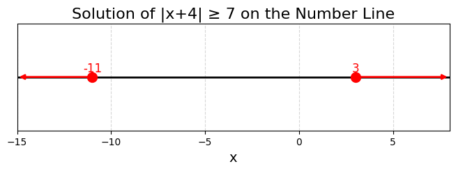
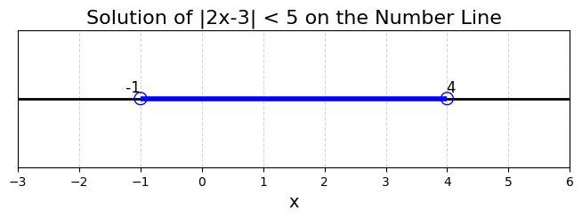

## Solving Inequalities with Absolute Values

Absolute value inequalities require special handling because the absolute value function measures the distance from zero. In other words, for any expression $f(x)$, the absolute value $|f(x)|$ tells us the distance between $f(x)$ and $0$, regardless of the sign of $f(x)$. This concept of distance is central to understanding the solutions to these inequalities.

There are two main forms of absolute value inequalities:

1. Inequalities of the form $$|ax+b| < c$$, where $c > 0$.

2. Inequalities of the form $$|ax+b| > c$$, where $c > 0$.

> Absolute value inequalities can often be rewritten as compound inequalities or as two separate inequalities. They show us all the values that are within a certain distance from a given point.

---

### 1. Solving Inequalities of the Form $|ax+b| < c$

When you have an inequality such as $$|ax+b| < c$$, it means that the expression $ax+b$ is less than $c$ units away from zero. To capture this idea, we can rewrite the inequality as a compound inequality:

$$
-c < ax+b < c
$$

This compound inequality shows that $ax+b$ must lie between $-c$ and $c$, which is equivalent to saying its distance from $0$ is less than $c$.

**Example 1: Solve $|2x-3| < 5$**

**Step 1: Rewrite the inequality**

Replace the absolute value inequality with a compound inequality:

$$
-5 < 2x-3 < 5
$$

**Step 2: Isolate the term with $x$**

Add $3$ to all three parts to move the constant term:

$$
-5 + 3 < 2x-3+3 < 5+3
$$

This simplifies to:

$$
-2 < 2x < 8
$$

**Step 3: Solve for $x$**

Divide each part by $2$ (since $2$ is positive, the direction of the inequalities remains unchanged):

$$
-1 < x < 4
$$

The solution is the set of all $x$ such that $-1 < x < 4$.

**Graphical Representation:**

On a number line, the solution for $|2x-3| < 5$ is shown with open circles at $x = -1$ and $x = 4$, with the portion between them highlighted. This representation helps you visualize that every number between $-1$ and $4$ satisfies the inequality.

---

### 2. Solving Inequalities of the Form $$|ax+b| > c$$

For an inequality like $$|ax + b| > c$$, the expression inside the absolute value must be more than $c$ units away from zero. This situation is represented by two separate conditions, because being far from zero can mean being either smaller than a negative value or larger than a positive value:

$$
ax+b < -c \quad \text{or} \quad ax+b > c
$$

In this case, the solution is the union of the solutions to these two separate inequalities.

**Example 2: Solve $|x+4| \ge 7$**

**Step 1: Break the inequality into two cases**

Since the inequality is under a "greater than or equal to" $(\ge)$ condition, both equality and the greater than condition apply. We split the inequality as follows:

1. $$x+4 \le -7$$

2. $$x+4 \ge 7$$

This approach is based on the idea that $|x+4|$ will be at least $7$ when $x+4$ is $7$ or more units away from $0$ in either direction.

**Step 2: Solve each inequality separately**

For case 1:

$$
\begin{aligned}
 x+4 &\le -7 \\
 x &\le -7-4 \\
 x &\le -11
\end{aligned}
$$

For case 2:

$$
\begin{aligned}
 x+4 &\ge 7 \\
 x &\ge 7-4 \\
 x &\ge 3
\end{aligned}
$$

The solution is all $x$ such that $$x \le -11 \quad \text{or} \quad x \ge 3.$$ This means values less than or equal to $-11$ or greater than or equal to $3$ satisfy the inequality.

**Graphical Representation:**

On a number line, the solution for $|x+4| \ge 7$ is depicted with a closed circle at $x = -11$ (all points to the left are shaded) and a closed circle at $x = 3$ (all points to the right are shaded). This clearly illustrates the two separate intervals where the inequality holds.

---

### 3. Real-World Application

Absolute value inequalities are frequently used to express tolerances and error boundaries in real-world scenarios. For example, consider a machine part that needs to be within $0.5$ mm of a target measurement of $10.0$ mm. The acceptable measurements $m$ can be modeled by the inequality:

$$
|m-10.0| \le 0.5
$$

This inequality states that the measurement $m$ must be no more than $0.5$ mm away from $10.0$ mm.

**Step 1: Rewrite as a compound inequality**

$$
-0.5 \le m-10.0 \le 0.5
$$

**Step 2: Solve for $m$ by adding $10.0$ to all parts**

$$
9.5 \le m \le 10.5
$$

This result indicates that any measurement between $9.5$ mm and $10.5$ mm is acceptable, ensuring the part is within the required tolerance.

---

### 4. Special Considerations

- If $c$ is negative in an inequality such as $$|ax+b| < c$$ or $$|ax+b| \le c$$, there is no solution because an absolute value can never be negative.

- When dealing with $$|ax+b| \ge c$$ and $c$ is negative, the inequality holds for all values of $x$ because the absolute value is always greater than or equal to any negative number.

These special rules help avoid errors when setting up and solving absolute value inequalities.

---

### 5. Summary of Steps

- **Isolate the Absolute Value:** Ensure that the absolute value expression is alone on one side of the inequality.

- **Determine the Form:** Identify whether the inequality is of the form $$|ax+b| < c$$ or $$|ax+b| > c$$.

- **Rewrite Appropriately:**
  - For the form $$|ax+b| < c$$, rewrite it as a compound inequality: $$-c < ax+b < c$$.
  - For the form $$|ax+b| > c$$, split it into two separate inequalities: $$ax+b < -c$$ or $$ax+b > c$$.

- **Solve the Resulting Inequalities:** Solve each inequality for $x$ to find the complete solution set.

By following these steps, you can systematically solve a wide range of inequalities involving absolute values. This method not only aids in solving textbook problems but also applies to real-world scenarios, such as maintaining error tolerances in engineering and quality control in manufacturing.
