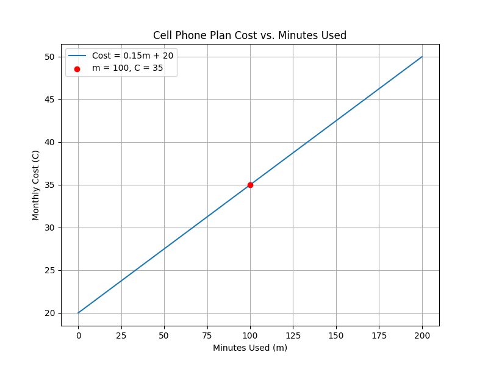
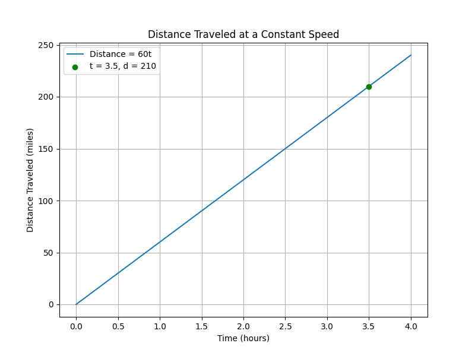
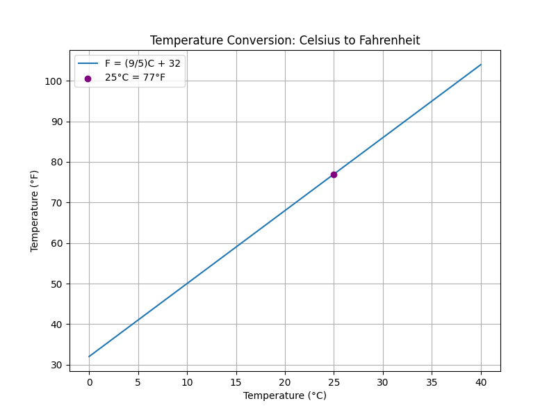

## Applications of Linear Equations in Real Life

Linear equations provide a powerful way to model real-world situations where one quantity changes at a constant rate relative to another. In these examples, we will build and solve equations that represent everyday scenarios. A standard linear equation takes the form

$$
y = mx + b
$$

where:

- $m$ is the slope, indicating the rate at which the dependent variable changes.
- $b$ is the y-intercept, representing the starting or initial value when the independent variable is zero.

Below are three examples that illustrate different applications of linear equations.

### Example 1: Modeling a Cell Phone Plan

Consider a cell phone plan with a fixed monthly fee and a cost per minute used. In this scenario, the plan charges a $20 monthly fee plus $0.15 for every minute of call time. This situation is modeled by the linear equation:

$$
C = 0.15m + 20
$$

Here, $C$ represents the total monthly cost and $m$ is the number of minutes used. The equation is constructed by identifying two parts:

1. The fixed fee: $20$, which does not change with usage.
2. The variable cost: $0.15m$, which increases as more minutes are used.

For instance, if a user talks for $100$ minutes, substitute $m = 100$ into the equation:

$$
C = 0.15(100) + 20
$$

First, calculate the variable portion:

$$
0.15(100) = 15
$$

Then, add the fixed fee:

$$
C = 15 + 20 = 35
$$

Thus, the monthly cost is $35$. This model helps in understanding how costs accumulate with usage and in comparing different plans.

### Example 2: Calculating Distance Traveled at Constant Speed

When an object moves at a constant speed, the distance traveled is directly proportional to the time spent moving. This relationship is described by the formula:

$$
d = vt
$$

where:

- $d$ is the distance traveled,
- $v$ is the constant speed, and
- $t$ is the time elapsed.

For example, if a car travels at $60$ mph, then after $3.5$ hours the distance is:

$$
d = 60(3.5)
$$

Multiplying the speed and time gives:

$$
d = 210
$$

This indicates that the car travels $210$ miles in $3.5$ hours. This linear model is useful for estimating travel distances and planning trips.

### Example 3: Temperature Conversion from Celsius to Fahrenheit

The conversion of temperatures from Celsius to Fahrenheit is a direct application of a linear equation. The conversion formula is:

$$
F = \frac{9}{5}C + 32
$$

In this formula, $C$ represents the temperature in Celsius and $F$ represents the temperature in Fahrenheit. The term $\frac{9}{5}C$ scales the Celsius temperature, and adding $32$ adjusts for the Fahrenheit offset.

For example, to convert $25^\circ C$ to Fahrenheit, substitute $C = 25$:

$$
F = \frac{9}{5}(25) + 32
$$

Begin by multiplying:

$$
\frac{9}{5}(25) = 45
$$

Then add $32$:

$$
F = 45 + 32 = 77
$$

Thus, $25^\circ C$ is equivalent to $77^\circ F$. This conversion is valuable in contexts ranging from weather forecasting to scientific experiments.

> Key Insight: Linear equations offer a systematic way to relate two quantities with a constant rate of change. By breaking down the equation into its components and applying arithmetic operations step by step, you can accurately solve a variety of real-world problems.

Each of the examples above demonstrates a linear relationship where one quantity changes at a constant rate relative to another. Grasping these models is essential for applying algebra to practical scenarios, making them a vital tool in your College Algebra toolkit.