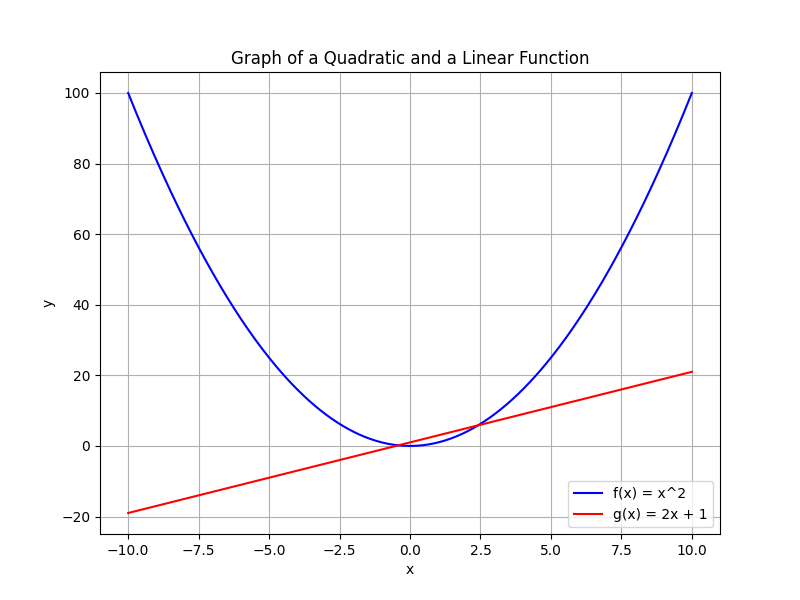

# Functions and Graphing: Exploring Relationships in Algebra

In this unit, you will be introduced to the concept of functions and the art of graphing. A function is a rule that pairs each input with exactly one output. This means that for every value you choose (called the input), the function provides one and only one result. This basic idea is essential in algebra and is the foundation for understanding more complex relationships.

Functions are typically written using the notation $f(x)$, where $f$ represents the function and $x$ represents the input. This notation helps clearly define how inputs are transformed into outputs. For example, the function $f(x)=2x+3$ tells you that for any input $x$, you multiply it by $2$ and then add $3$ to get the output.

Graphing is the process of drawing a function on a coordinate plane. A graph visually represents how the values of the function change with different inputs. This visual aid makes it easier to understand trends, patterns, and behaviors. For instance, a straight line indicates a constant rate of change (as seen in linear functions), while curved lines can represent quadratic or exponential relationships.

Understanding these concepts is important in many real-world situations. Engineers use graphs to design curves and optimize structures, while economists analyze trends in data to make predictions. By learning how to define and graph functions, you build a toolkit for solving practical problems in technology, science, finance, and more.

This unit covers:

- The definition of a function and the use of function notation.
- How to interpret and create graphs that represent functions.
- The importance of understanding function properties such as domain, range, and slope.

By mastering these ideas, you will be able to analyze data and predict outcomes in various professional and everyday contexts. This understanding is crucial as you progress to more advanced topics in mathematics and applications in various fields.

You will learn through clear explanations and step-by-step examples that show exactly how functions work and how their graphs are constructed. With practice, you will be able to model real-life situations and solve problems using these fundamental concepts.

> Functions are the invisible threads of a mathematical narrative; when traced on a graph, they unveil the hidden architecture of relationships.

