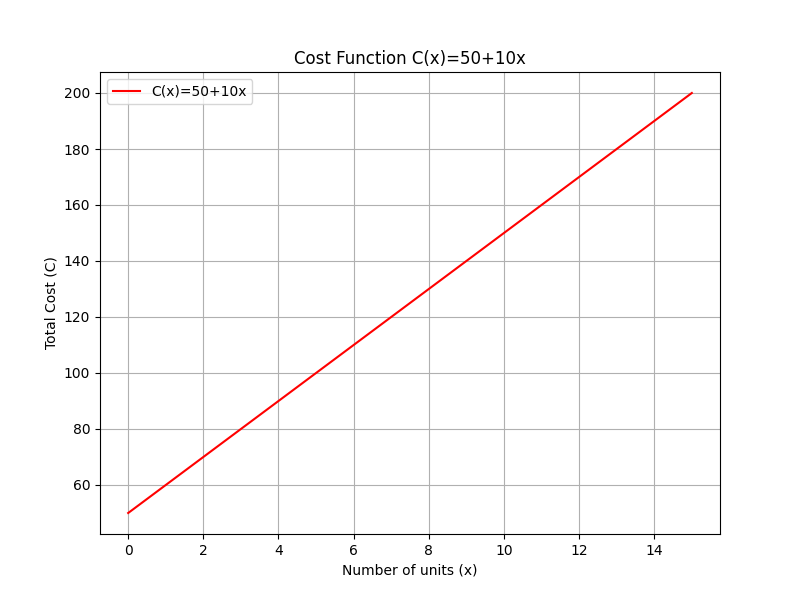
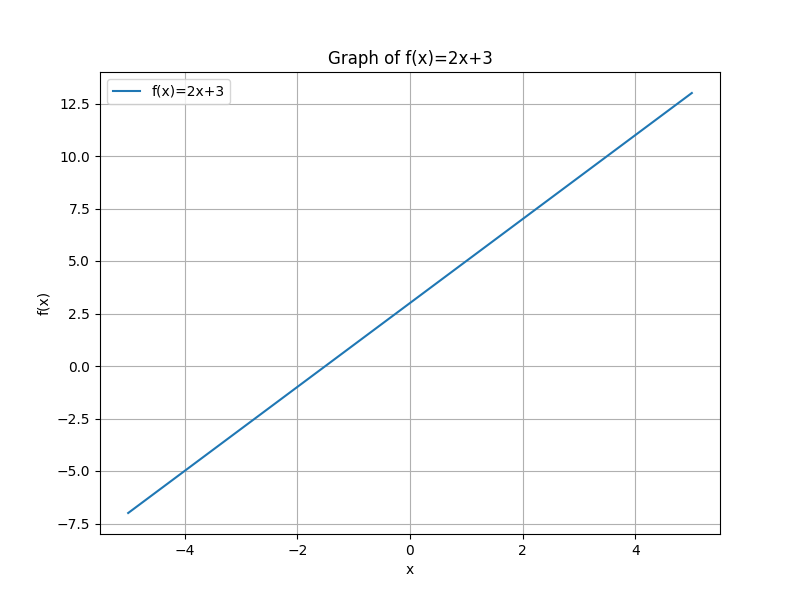

## Defining Functions and Function Notation

A function is a rule that assigns each input exactly one output. In algebra, functions provide a systematic way to relate two quantities where one depends on the other. Understanding functions helps you model real-life situations and solve problems step by step.

> “Pure mathematics is, in its way, the poetry of logical ideas.” – Albert Einstein

### What Is a Function?

A function associates every element in a set, called the $domain$, with one unique element in another set, called the $range$. When you input a value into a function, you receive exactly one corresponding output. This consistent pairing is essential for building reliable mathematical models.

> Intuition: Imagine a vending machine that dispenses a specific snack when you enter a particular code. Each code (input) always produces the same snack (output), ensuring predictability.

### Function Notation

Function notation uses a letter, typically $f$, followed by parentheses. The expression inside the parentheses represents the input value. For example, when we write

$$
f(x) = 2x + 3,
$$

the notation tells us that for every value of $x$, the function multiplies $x$ by 2 and then adds 3 to produce the output. Here:

- $f$ is the name of the function.
- $x$ is the variable representing the input.

This clear format helps distinguish what value is being manipulated and how the output is derived.

### Evaluating a Function

To evaluate a function, substitute a specific number for the variable and simplify the expression. This is similar to following a recipe where you replace a placeholder ingredient with an actual one.

**Example**

Given the function

$$
f(x) = 2x + 3,
$$

evaluate $f(4)$ as follows:

1. Replace $x$ with $4$:

$$
f(4) = 2(4) + 3
$$

2. Multiply $2$ by $4$:

$$
f(4) = 8 + 3
$$

3. Add $8$ and $3$:

$$
f(4) = 11
$$

Thus, when $x = 4$, the function outputs $11$.

### Real-World Application

Consider the cost function

$$
C(x) = 50 + 10x,
$$

where:

- $C(x)$ represents the total cost,
- $50$ is the fixed cost, and
- $10x$ is the variable cost, which changes with the number of units produced, $x$.

If a company produces 7 units, the total cost is computed as follows:

$$
C(7) = 50 + 10(7) = 50 + 70 = 120.
$$

This function is useful for predicting and managing production costs in real-world business scenarios.

### Key Vocabulary

- **Domain:** The set of all possible input values for the function.
- **Range:** The set of all possible output values for the function.
- **Function Notation:** A method of representing functions, such as $f(x)$, that clearly shows the relationship between inputs and outputs.

Understanding these terms is critical for solving equations and applying algebra in real-life contexts.

### Input-Output Table Example

The table below lists several values of $x$ and their corresponding outputs for the function

$$
f(x) = 2x + 3:
$$

| $x$ | $f(x)$ |
|-----|--------|
| 0   | 3      |
| 1   | 5      |
| 2   | 7      |
| 3   | 9      |
| 4   | 11     |

This table shows how each input value $x$ is paired with one unique output $f(x)$, reinforcing the definition of a function.

> Intuition: Think of the table as a lookup chart where every input has a predetermined output. This organized structure helps highlight the consistent and predictable nature of functions.