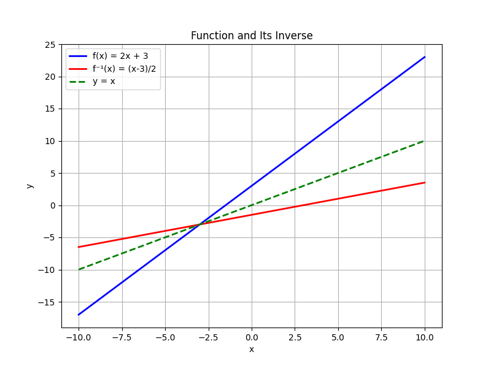
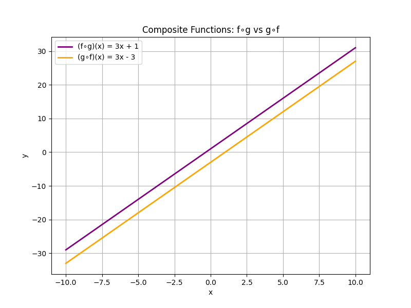

## Inverse Functions and Composite Functions

This lesson covers two important types of functions: inverse functions and composite functions. Both concepts are used to reverse operations or combine processes, which is useful in many real-world scenarios such as converting units or layering operations in engineering calculations.

### Inverse Functions

An inverse function reverses the effect of the original function. If a function $f$ maps an input $x$ to an output $y$, then the inverse function, denoted by $f^{-1}$, maps $y$ back to $x$. In mathematical terms, if

$$
f(x) = y,
$$

then the inverse function satisfies

$$
f^{-1}(y) = x.
$$

For a function to have an inverse, it must be one-to-one, meaning that each output is paired with exactly one input.

#### Finding the Inverse Function

To find the inverse of a function, follow these steps:

1. Replace $f(x)$ with $y$. 
2. Solve the equation for $x$ in terms of $y$.
3. Swap $x$ and $y$. 
4. The resulting expression is $f^{-1}(x)$.

##### Example: Find the Inverse of $f(x)=2x+3$

Step 1: Write the function using $y$:

$$
y=2x+3
$$

Step 2: Solve for $x$:

$$
2x=y-3\
x=\frac{y-3}{2}
$$

Step 3: Swap $x$ and $y$:

$$
y=\frac{x-3}{2}
$$

Thus, the inverse function is

$$
f^{-1}(x)=\frac{x-3}{2}
$$

To verify, compose the functions:

$$
f(f^{-1}(x))=2\left(\frac{x-3}{2}\right)+3=x-3+3=x
$$

This confirms that $f^{-1}(x)$ is correct.

### Composite Functions

Composite functions combine two functions into one. The composition of $f$ and $g$, denoted by $(f \circ g)(x)$, means you first apply $g(x)$ and then apply $f$ to the result. In formula form:

$$
(f \circ g)(x)=f(g(x))
$$

It is important to note that function composition is not necessarily commutative; in general, $f(g(x))\neq g(f(x))$.

#### Example: Composing Two Functions

Consider the functions:

$$
f(x)=3x-5
$$

and

$$
g(x)=x+2
$$

Find $(f \circ g)(x)$ and $(g \circ f)(x)$.

Step 1: Compute $(f \circ g)(x)=f(g(x))$:

$$
\begin{aligned}
f(g(x))&=3(g(x))-5 \\
&=3(x+2)-5 \\
&=3x+6-5 \\
&=3x+1
\end{aligned}
$$

Step 2: Compute $(g \circ f)(x)=g(f(x))$:

$$
\begin{aligned}
g(f(x))&=f(x)+2 \\
&=(3x-5)+2 \\
&=3x-3
\end{aligned}
$$

Observe that $(f \circ g)(x)=3x+1$ and $(g \circ f)(x)=3x-3$, which are not the same.

### Inverse and Composite Functions Relationship

A key property of inverse functions is their ability to 'cancel out' the original function. If $f$ and $f^{-1}$ are inverse functions, then:

$$
f(f^{-1}(x))=x \quad \text{and} \quad f^{-1}(f(x))=x
$$

This means that composing a function with its inverse returns the original input. This property is useful in problem-solving when you need to undo an operation.

### Real-World Applications

- In engineering, inverse functions are used to reverse processes. For example, converting a measured sensor value back to a physical quantity often requires an inverse function.
- In computer graphics, composite functions are used to apply successive transformations to shapes.
- In finance, converting between currencies or scaling investments often uses inverse functions to retrieve original amounts after adjustments.

This lesson has outlined the step-by-step process of finding inverse functions and composing functions with detailed examples. Understanding these concepts is essential for solving a wide range of algebraic problems encountered in both academic tests and real-world applications.