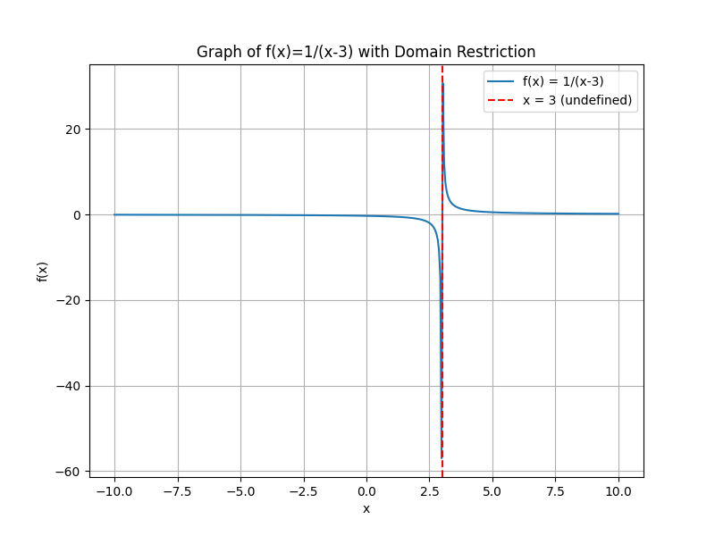
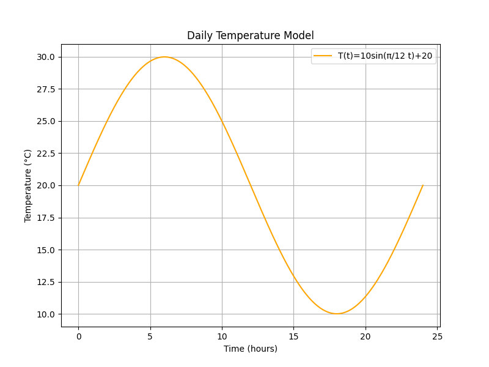

## Lesson: Domain and Range of Functions

The domain and range of a function are two key concepts that describe the set of input and output values, respectively. Understanding these sets is crucial for analyzing functions and solving problems in algebra.

### Definitions

- The **domain** of a function is the set of all possible values of $x$ for which the function is defined. It represents the inputs to the function.

- The **range** of a function is the set of all possible outputs or $y$-values that the function can produce as $x$ varies over the domain.

> Knowing the domain and range helps determine what values a function can accept and produce.

### Determining the Domain

To find the domain of a function:

1. **Identify restrictions:** Look for operations that may limit the values of $x$, such as division by zero or even roots of negative numbers.

2. **Set conditions:** Write conditions that $x$ must satisfy to avoid undefined operations.

3. **Express the domain:** Use interval notation or set-builder notation to clearly state the allowed values of $x$.

#### Example 1: Rational Function

Consider the function:

$$
f(x)=\frac{1}{x-3}.
$$

The function is undefined when the denominator is zero. Set up the restriction:

$$
x-3 \neq 0 \quad\Longrightarrow\quad x \neq 3.
$$

Thus, the domain is:

$$
(-\infty,3)\cup(3,\infty).
$$

#### Example 2: Square Root Function

Consider the function:

$$
g(x)=\sqrt{x-2}.
$$

The expression under the square root must be non-negative:

$$
x-2 \geq 0 \quad\Longrightarrow\quad x \geq 2.
$$

So, the domain is:

$$
[2,\infty).
$$

### Determining the Range

Finding the range of a function can be more challenging than finding the domain. Consider these steps:

1. **Analyze the function's behavior:** Determine how $y$ changes as $x$ varies over the domain.

2. **Invert the relationship if possible:** Solve the equation $y=f(x)$ for $x$. Identify which $y$ values yield valid $x$ values in the domain.

3. **Express the range:** Use interval notation or set-builder notation to indicate the possible $y$ values.

#### Example 3: Quadratic Function

Consider the function:

$$
h(x)=x^2.
$$

- **Domain:** There are no restrictions, so the domain is $(-\infty,\infty)$.

- **Range:** Since squaring any real number yields a non-negative result, the range is:

$$
[0,\infty).
$$

#### Example 4: Transformed Square Root Function

Consider the function:

$$
k(x)=2\sqrt{x-2}+3.
$$

- **Domain:** The expression under the square root must be non-negative: $x-2 \geq 0 \Rightarrow x \geq 2$, so the domain is $[2,\infty)$.

- **Range:** The basic square root function $\sqrt{x-2}$ produces outputs in $[0,\infty)$. Multiplying by $2$ stretches the output and then adding $3$ shifts it upward. Thus, the minimum value occurs at $x=2$:

$$
k(2)=2\sqrt{2-2}+3=3.
$$

The range is:

$$
[3,\infty).
$$

### Graphical Interpretation

When graphing a function, it is helpful to visually represent the domain and range:

- **Domain:** Mark a horizontal number line and indicate the $x$ values where the function exists. For example, for $f(x)=\frac{1}{x-3}$, place an open circle at $x=3$ to show that this value is excluded.

- **Range:** Plot the function on the coordinate plane and observe the spread of $y$-values. For $h(x)=x^2$, you will notice that the graph only covers $y$ values from $0$ upwards.

> Visualizing functions on a graph aids in comprehending the domain and range by clearly showing the behavior of the function.

### Real-World Application: Modeling Temperature

Imagine a function that represents the temperature $T$ (in degrees Celsius) over a day:

$$
T(t)=10\sin\left(\frac{\pi}{12}t\right)+20,
$$

where $t$ is the time in hours. Here:

- **Domain:** Since $t$ represents time over a 24-hour period, the domain is $[0,24]$.

- **Range:** The sine function outputs values between $-1$ and $1$. After scaling and shifting:

$$
\text{Minimum: } 10(-1)+20=10, \quad \text{Maximum: } 10(1)+20=30.
$$

So, the range is:

$$
[10,30].
$$

This model helps in predicting temperature variations during the day while considering realistic input constraints.

### Summary of Key Points

- The domain is the set of all valid input values, while the range is the set of possible output values.

- Determine the domain by avoiding values that lead to division by zero or negative values under even roots.

- Find the range by analyzing how the function transforms input values and, when feasible, inverting the function.

A clear grasp of these concepts enables accurate analysis of functions in both theoretical and applied contexts.