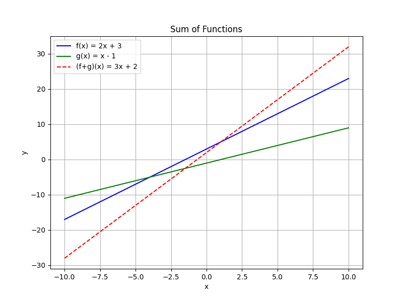
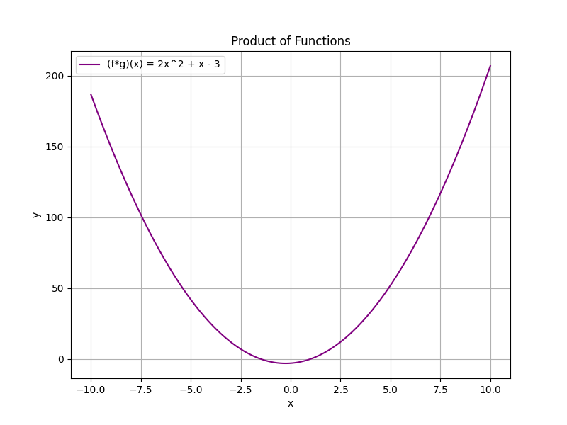
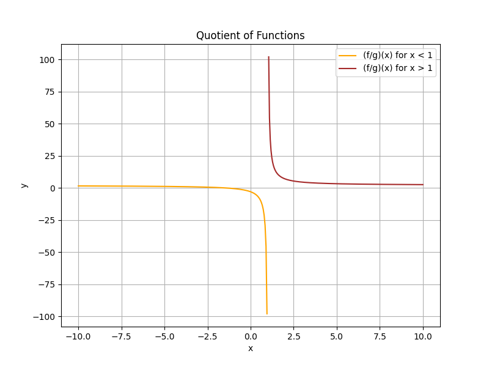

## Algebra of Functions: Sums, Products, and Quotients

In this lesson, we explore how to combine functions using basic algebraic operations. We will define the sum, product, and quotient of functions and provide detailed, step-by-step examples. These operations are foundational for understanding how functions can be manipulated to model real-world phenomena.

### Sums of Functions

When adding two functions, the sum function is defined as:

$$
(f+g)(x)=f(x)+g(x)
$$

The domain of the sum is the intersection of the domains of the individual functions. This operation is often used when combining different effects in a single model, such as total cost from different sources.

**Example:**

Let

$$
f(x)=2x+3 \quad\text{and}\quad g(x)=x-1.
$$

Then the sum function is

$$
(f+g)(x)=(2x+3)+(x-1)=3x+2.
$$

### Products of Functions

The product of two functions is given by multiplying the functions together:

$$
(f\cdot g)(x)=f(x)\cdot g(x).
$$

Again, the domain is the intersection of the domains of $f(x)$ and $g(x)$. Multiplying functions is useful, for instance, in calculating areas or combining rates of change.

**Example:**

Using the same functions:

$$
f(x)=2x+3 \quad\text{and}\quad g(x)=x-1,
$$

compute the product function:

$$
(f\cdot g)(x)=(2x+3)(x-1).
$$

Expanding, we apply the distributive property:

$$
\begin{aligned}
(2x+3)(x-1)&=2x\cdot x+2x\cdot(-1)+3\cdot x+3\cdot(-1)\\
&=2x^2 -2x+3x-3\\
&=2x^2 + x - 3.
\end{aligned}
$$

### Quotients of Functions

The quotient of two functions is defined by dividing one function by the other:

$$
\left(\frac{f}{g}\right)(x)=\frac{f(x)}{g(x)}, \quad \text{provided that } g(x)\neq 0.
$$

The domain of the quotient consists of those values that are in the domains of both functions but exclude values where $g(x)=0$. This operation is common when determining ratios, like speed (distance/time) or efficiency.

**Example:**

Again, let

$$
f(x)=2x+3 \quad\text{and}\quad g(x)=x-1.
$$

Then the quotient function is

$$
\left(\frac{f}{g}\right)(x)=\frac{2x+3}{x-1}, \quad \text{with } x\neq1.
$$

Always check the domain of the quotient; here, the expression is undefined when $x=1$.

### Domain Considerations

For all operations involving functions:

- **Sum and Product:** The domain is the set of all $x$ values common to both functions.
- **Quotient:** In addition to sharing the common domain, exclude any $x$ such that $g(x)=0$.

This careful consideration of domains ensures that any model or equation you set up is valid under the conditions given.

### Real-World Application

Imagine a scenario in sports analytics where $f(x)$ represents the number of successful field goals in $x$ games and $g(x)$ represents the number of attempts. The sum function could model the total successes when combining contributions from two different players. The product might be used in a simulation model where combined effects are multiplicative, and the quotient function can provide the average success rate per game. 

By understanding these fundamental operations on functions, you can build more complex models and analyze relationships between different variables in a systematic way.

> A function is like a machine: it takes an input, processes it, and produces an output. Approach each operation methodically to truly understand how these transformations work.