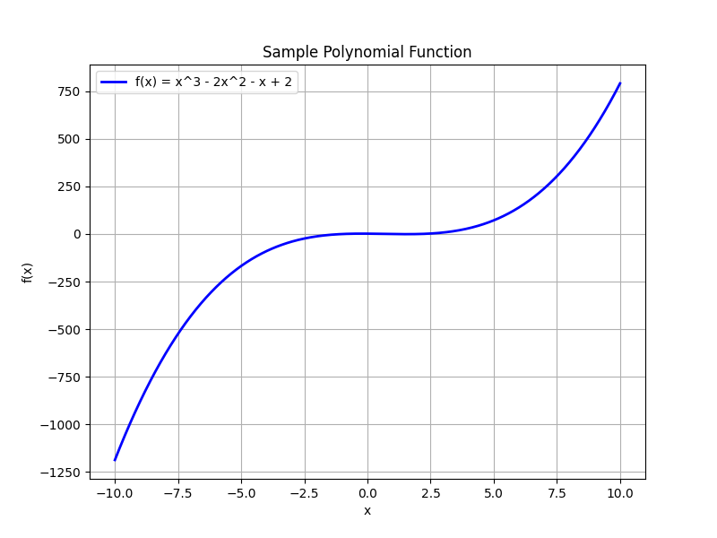

# Polynomial Functions and Operations

This unit introduces polynomial functions and explains the operations used to work with them. It covers what polynomial functions are, why they are essential in algebra, and how to perform operations such as addition, subtraction, multiplication, and division of polynomials.

A polynomial is an expression consisting of terms in the form $a_nx^n$, where $a_n$ is a coefficient and $n$ is a nonnegative integer. The terms are combined using addition or subtraction. For example, the expression

$$
f(x)=2x^3-5x^2+3x-7
$$

is a polynomial of degree 3.

Understanding polynomial functions helps you break down complex expressions into simpler parts. This ability is crucial for solving equations, analyzing data trends, and modeling real-world situations. For instance, in financial calculations a polynomial can model compound interest; in engineering it may represent stress distributions; and in sports analytics it can help predict performance over time.

Operations with polynomials follow specific rules:

- **Addition and Subtraction:** Combine like terms by adding or subtracting their coefficients. For example, adding

$$
(3x^2+4x+5)+(2x^2-x+1)
$$

yields

$$
5x^2+3x+6
$$

- **Multiplication:** Multiply each term in one polynomial by every term in the other. For example, multiplying

$$
(x+2)(x^2-x+3)
$$

involves distributing each term to form a new polynomial. This process is useful for expanding expressions and simplifying equations.

- **Division:** Dividing polynomials, whether by long division or synthetic division, simplifies expressions and helps find factors or roots. For example, dividing a polynomial $P(x)$ by $(x-r)$ can determine if $r$ is a root of $P(x)=0$.

By mastering these operations, you gain the tools necessary to analyze and solve a variety of algebraic problems. The techniques not only assist in factoring and solving equations, but also lay the foundation for more advanced topics in algebra.

> "Mathematics is the language with which God has written the universe."
>
> - Galileo Galilei