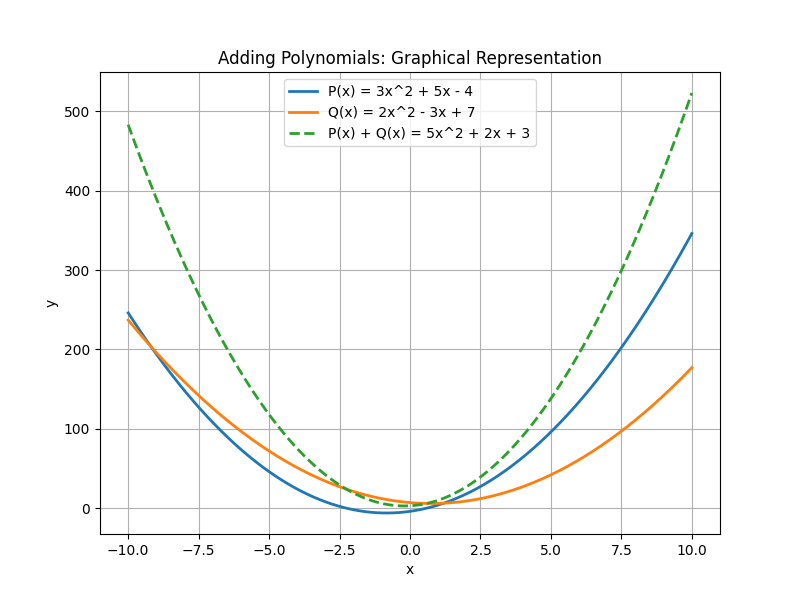
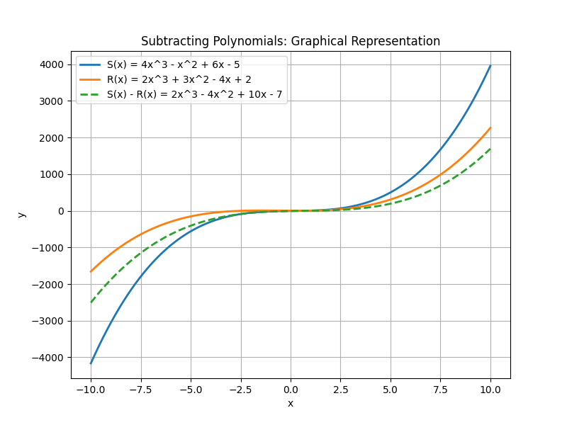

## Adding and Subtracting Polynomials

In this lesson, we will learn how to add and subtract polynomials by combining like terms. Like terms are terms that have the same variable raised to the same power. This process is similar to combining similar items in real-world situations, such as combining expenses from different sources or aggregating scores from multiple games.

### Identifying Like Terms

For polynomials, like terms have identical variable parts. For example, in the polynomial

$$
3x^2 + 5x - 4
$$

- The term $3x^2$ can only be combined with another $x^2$ term.
- The term $5x$ can only be combined with another $x$ term.
- The constant $-4$ can only be combined with other constants.

### Steps for Adding and Subtracting Polynomials

1. Rewrite each polynomial so that like terms line up in descending order by degree.
2. If a term is missing in one polynomial, imagine it with a coefficient of zero.
3. Combine the like terms by adding or subtracting their coefficients.
4. Write the result starting with the highest degree term.

### Example 1: Adding Polynomials

**Problem:** Add the polynomials

$$
P(x) = 3x^2 + 5x - 4
$$

and

$$
Q(x) = 2x^2 - 3x + 7
$$

**Solution:**

1. Write the polynomials so that like terms are aligned:

$$
\begin{array}{rcrcr}
  3x^2 &+& 5x &-& 4 \\
+\;2x^2 &-& 3x &+& 7 \\
\end{array}
$$

2. Combine the like terms:

- $x^2$ terms: $3x^2 + 2x^2 = 5x^2$
- $x$ terms: $5x + (-3x) = 2x$
- Constants: $-4 + 7 = 3$

3. Write the final polynomial:

$$
5x^2 + 2x + 3
$$

### Example 2: Subtracting Polynomials

**Problem:** Subtract the polynomial

$$
R(x) = 2x^3 + 3x^2 - 4x + 2
$$

from

$$
S(x) = 4x^3 - x^2 + 6x - 5
$$

That is, evaluate

$$
S(x) - R(x).
$$

**Solution:**

1. Write the subtraction problem by distributing the negative sign:

$$
4x^3 - x^2 + 6x - 5 \; - \; \Bigl(2x^3 + 3x^2 - 4x + 2\Bigr)
$$

2. Remove the parentheses, taking care to change the signs of the second polynomial:

$$
4x^3 - x^2 + 6x - 5 - 2x^3 - 3x^2 + 4x - 2
$$

3. Combine like terms:

- $x^3$ terms: $4x^3 - 2x^3 = 2x^3$
- $x^2$ terms: $-x^2 - 3x^2 = -4x^2$
- $x$ terms: $6x + 4x = 10x$
- Constant terms: $-5 - 2 = -7$

4. Write the final result:

$$
2x^3 - 4x^2 + 10x - 7
$$

### Real-World Application

Consider a scenario where a business tracks monthly changes in revenue. One department has a revenue change modeled by

$$
R_1(x) = 3x^2 + 5x - 4,
$$

and another department has

$$
R_2(x) = 2x^2 - 3x + 7.
$$

Adding these functions gives the total change:

$$
R(x) = R_1(x) + R_2(x) = 5x^2 + 2x + 3.
$$

This combined polynomial can be used to analyze overall performance.

### Practice with Negative Coefficients

When subtracting polynomials, the negative sign must be distributed to each term in the polynomial being subtracted. This ensures accurate combination of like terms. Always double-check your sign changes during the process.

By following these systematic steps, you can confidently add and subtract any polynomials, which is a fundamental skill for more advanced algebra topics.