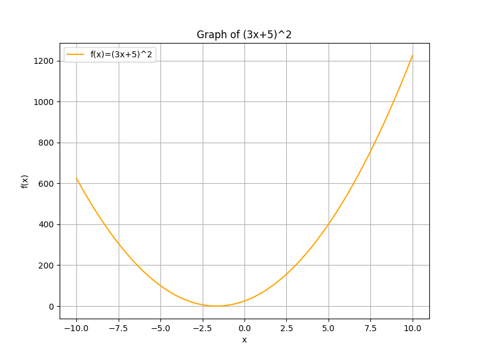

## Multiplying Polynomials and Special Products

In this lesson, we learn how to multiply polynomials and recognize special products. Multiplying polynomials uses the distributive property to multiply every term in one polynomial by each term in the other, and then combining like terms. Special products are common patterns, especially when working with binomials, that allow for faster expansion of expressions. These techniques are essential for simplifying complex algebraic expressions often encountered on the College Algebra CLEP exam.

### Multiplying Polynomials

To multiply two polynomials, use the distributive property. This means you multiply each term in the first polynomial by every term in the second polynomial. Then, you add the resulting products by combining like terms (terms with the same variable raised to the same power). This step-by-step process ensures every product is calculated and correctly simplified.

For example, consider the multiplication of two binomials:

$$
(2x + 3)(x + 4)
$$

**Step 1:** Multiply the first term in the first binomial by each term in the second binomial:

$$
2x \cdot x = 2x^2
$$

$$
2x \cdot 4 = 8x
$$

**Step 2:** Multiply the second term in the first binomial by each term in the second binomial:

$$
3 \cdot x = 3x
$$

$$
3 \cdot 4 = 12
$$

**Step 3:** Combine the like terms from the two steps:

$$
2x^2 + 8x + 3x + 12 \quad \Longrightarrow \quad 2x^2 + 11x + 12
$$

This example shows that by systematically applying the distributive property, you can simplify the product into a single polynomial.

This method works for polynomials of any size. For instance, when multiplying a trinomial by a binomial such as:

$$
(x^2 + 2x + 3)(x + 4)
$$

Follow these steps:

1. **Multiply $x^2$ by each term in $(x+4)$:**

   $$
   x^2 \cdot x = x^3 \quad \text{and} \quad x^2 \cdot 4 = 4x^2
   $$

2. **Multiply $2x$ by each term in $(x+4)$:**

   $$
   2x \cdot x = 2x^2 \quad \text{and} \quad 2x \cdot 4 = 8x
   $$

3. **Multiply $3$ by each term in $(x+4)$:**

   $$
   3 \cdot x = 3x \quad \text{and} \quad 3 \cdot 4 = 12
   $$

Finally, add all the terms:

$$
\begin{aligned}
x^3 &+ (4x^2 + 2x^2) \\
&+ (8x + 3x) + 12 \\
&= x^3 + 6x^2 + 11x + 12
\end{aligned}
$$

Each multiplication and addition step reinforces the idea of systematically breaking down the problem.

### Special Products

Recognizing special product formulas can simplify expansion, reduce errors, and speed up calculations. These formulas arise from common patterns in binomial multiplication.

> **Square of a Binomial:**
>
> $$
> (a+b)^2 = a^2 + 2ab + b^2
> $$
>
> $$
> (a-b)^2 = a^2 - 2ab + b^2
> $$

> **Difference of Squares:**
>
> $$
> (a+b)(a-b) = a^2 - b^2
> $$

Understanding these templates helps in recognizing when a polynomial fits a special product pattern, which is useful in both simplifying expressions and solving equations quickly.

#### Example 1: Square of a Binomial

Expand the expression:

$$
(3x + 5)^2
$$

According to the square of a binomial formula:

$$
(3x + 5)^2 = (3x)^2 + 2(3x)(5) + (5)^2
$$

Breakdown:

- $$ (3x)^2 = 9x^2 $$
- $$ 2(3x)(5) = 30x $$
- $$ (5)^2 = 25 $$

Thus, the expanded form is:

$$
9x^2 + 30x + 25
$$

This example illustrates how special products reduce the number of steps compared to multiplying each term individually.

#### Example 2: Difference of Squares

Expand the expression:

$$
(x + 7)(x - 7)
$$

Using the difference of squares formula:

$$
(x + 7)(x - 7) = x^2 - 7^2
$$

Simplify the square:

$$
x^2 - 49
$$

This shortcut is especially useful in problems that require quick manipulation of algebraic expressions, such as in engineering calculations or financial models where time is critical.

### Application in Real World Context

In sports analytics, a team’s score difference in a game might be modeled by a binomial expression. Multiplying two such expressions can provide insights into combined performance measures over several games. For example, if one game’s score difference is represented by $(2x+3)$ and another by $(x+4)$, then multiplying these gives:

$$
(2x + 3)(x + 4) = 2x^2 + 11x + 12
$$

Each term in the expanded expression may represent different factors such as offensive efficiency, defensive performance, or special teams contributions. This structured approach helps in understanding how individual components combine to affect overall performance.

### Summary of Steps

1. Multiply each term in the first polynomial by every term in the second.
2. Apply the distributive property in a systematic manner.
3. Combine like terms to simplify the expression.
4. Recognize and use special product formulas to speed up calculations.

Mastering these techniques deepens your understanding of algebraic relationships and builds a strong foundation for advanced problems encountered on the CLEP exam.
