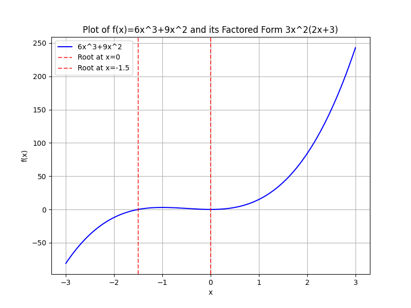

## Factoring Polynomials and Common Factors

In this lesson, we focus on factoring polynomials by first identifying and extracting common factors. Factoring is the process of rewriting a polynomial as a product of simpler expressions. This technique is crucial for solving equations and simplifying algebraic expressions in applications such as engineering calculations and financial modeling.

### Understanding Common Factors

A common factor is a number, variable, or expression that divides each term of a polynomial without leaving a remainder. Finding the greatest common factor (GCF) allows you to break a complex expression into simpler pieces. This step not only simplifies calculations but also builds a clearer understanding of the structure within a polynomial.

> The greatest common factor (GCF) of two or more terms is the largest expression that divides each term exactly.

### Steps to Factor Out the GCF

1. **Identify the GCF for the coefficients:** Look at the numerical parts of each term and determine the largest number that divides them evenly.

2. **Identify the common variables:** For each variable present in every term, take the smallest exponent common to all terms.

3. **Extract the GCF:** Rewrite the polynomial as the product of the GCF and the resulting simplified polynomial.

This approach helps you see the underlying components of an expression, transforming a sum into a product of factors.

### Example 1: Factoring a Basic Polynomial

Factor the polynomial:

$$
6x^3 + 9x^2
$$

**Step 1: Find the GCF of 6 and 9.**

The GCF of the numbers 6 and 9 is 3.

**Step 2: Look at the variable part.**

Both terms include at least $x^2$. Hence, the common variable factor is $x^2$.

**Step 3: Factor out the GCF.**

Combine the numerical and variable factors to get $3x^2$. Divide each term by $3x^2$:

$$
\frac{6x^3}{3x^2} = 2x, \quad \frac{9x^2}{3x^2} = 3.
$$

Thus, the factored form is:

$$
6x^3 + 9x^2 = 3x^2(2x + 3).
$$

This factorization shows that the structure of the polynomial is built upon its common components.

### Example 2: Factoring a Polynomial with Multiple Variables

Consider the polynomial:

$$
12xy^2 + 18x^2y
$$

**Step 1: Identify the GCF of the coefficients.**

The numbers 12 and 18 have a GCF of 6.

**Step 2: Determine the common variable factors.**

Both terms contain the variables $x$ and $y$. For $x$, use the smallest power, $x$, and for $y$, use the smallest power which is $y$.

**Step 3: Factor out the GCF.**

The common factor is $6xy$. Dividing each term by $6xy$ gives:

$$
\frac{12xy^2}{6xy} = 2y, \quad \frac{18x^2y}{6xy} = 3x.
$$

So, the polynomial factors as:

$$
12xy^2 + 18x^2y = 6xy(2y + 3x).
$$

This method illustrates how common elements in multi-variable expressions can be extracted to simplify the overall structure.

### Example 3: Factoring by Grouping

Sometimes a polynomial does not have a single common factor across all terms but can be factored by grouping. Consider the polynomial:

$$
ax + ay + bx + by
$$

**Step 1: Group the terms with common factors.**

Group the expression as follows:

$$
(ax + ay) + (bx + by).
$$

**Step 2: Factor out common factors in each group.**

From the first group $ax + ay$, factor out $a$:

$$
a(x + y).
$$

From the second group $bx + by$, factor out $b$:

$$
b(x + y).
$$

Now, the expression becomes:

$$
a(x + y) + b(x + y).
$$

**Step 3: Factor out the common binomial $(x + y)$.**

$$
(x + y)(a + b).
$$

Thus, the factored form is:

$$
ax + ay + bx + by = (x + y)(a + b).
$$

This example demonstrates how grouping terms reveals hidden structures in a polynomial.

### Real-World Connection

Factoring is not only applied in mathematics but also in solving practical problems. For instance, in sports analytics, a polynomial may represent the score difference over time. Factoring helps identify key moments, such as when a game reaches a tie. In engineering, the process simplifies complex formulas, making it easier to solve for unknown variables during design calculations.

### Practice Tips

- Always start by looking for the greatest common factor.

- When no overall common factor exists, consider grouping terms to find factorable patterns.

- Verify your work by multiplying the factored terms to ensure the original polynomial is obtained.

By systematically applying these steps, you convert challenging expressions into simpler components, which can greatly ease subsequent problem-solving tasks and enhance your overall understanding of algebraic structures.