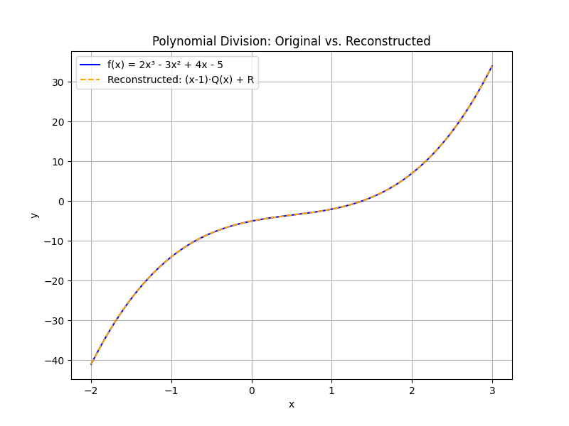

## Polynomial Division and Synthetic Division

Polynomial division is a method for dividing a polynomial by another polynomial of a lower degree. It is similar to the long division algorithm used with numbers. In many cases, synthetic division provides a shortcut when dividing by a linear factor of the form $x - c$.

### Polynomial Long Division

Polynomial long division follows these steps:

1. Divide the first term of the dividend by the first term of the divisor. This gives the first term of the quotient.

2. Multiply the entire divisor by that term and subtract the result from the dividend.

3. Bring down the next term from the original dividend to form a new sub-dividend.

4. Repeat the process until all terms have been brought down. The final answer has a quotient and, if not divisible exactly, a remainder.

#### Step-by-Step Example of Long Division

Divide $$2x^3 - 3x^2 + 4x - 5$$ by $$x - 1$$.

1. Divide the leading term: $$\frac{2x^3}{x} = 2x^2$$. Write $$2x^2$$ above the division bar.

2. Multiply $$2x^2$$ by the divisor $$x - 1$$ to get $$2x^3 - 2x^2$$.

3. Subtract this product from the original polynomial:

$$
\begin{array}{r@{}r@{}r@{}r}
      & 2x^3 & -3x^2 & +4x - 5 \\
-\, ( & 2x^3 & -2x^2 & ) \\
\hline
      & 0    & -x^2 & +4x - 5 \\
\end{array}
$$

4. Bring down the next term. The new polynomial is $$-x^2 + 4x$$.

5. Divide $$-x^2$$ by $$x$$ to get $$-x$$. Write this above the bar next to $$2x^2$$.

6. Multiply $$-x$$ by $$x - 1$$ to obtain $$-x^2 + x$$.

7. Subtract this product from the current polynomial:

$$
\begin{array}{r@{}r@{}r}
      & -x^2 & +4x \\
-\, ( & -x^2 & + x ) \\
\hline
      & 0    & +3x \\
\end{array}
$$

8. Bring down the remaining term, $$-5$$, to get $$3x - 5$$.

9. Divide $$3x$$ by $$x$$ to get $$3$$ and place it in the quotient.

10. Multiply $$3$$ by the divisor $$x - 1$$ to get $$3x - 3$$.

11. Subtract this from $$3x -5$$:

$$
\begin{array}{r@{}r}
      & 3x - 5 \\
-\, ( & 3x - 3 ) \\
\hline
      & -2 \\
\end{array}
$$

The quotient is $$2x^2 - x + 3$$ and the remainder is $$-2$$. We can express the result as:

$$
\frac{2x^3 - 3x^2 + 4x - 5}{x - 1} = 2x^2 - x + 3 - \frac{2}{x - 1}
$$

### Synthetic Division

Synthetic division is a shortcut method used when dividing by a linear factor of the form $$x - c$$. Only the coefficients of the polynomial are used in synthetic division.

The steps for synthetic division are:

1. Identify $$c$$ from the divisor $$x - c$$.

2. Write the coefficients of the dividend in order. If any power is missing, use 0 as its coefficient.

3. Bring down the first coefficient to the bottom row.

4. Multiply this number by $$c$$ and write the result under the second coefficient.

5. Add the second coefficient and the product, writing the result in the bottom row.

6. Continue the process for all coefficients. The final number in the bottom row is the remainder.

#### Step-by-Step Example of Synthetic Division

We will use synthetic division on the same problem: Divide $$2x^3 - 3x^2 + 4x - 5$$ by $$x - 1$$. Here, $$c = 1$$.

1. Write the coefficients: 2, -3, 4, -5.

2. Set up the synthetic division:

$$
\begin{array}{c|cccc}
  1 & 2 & -3 & 4 & -5 \\
    &   &    &   &    \\
\hline
    &   &    &   &    \\
\end{array}
$$

3. Bring down the first coefficient (2):

$$
\begin{array}{c|cccc}
  1 & 2 & -3 & 4 & -5 \\
    &   &    &   &    \\
\hline
    & 2 &    &   &    \\
\end{array}
$$

4. Multiply 2 by $$c=1$$ to get 2. Write this under the second coefficient:

$$
\begin{array}{c|cccc}
  1 & 2 & -3 & 4 & -5 \\
    &   & 2  &   &    \\
\hline
    & 2 &    &   &    \\
\end{array}
$$

5. Add the second coefficient and 2: $$-3 + 2 = -1$$.

$$
\begin{array}{c|cccc}
  1 & 2 & -3 & 4 & -5 \\
    &   & 2  &   &    \\
\hline
    & 2 & -1 &   &    \\
\end{array}
$$

6. Multiply $$-1$$ by 1 to get $$-1$$ and write it under the third coefficient:

$$
\begin{array}{c|cccc}
  1 & 2 & -3 & 4 & -5 \\
    &   & 2  & -1 &    \\
\hline
    & 2 & -1 &   &    \\
\end{array}
$$

7. Add the third coefficient and $$-1$$: $$4 + (-1) = 3$$.

$$
\begin{array}{c|cccc}
  1 & 2 & -3 & 4 & -5 \\
    &   & 2  & -1 &    \\
\hline
    & 2 & -1 & 3 &    \\
\end{array}
$$

8. Multiply 3 by 1 to get 3. Write it under the fourth coefficient:

$$
\begin{array}{c|cccc}
  1 & 2 & -3 & 4 & -5 \\
    &   & 2  & -1 & 3  \\
\hline
    & 2 & -1 & 3 &    \\
\end{array}
$$

9. Add the fourth coefficient and 3: $$-5 + 3 = -2$$.

$$
\begin{array}{c|cccc}
  1 & 2 & -3 & 4 & -5 \\
    &   & 2  & -1 & 3  \\
\hline
    & 2 & -1 & 3 & -2 \\
\end{array}
$$

The bottom row (except the last number) represents the coefficients of the quotient polynomial, and the last number is the remainder. The quotient is $$2x^2 - x + 3$$ and the remainder is $$-2$$.

We write the final answer as:

$$
\frac{2x^3 - 3x^2 + 4x - 5}{x - 1} = 2x^2 - x + 3 - \frac{2}{x - 1}
$$

### Applications and Key Points

> Polynomial division is essential in algebra for simplifying complex rational expressions and solving higher degree equations. Synthetic division speeds up the process when the divisor is linear.

Both methods are valuable. Use long division for any divisor and synthetic division when applicable.

Understanding these techniques is vital in many fields including engineering, economics, and statistics, where modeling and simplifying polynomial functions are necessary.