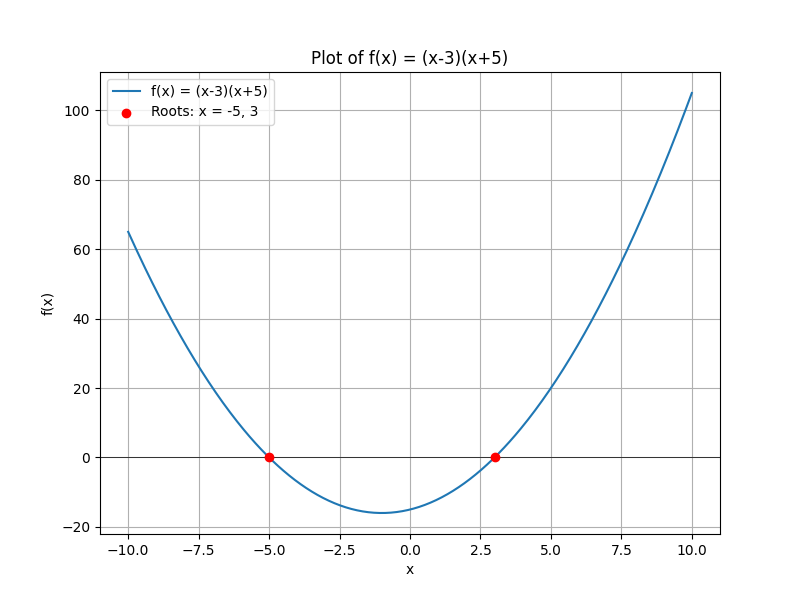

## Solving Polynomial Equations Using the Zero Product Property

The zero product property is a key tool for solving polynomial equations that have been factored into a product of simpler expressions. This lesson explains the property and shows how to use it step by step.

### Key Concept: The Zero Product Property

The zero product property states that if a product of factors equals zero, then at least one of the factors must be zero. In mathematical terms, if

$$
a \cdot b = 0,
$$

then either

$$
a = 0 \quad \text{or} \quad b = 0.
$$

This principle is used to break down a factored polynomial into simpler equations, each of which can be solved for the variable.

### Step-by-Step Procedure

1. **Write the Equation in Factored Form**

   If the polynomial equation is not already factored, factor it completely. The equation should be in the form

   $$
   (\text{factor}_1)(\text{factor}_2) \cdots (\text{factor}_n) = 0.
   $$

2. **Apply the Zero Product Property**

   Set each factor equal to zero. This gives a series of simple equations:

   $$
   \text{factor}_1 = 0, \quad \text{factor}_2 = 0, \quad \ldots, \quad \text{factor}_n = 0.
   $$

3. **Solve Each Equation**

   Solve for the variable in each equation. The solutions are the roots of the original polynomial equation.

4. **Check the Solutions (if necessary)**

   Substitute the solutions back into the original equation to ensure they satisfy it.

### Example 1: A Direct Application

Solve the equation:

$$
(x - 3)(x + 5) = 0.
$$

**Step 1: Apply the Zero Product Property**

Set each factor equal to zero:

$$
x - 3 = 0 \quad \text{or} \quad x + 5 = 0.
$$

**Step 2: Solve Each Equation**

For the first factor:

$$
x - 3 = 0 \quad \Longrightarrow \quad x = 3.
$$

For the second factor:

$$
x + 5 = 0 \quad \Longrightarrow \quad x = -5.
$$

The solutions are $x = 3$ and $x = -5$.

### Example 2: Factoring Before Applying the Property

Solve the equation:

$$
x^2 + x - 12 = 0.
$$

**Step 1: Factor the Quadratic**

Find two numbers that multiply to $-12$ and add to $1$. These numbers are $4$ and $-3$. Factor the quadratic:

$$
x^2 + x - 12 = (x + 4)(x - 3) = 0.
$$

**Step 2: Apply the Zero Product Property**

Set each factor equal to zero:

$$
x + 4 = 0 \quad \text{or} \quad x - 3 = 0.
$$

**Step 3: Solve Each Equation**

For the first factor:

$$
x + 4 = 0 \quad \Longrightarrow \quad x = -4.
$$

For the second factor:

$$
x - 3 = 0 \quad \Longrightarrow \quad x = 3.
$$

The solutions are $x = -4$ and $x = 3$.

### Real-World Application Example

Consider a situation in engineering where the dimensions of a component affect its performance. Suppose the performance function for a device is modeled by the equation

$$
(w - 2)(w + 7) = 0,
$$

where $w$ represents a width in centimeters. By applying the zero product property:

$$
w - 2 = 0 \quad \text{or} \quad w + 7 = 0,
$$

we find that $w = 2$ cm or $w = -7$ cm. Since a negative width is not physically meaningful, the viable solution is $w = 2$ cm. This process shows how the zero product property helps eliminate non-viable solutions in real-world problems.

By mastering this property, you can quickly break down and solve complex polynomial equations by reducing them to simpler, manageable parts.