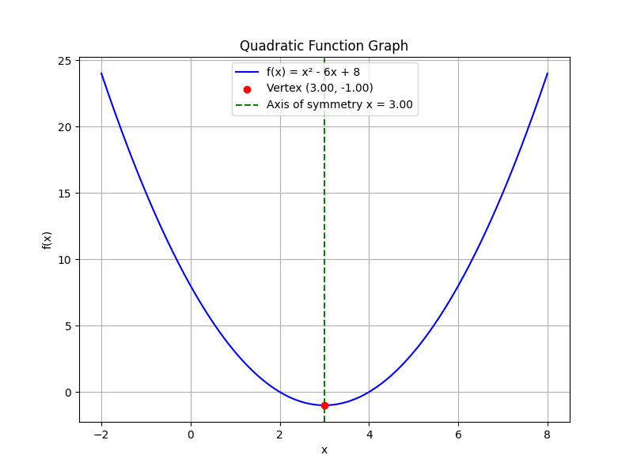

# Quadratic Functions and Equations

This unit covers quadratic functions and equations with a detailed explanation of each core concept. Quadratic functions are expressions of the form $$ax^2 + bx + c$$ where $a$, $b$, and $c$ are constants and $a \neq 0$. They are important because they model many real-world phenomena such as projectile motion, profit optimization, and design geometry.

In this unit, you will explore several key ideas:

- The standard form of a quadratic equation: $$ax^2 + bx + c = 0$$
- The vertex, which is the highest or lowest point on the graph, representing the turning point of the parabola.
- The axis of symmetry, a vertical line that divides the parabola into two mirror-image halves, revealing the balance inherent in quadratic functions.
- Multiple methods to solve quadratic equations, including factoring, the quadratic formula, and completing the square.

Understanding these methods provides flexibility in problem solving. For instance, factoring is efficient when the equation factors neatly, while the quadratic formula is a universal method that can solve any quadratic equation. Completing the square, on the other hand, not only solves the equation but also reveals the vertex form, offering insight into the graph's structure.

The vertex gives you the minimum or maximum value of the function, which in real-world contexts can indicate optimal outcomes or critical points in designs and calculations. The axis of symmetry shows the inherent balance of the function, making it easier to determine corresponding values on either side of the vertex once one is known.

> A quadratic equation is like a graceful arch bridging two realms—each solution a turning point in the tale of symmetry.

Approach this unit step by step. Each method has its advantages and is applicable in various real-world scenarios encountered in physics, engineering, and economics. With practice, analyzing and solving quadratic equations will become an intuitive process, strengthening your algebra skills and preparing you for the College Algebra CLEP exam.