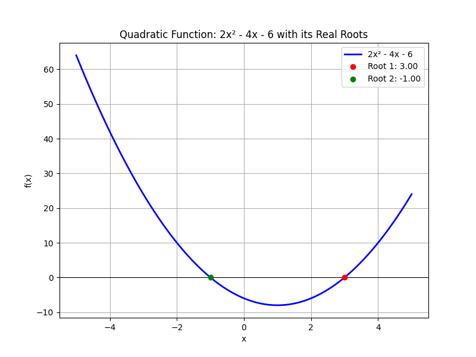

## Solving Quadratic Equations Using the Quadratic Formula

A quadratic equation takes the form

$$
a x^2 + b x + c = 0,
$$

where $a$, $b$, and $c$ are constants and $a \neq 0$. The quadratic formula

$$
x = \frac{-b \pm \sqrt{b^2 - 4ac}}{2a}
$$

provides a method to find the values of $x$ that satisfy the equation. The expression under the square root, called the discriminant

$$
D = b^2 - 4ac,
$$

determines the nature of the solutions:

- If $D > 0$, there are two distinct real roots.
- If $D = 0$, there is one repeated real root.
- If $D < 0$, the equation has two complex roots.

This lesson explains how to apply the formula step by step.

---

### Step-by-Step Process

1. **Write the Equation in Standard Form:**

   Ensure the quadratic is in the form

   $$
a x^2 + b x + c = 0.
   $$

2. **Identify the Coefficients:**

   Determine the values of $a$, $b$, and $c$ from the equation.

3. **Substitute into the Formula:**

   Plug these coefficients into the quadratic formula

   $$
x = \frac{-b \pm \sqrt{b^2 - 4ac}}{2a}.
   $$

4. **Calculate the Discriminant:**

   Compute $D = b^2 - 4ac$ to know what kind of roots to expect.

5. **Simplify:**

   Evaluate the square root and complete the arithmetic to solve for $x$.

---

### Example 1: Solving $2x^2 - 4x - 6 = 0$

1. **Standard Form:** The equation is already in standard form.

2. **Identify Coefficients:**

   $$
a = 2, \quad b = -4, \quad c = -6.
   $$

3. **Substitute into the Formula:**

   $$
x = \frac{-(-4) \pm \sqrt{(-4)^2 - 4(2)(-6)}}{2(2)}.
   $$

4. **Calculate the Discriminant:**

   $$
(-4)^2 - 4(2)(-6) = 16 + 48 = 64.
   $$

5. **Simplify:**

   $$
x = \frac{4 \pm \sqrt{64}}{4} = \frac{4 \pm 8}{4}.
   $$

   This gives two solutions:

   - $$x = \frac{4 + 8}{4} = 3.$$ 
   - $$x = \frac{4 - 8}{4} = -1.$$ 

The solutions are $x = 3$ and $x = -1$.

---

### Example 2: Solving $x^2 + 6x + 8 = 0$

1. **Standard Form:** The equation is in the form

   $$
x^2 + 6x + 8 = 0.
   $$

2. **Identify Coefficients:**

   $$
a = 1, \quad b = 6, \quad c = 8.
   $$

3. **Substitute into the Formula:**

   $$
x = \frac{-6 \pm \sqrt{6^2 - 4(1)(8)}}{2(1)}.
   $$

4. **Calculate the Discriminant:**

   $$
6^2 - 4(1)(8) = 36 - 32 = 4.
   $$

5. **Simplify:**

   $$
x = \frac{-6 \pm \sqrt{4}}{2} = \frac{-6 \pm 2}{2}.
   $$

   This leads to two solutions:

   - $$x = \frac{-6 + 2}{2} = -2.$$ 
   - $$x = \frac{-6 - 2}{2} = -4.$$ 

The solutions are $x = -2$ and $x = -4$.

---

### Real-World Application

Quadratic equations appear in various real-life contexts. For example, when modeling the trajectory of a ball in sports, the height of the ball over time can be represented by a quadratic equation. The coefficients may relate to factors such as initial speed and gravity, while the quadratic formula helps predict the times when the ball reaches a specific height.

Understanding the quadratic formula provides a reliable method to solve these equations and analyze the motion of objects in fields like physics and engineering.

---

By following this structured approach, you can solve any quadratic equation using the quadratic formula, ensuring you account for all possible types of solutions.