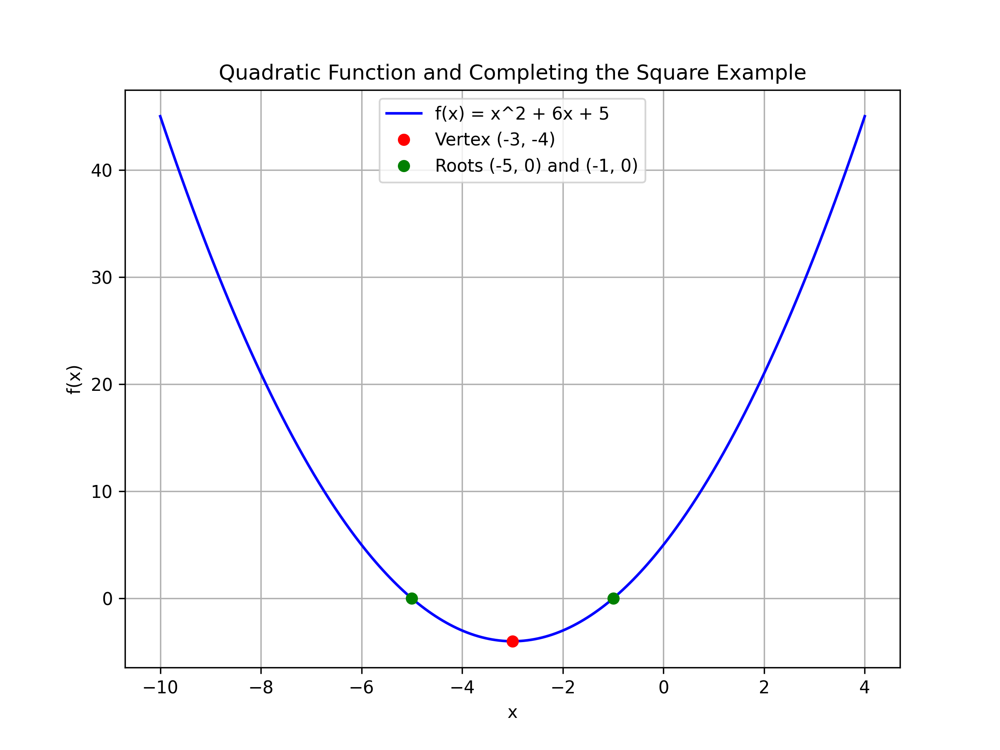

## Completing the Square Technique

Completing the square is a powerful method for solving quadratic equations and rewriting quadratic functions into a form that makes important features, like the vertex, immediately apparent. In this lesson, we explain each step in detail, provide intuitive explanations of the process, and show practical applications of this method.

### Key Idea

A quadratic equation is generally written as

$$
ax^2 + bx + c = 0
$$

The goal of completing the square is to rewrite the quadratic expression as a perfect square trinomial. In this form, the equation becomes

$$
(ax + d)^2 = e
$$

This structure is easier to work with because it allows you to solve for $x$ by taking the square root of both sides. It also clearly reveals the vertex of the parabola represented by the quadratic function.

### Steps for Completing the Square

1. **Normalize the quadratic term:**

   If $a \neq 1$, divide the entire equation by $a$ so that the coefficient of $x^2$ becomes $1$. This simplifies later calculations.

2. **Isolate the constant term:**

   Rewrite the equation so that the constant is on the right side and the $x$ terms are on the left. For example, start with:

   $$
x^2 + bx = -c
   $$

   This separation helps in constructing a perfect square on the left side.

3. **Determine the correction term:**

   Take half of the coefficient of $x$ and square it. In mathematical terms, calculate

   $$
   \left(\frac{b}{2}\right)^2
   $$

   This term, when added inside the bracket, makes the $x$ terms a perfect square trinomial.

4. **Add and subtract the correction term:**

   Add and subtract the computed term on the left side of the equation. Then group the terms to form the perfect square trinomial. This method ensures that you do not change the original value of the expression.

5. **Rewrite as a perfect square and solve:**

   Express the grouped trinomial as the square of a binomial. Finally, solve for $x$ by taking the square root of both sides of the equation and isolating $x$.

### Example 1: Solve $$x^2 + 6x + 5 = 0$$

We begin with the quadratic equation:

$$
x^2 + 6x + 5 = 0
$$

**Step 1:** Move the constant term to the right side:

$$
x^2 + 6x = -5
$$

This step separates the $x$ terms from the constant, putting the equation into a form that is easier to manipulate.

**Step 2:** Compute half of the coefficient of $x$:

Divide $6$ by $2$ to obtain $3$, and then square it:

$$
3^2 = 9
$$

Here, $9$ is the correction term that will complete the square.

**Step 3:** Add $9$ to both sides of the equation to complete the square:

$$
x^2 + 6x + 9 = -5 + 9
$$

Simplify the right side:

$$
x^2 + 6x + 9 = 4
$$

**Step 4:** Express the left side as a perfect square:

$$
(x + 3)^2 = 4
$$

This step rewrites the quadratic as a binomial squared, which directly reveals the structure of the function.

**Step 5:** Solve by taking the square root of both sides:

$$
x + 3 = \pm 2
$$

This gives two simple equations:

- When $x + 3 = 2$, then $x = -1$.
- When $x + 3 = -2$, then $x = -5$.

Thus, the solutions are $x = -1$ and $x = -5$.

### Example 2: Solve $$2x^2 + 8x + 6 = 0$$

**Step 1:** Divide the entire equation by $2$ to normalize the quadratic term:

$$
\frac{2x^2}{2} + \frac{8x}{2} + \frac{6}{2} = 0
$$

Simplify the equation:

$$
x^2 + 4x + 3 = 0
$$

**Step 2:** Isolate the $x$ terms by moving the constant to the right:

$$
x^2 + 4x = -3
$$

**Step 3:** Take half of the coefficient of $x$. Here, half of $4$ is $2$, and squaring gives $4$:

$$
2^2 = 4
$$

**Step 4:** Add $4$ to both sides to complete the square:

$$
x^2 + 4x + 4 = -3 + 4
$$

Simplify the equation:

$$
x^2 + 4x + 4 = 1
$$

**Step 5:** Rewrite the left side as the square of a binomial:

$$
(x + 2)^2 = 1
$$

**Step 6:** Solve by taking the square root of both sides:

$$
x + 2 = \pm 1
$$

This results in two simple equations:

- When $x + 2 = 1$, then $x = -1$.
- When $x + 2 = -1$, then $x = -3$.

Thus, the solutions are $x = -1$ and $x = -3$.

### Real-World Application

Completing the square is not only a method for finding the roots of quadratic equations but also a tool for rewriting quadratic functions into vertex form. Expressing a quadratic in vertex form makes it easy to identify the vertex of the parabola, which is essential in many real-world applications such as:

- **Financial calculations:** Determining maximum profit or minimum cost in quadratic models.
- **Engineering designs:** Analyzing parabolic trajectories or structural arches.
- **Physics problems:** Identifying optimal points in projectile motion or energy functions.

By transforming the quadratic into the form $$(x + h)^2 = k,$$ you directly see that the vertex of the parabola is $(-h, k)$, giving clear insight into the function's behavior. This intuitive understanding can help you remember the process and apply it in various scenarios.

> Completing the square transforms a quadratic into a form that directly reveals its vertex, providing valuable insights into the function’s behavior.

Mastering this method reinforces your overall understanding of algebra and prepares you for more complex problems on the College Algebra CLEP exam.