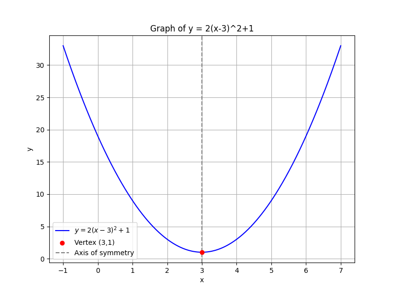
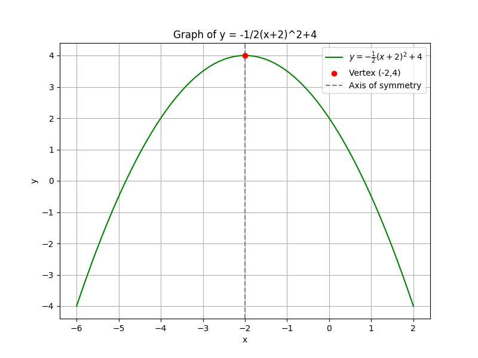

## Graphing Quadratic Functions Using Vertex Form

A quadratic function in vertex form is written as

$$
y = a(x - h)^2 + k,
$$

where

- $a$ controls the direction of the parabola (upward if positive, downward if negative) and its width (narrower when $|a| > 1$ and wider when $|a| < 1$),
- $(h, k)$ is the vertex, which is the highest or lowest point of the graph.

This form makes it easier to graph a quadratic function because it directly shows how the graph of the basic function $y=x^2$ is shifted and stretched.

### Understanding the Vertex Form

The vertex form

$$
y = a(x - h)^2 + k
$$

can be broken down as follows:

- **Horizontal Shift:** The value $h$ indicates how far the graph is moved left or right. If $h > 0$, the graph shifts to the right; if $h < 0$, it shifts to the left.

- **Vertical Shift:** The value $k$ shows how far the graph moves vertically. A positive $k$ moves the graph up; a negative $k$ moves it down.

- **Vertical Stretch/Compression and Reflection:** The coefficient $a$ determines the openness of the parabola: if $|a|>1$, the graph is stretched vertically (narrower); if $|a|<1$, the graph is compressed (wider). A negative $a$ also reflects the graph across the horizontal axis.

These components provide intuition about how changes in the equation affect the graph. For instance, knowing the vertex immediately tells you the turning point of the graph, and the value of $a$ tells you whether it has a steep or gentle curve.

### Step-by-Step Graphing Process

1. **Identify the vertex and coefficient:**

   From the form

   $$
y = a(x - h)^2 + k,
   $$

   the vertex is at $(h, k)$ and the coefficient $a$ influences the width and direction of the parabola.

2. **Plot the vertex:**

   Mark the point $(h, k)$ on the coordinate plane. This point serves as an anchor for the graph.

3. **Determine the axis of symmetry:**

   The vertical line $x = h$ is the axis around which the parabola is symmetric. This helps to quickly plot the corresponding points on either side of the vertex.

4. **Find additional points:**

   Choose values for $x$ near the vertex, substitute them into the equation, and calculate the corresponding $y$ values. These points will lie symmetrically on either side of the axis of symmetry.

5. **Sketch the parabola:**

   Draw a smooth, curved line that passes through the vertex and the additional points, ensuring that the curve is symmetric about the line $x=h$.

This systematic approach not only helps in plotting the graph accurately but also builds a deeper understanding of the function's behavior.

### Example 1

Graph the quadratic function

$$
y = 2(x - 3)^2 + 1.
$$

**Step 1: Identify the vertex and coefficient**

- The vertex is $(3, 1)$.
- Here, $a = 2$, which indicates that the parabola opens upward and is narrower than the parent function $y=x^2$.

**Step 2: Plot the vertex**

Place a point at $(3, 1)$ on the coordinate plane.

**Step 3: Identify the axis of symmetry**

The axis is the vertical line $x = 3$.

**Step 4: Calculate additional points**

Choose $x$-values near 3 and substitute them into the equation:

For $x = 4$:

$$
y = 2(4 - 3)^2 + 1 = 2(1)^2 + 1 = 2 + 1 = 3.
$$

For $x = 2$:

$$
y = 2(2 - 3)^2 + 1 = 2(-1)^2 + 1 = 2 + 1 = 3.
$$

The points $(4, 3)$ and $(2, 3)$ are symmetric about the vertex.

**Step 5: Sketch the graph**

Draw a smooth curve through the vertex $(3, 1)$ and the points $(4, 3)$ and $(2, 3)$, ensuring that both sides of the graph mirror each other.

### Example 2

Graph the quadratic function

$$
y = -\frac{1}{2}(x + 2)^2 + 4.
$$

**Step 1: Rewrite in vertex form**

Note that $x+2$ can be interpreted as $x-(-2)$, so the vertex form is already clear:

- The vertex is $(-2, 4)$.
- Here, $a = -\frac{1}{2}$, which means the parabola opens downward and is wider than $y=x^2$.

**Step 2: Plot the vertex**

Place the point $(-2, 4)$ on your coordinate plane.

**Step 3: Identify the axis of symmetry**

The axis is the vertical line $x = -2$.

**Step 4: Calculate additional points**

Select $x$-values near $-2$:

For $x = -1$:

$$
y = -\frac{1}{2}(-1 + 2)^2 + 4 = -\frac{1}{2}(1)^2 + 4 = -\frac{1}{2} + 4 = 3.5.
$$

For $x = -3$:

$$
y = -\frac{1}{2}(-3 + 2)^2 + 4 = -\frac{1}{2}(-1)^2 + 4 = -\frac{1}{2} + 4 = 3.5.
$$

The points $(-1, 3.5)$ and $(-3, 3.5)$ are symmetric with respect to the vertex.

**Step 5: Sketch the graph**

Draw a smooth, downward opening curve passing through the vertex $(-2, 4)$ and the points $(-1, 3.5)$ and $(-3, 3.5)$.

### Real-World Application

In many practical situations, such as sports analytics, the vertex form is especially useful. For example, the trajectory of a soccer ball can be modeled using a quadratic function. The vertex $(h, k)$ represents the highest point of the ball's flight, while the coefficient $a$ indicates how sharply the ball curves. This method can be applied in physics and engineering to simulate real-life projectile motion and optimize performance.

### Summary of Key Points

> The vertex form $y = a(x - h)^2 + k$ clearly shows the vertex and makes graphing quadratic functions straightforward.

- The vertex $(h, k)$ is the maximum or minimum point of the parabola.
- The coefficient $a$ determines the opening direction and the width of the graph.
- By plotting the vertex and using symmetry, graphing becomes both systematic and efficient.

This thorough approach is invaluable across various fields, including physics, engineering, and finance, where understanding the peak or trough of a relationship can be crucial.