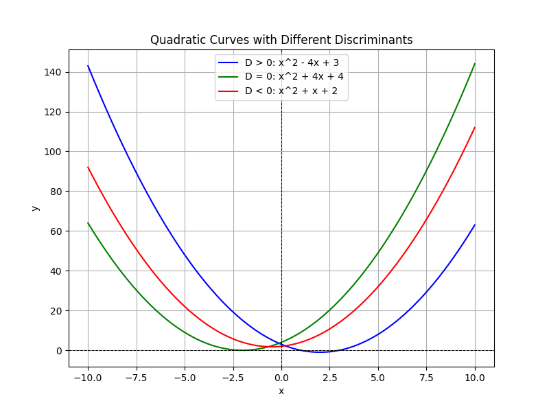

## Analyzing the Discriminant and Nature of Roots

A quadratic equation is commonly written in the form

$$
a x^2 + b x + c = 0,
$$

where $a$, $b$, and $c$ are constants and $a \neq 0$. The expression

$$
D = b^2 - 4ac
$$

is called the discriminant. The value of the discriminant tells us about the nature of the roots of the quadratic equation.

### What Does the Discriminant Tell Us?

The discriminant $D = b^2 - 4ac$ provides three key cases:

- **Case 1: $D > 0$**

  The quadratic equation has two distinct real roots. This occurs when the graph of the quadratic function crosses the x-axis at two points.

- **Case 2: $D = 0$**

  The quadratic equation has exactly one real root (a repeated or double root). The graph touches the x-axis at one point (the vertex).

- **Case 3: $D < 0$**

  The quadratic equation has two complex conjugate roots. The graph does not intersect the x-axis.

### Step-by-Step Analysis

1. **Identify the coefficients.**

   Write the quadratic equation in the form

   $$
a x^2 + b x + c = 0.
   $$

   Determine the values of $a$, $b$, and $c$.

2. **Calculate the discriminant.**

   Substitute into the formula

   $$
   D = b^2 - 4ac.
   $$

3. **Compare the discriminant to zero to determine the type of roots.**

   - If $D > 0$, the equation has two distinct real roots.
   - If $D = 0$, the equation has a repeated real root.
   - If $D < 0$, the equation has two complex roots.

### Example 1: Two Distinct Real Roots

Consider the equation

$$
x^2 - 4x + 3 = 0.
$$

Identify the coefficients:

- $a = 1$
- $b = -4$
- $c = 3$

Calculate the discriminant:

$$
D = (-4)^2 - 4(1)(3) = 16 - 12 = 4.
$$

Since $D > 0$, the equation has two distinct real roots.

### Example 2: One Real Root (Repeated)

Examine the equation

$$
x^2 + 4x + 4 = 0.
$$

Identify the coefficients:

- $a = 1$
- $b = 4$
- $c = 4$

Calculate the discriminant:

$$
D = 4^2 - 4(1)(4) = 16 - 16 = 0.
$$

Because $D = 0$, the equation has one real repeated root. The quadratic can be factored as

$$
(x + 2)^2 = 0.
$$

which gives $x = -2$.

### Example 3: Two Complex Roots

Consider the equation

$$
x^2 + x + 2 = 0.
$$

Identify the coefficients:

- $a = 1$
- $b = 1$
- $c = 2$

Calculate the discriminant:

$$
D = 1^2 - 4(1)(2) = 1 - 8 = -7.
$$

Since $D < 0$, the equation has two complex roots. They can be expressed as

$$
x = \frac{-b \pm \sqrt{D}}{2a} = \frac{-1 \pm \sqrt{-7}}{2} = \frac{-1 \pm i\sqrt{7}}{2}.
$$

### Real-World Applications

The discriminant is useful in many real-world scenarios. For example:

- **Engineering:** When designing structures, engineers use quadratic equations to model curves. Knowing whether the model yields two distinct, one, or no real intersection points with a reference line can influence design decisions.

- **Finance:** Quadratic equations can model profit functions. The nature of the roots indicates possible break-even points or critical values.

- **Sports Analytics:** In projectile motion problems (such as finding the maximum height of a thrown ball), the discriminant in the quadratic equation helps determine the points at which the ball reaches specific heights.

Understanding the discriminant helps you quickly assess the behavior of a quadratic equation without having to fully solve it. This insight is crucial for both academic problems and practical applications in various fields.