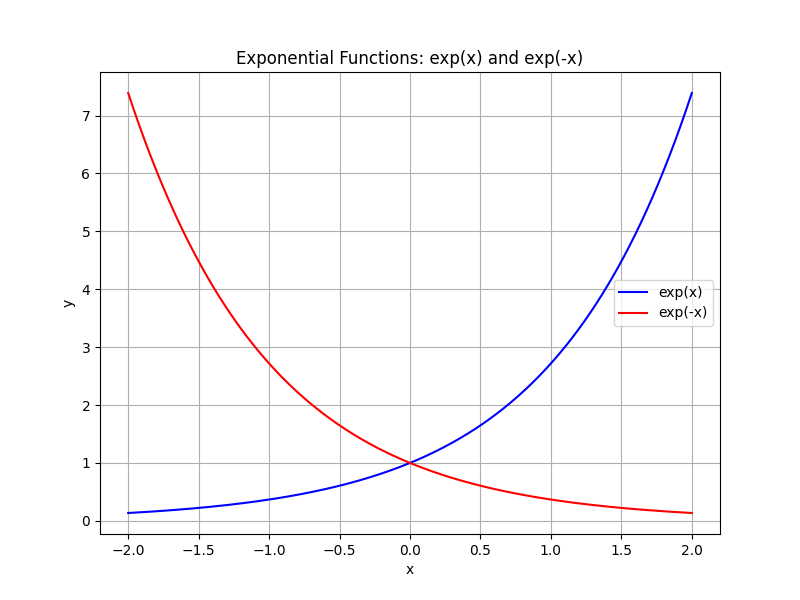
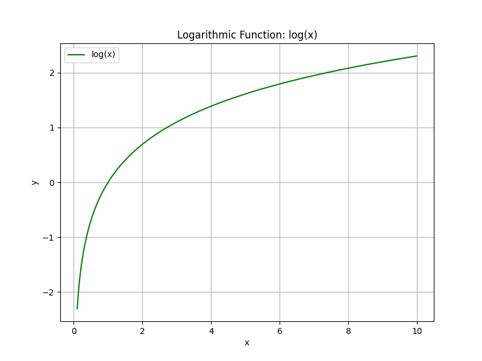

# Exponential and Logarithmic Functions

This unit introduces exponential and logarithmic functions, two central types of functions with wide-ranging applications.

Exponential functions are expressed in the form $f(x)=a\cdot b^x$, where $b$ is a positive constant known as the base. When $b>1$, the function models growth; when $0<b<1$, it models decay. These functions are used to represent real-life processes such as population increase, radioactive decay, and compound interest.

Logarithmic functions are the inverses of exponential functions and are written as $f(x)=\log_b(x)$. They allow us to solve equations in which the variable appears in the exponent. Logarithms simplify complex multiplicative processes into additive ones and are useful for measuring quantities that cover a wide range of values, like sound intensity and earthquake magnitudes.

Understanding these functions is essential for describing and predicting behaviors in fields such as finance, science, and engineering. Their properties help translate exponential growth or decay into manageable patterns, making it easier to analyze and solve real-world problems.

Throughout this unit, you will explore the properties of exponential and logarithmic functions, learn how to graph them accurately, and apply various techniques to solve related equations. The skills you develop here will provide a strong foundation for more advanced topics in algebra and calculus.

> Exponential functions burst forth like wild crescendos in nature's symphony, while logarithms serve as the gentle interpreters that reveal the measured rhythm behind the chaos.