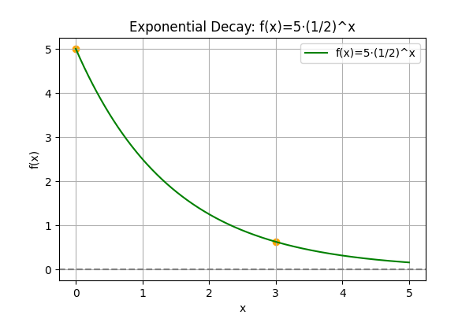
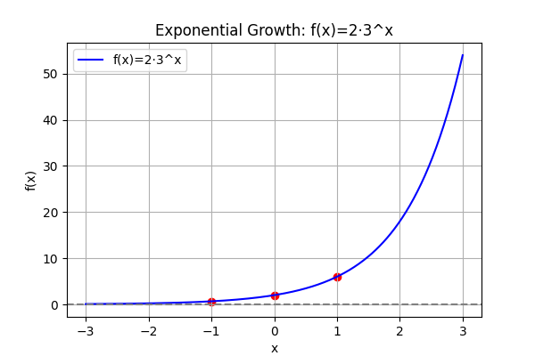

## Defining Exponential Functions and Their Properties

Exponential functions are a key topic in algebra. They model processes where the rate of change is proportional to the current value. In simple terms, an exponential function can be written as

$$
f(x)=a\cdot b^x
$$

where:

- $a$ is the initial value, which scales the function vertically.
- $b$ is the base, a constant that determines the rate of change. (Note: $b$ must be positive and cannot equal 1.)

### Definition and Components

Exponential functions have two main components:

1. **Initial Value ($a$):**

   The value of the function when $x=0$. Since $b^0=1$, we have

   $$
f(0)=a\cdot b^0=a.
   $$

   This value sets the starting point of the function and determines its vertical position.

2. **Base ($b$):**

   The base controls how the function behaves as $x$ changes.

   - When $b>1$, the function increases as $x$ increases. This is called exponential growth.
   - When $0<b<1$, the function decreases as $x$ increases. This is exponential decay.

   The base determines how rapidly the function grows or decays.

### Key Properties

Exponential functions have several important characteristics:

- **Domain:**

  The domain is all real numbers, $$(-\infty,\infty),$$ because any real number can be used as an exponent.

- **Range:**

  The range is all positive numbers, $$(0,\infty),$$ since a positive number raised to any power remains positive, and multiplying by a positive $a$ keeps the output positive.

- **Y-intercept:**

  At $x=0$, the function crosses the $y$-axis at $(0,a)$ because $$f(0)=a.$$

- **Asymptote:**

  The horizontal line $$y=0$$ is an asymptote. This means that as $x$ becomes very large in the negative direction (or in the case of decay, as $x$ becomes large), the function approaches zero but never actually reaches it.

- **Monotonicity:**

  Depending on the base $b$, the function is always either strictly increasing (if $b>1$) or strictly decreasing (if $0<b<1$). This predictable behavior simplifies analysis and problem solving.

### Example 1: Exponential Growth

Consider the exponential function

$$
f(x)=2\cdot 3^x.
$$

**Step-by-step explanation:**

1. **Calculate the y-intercept:**

   Substitute $x=0$:

   $$
f(0)=2\cdot 3^0=2\cdot 1=2.
   $$

   This tells us that the graph starts at $y=2$.

2. **Evaluate at $x=2$:**

   Substitute $x=2$:

   $$
f(2)=2\cdot 3^2=2\cdot 9=18.
   $$

   The function rises rapidly, tripling each time $x$ increases by 1. This models situations such as population growth or investment growth.

### Example 2: Exponential Decay

Now consider the exponential decay function

$$
f(x)=5\cdot \left(\frac{1}{2}\right)^x.
$$

**Step-by-step explanation:**

1. **Calculate the y-intercept:**

   Substitute $x=0$:

   $$
f(0)=5\cdot \left(\frac{1}{2}\right)^0=5\cdot 1=5.
   $$

   The graph starts at $y=5$.

2. **Evaluate at $x=3$:**

   Substitute $x=3$:

   $$
f(3)=5\cdot \left(\frac{1}{2}\right)^3=5\cdot \frac{1}{8}=\frac{5}{8}.
   $$

   This rapid decrease illustrates exponential decay, similar to processes seen in radioactive decay or asset depreciation.

### Graphing Exponential Functions

Visualizing an exponential function helps build intuition. Consider the function

$$
f(x)=2\cdot 3^x.
$$

Key points on the graph include:

- At $x=0$, $y=2$.
- At $x=1$, $y=2\cdot 3=6$.
- At $x=-1$, $y=2\cdot \frac{1}{3}\approx0.67.$

The graph increases rapidly for positive $x$ and approaches zero for negative $x$. The horizontal line $y=0$ is drawn as an asymptote to show that the function never reaches zero.

Below is a graphical representation of this exponential growth function:

<!-- tikzpicture -->

### Real-World Applications

Exponential functions are used in many fields where change occurs by a constant percentage:

- **Finance:** Used for compound interest calculations. For example, the future balance can be modeled by

  $$
  A=P\cdot (1+r)^t,
  $$

  where $P$ is the principal, $r$ is the interest rate per period, and $t$ is the time in periods.

- **Biology:** Models population growth, where the population increases by a constant percentage over time.

- **Chemistry and Physics:** Models radioactive decay, where the amount of a substance decreases exponentially over time.

In each application, the exponential model captures the idea of change occurring by a fixed factor over equal time intervals.

Understanding these functions and their properties builds a strong foundation for later topics, such as logarithms and advanced growth models. The detailed examples and step-by-step methods help reinforce learning, making it easier to apply these concepts in real-world scenarios.