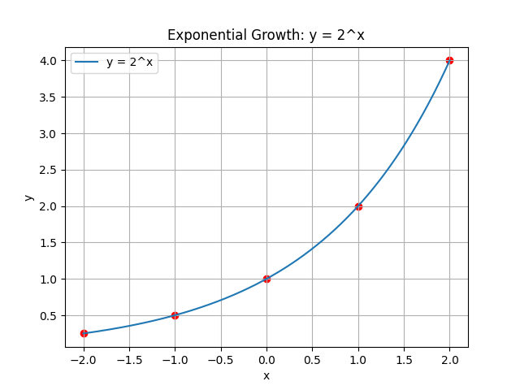
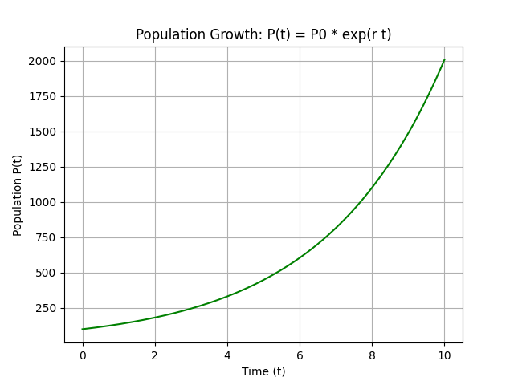
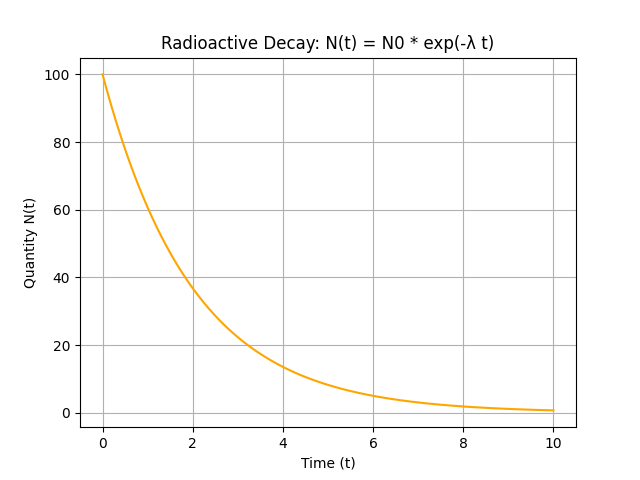

## Graphing Exponential Functions and Real World Applications

Exponential functions have the form

$$
 y = a \cdot b^x
$$

where $a$ is the initial value and $b$ is the base. When $b > 1$, the function represents growth because the output increases as $x$ increases. When $0 < b < 1$, it represents decay since the output decreases as $x$ increases.

### Understanding the Exponential Function

Exponential functions are common in real-life applications such as population growth, compound interest, and radioactive decay. They are characterized by a constant proportional change, meaning that the rate of change is always a fixed percentage of the current value. This concept is key in understanding how small changes can compound over time.

Key features include:

- **Constant proportional change:** The change in $y$ is always a fixed percentage of the current value, so the function grows or decays at a rate proportional to its size.
- **Y-intercept at $a$:** When $x = 0$, we have $y = a$, which sets the baseline value of the function.
- **Smooth, continuous curve:** The graph is smooth with no breaks; even in decay, the curve approaches the horizontal axis ($y = 0$) but never touches it.

For example, consider the function

$$
 y = 2^x
$$

This function models exponential growth since the output doubles as $x$ increases by 1.

### Graphing an Exponential Function

Graphing an exponential function involves a systematic process. Let’s consider $y = 2^x$ and explain each step in detail.

1. **Plot the Y-intercept:** Evaluate the function at $x = 0$. Since $2^0 = 1$, the point is $(0, 1)$. This is the starting point and represents the initial value of the function.
2. **Choose additional values of $x$:** Select simple values of $x$ to see how $y$ changes. For $x = 1$, we get $y = 2^1 = 2$, and for $x = -1$, we have $y = 2^{-1} = \frac{1}{2}$. These points illustrate the rapid increase when $x$ is positive and the gradual approach towards zero when $x$ is negative.
3. **Plot the computed points:** Commonly, you might select points at $x = -2$, $-1$, $0$, $1$, and $2$. This would give approximate points: $(-2, \frac{1}{4})$, $(-1, \frac{1}{2})$, $(0, 1)$, $(1, 2)$, and $(2, 4)$. Plotting several points helps form an accurate picture of the curve.
4. **Draw a smooth curve:** Connect the points with a smooth, continuous line. The curve will rise steeply for positive $x$ and fall off gradually towards the horizontal axis for negative $x$.

The following graph shows the plot of $y = 2^x$:

<!-- tikzpicture -->

This graph illustrates how the value of $y$ changes with $x$. Notice the exponential increase as $x$ becomes positive and the tendency to approach zero as $x$ becomes negative.

### Real World Applications

Exponential functions are vital in modeling and solving problems across various fields. Below are several real-world examples:

#### 1. Population Growth

A growing population can be modeled using the formula

$$
 P(t) = P_0 \cdot e^{rt}
$$

In this model, $P_0$ represents the initial population, $r$ is the constant growth rate, and $t$ denotes time. If a population doubles every few years, the exponential model captures the quick compound increase in numbers.

#### 2. Compound Interest

Compound interest grows an investment over time by applying interest to both the initial principal and the accumulated interest. The compound interest formula is

$$
 A = P \cdot \left(1 + \frac{r}{n}\right)^{nt}
$$

Here, $P$ is the principal (initial amount), $r$ is the annual interest rate, $n$ is the number of times interest is compounded per year, and $t$ is the number of years. The exponential aspect is seen in how the sum grows multiplicatively with each compounding period.

#### 3. Radioactive Decay

Radioactive decay follows an exponential model where a substance decreases over time. The decay is modeled by the equation

$$
 N(t) = N_0 \cdot e^{-\lambda t}
$$

In this equation, $N_0$ represents the initial quantity, and $\lambda$ is the decay constant. Even though the decay is continuous, the substance never completely reaches zero, a property highlighted by the asymptotic behavior of the function.

### Step-by-Step Example: Graphing a Compound Interest Function

Consider a savings account with an initial deposit of $1000$ and an annual interest rate of 5% compounded annually. The account balance over time is modeled by

$$
 A(t) = 1000 \cdot (1.05)^t
$$

Detailed steps to graph this function are as follows:

1. **Identify the Y-intercept:**

   Evaluate the function at $t = 0$. Since $1.05^0 = 1$, we have:

   $$
   A(0) = 1000 \cdot 1 = 1000
   $$

   This point is the starting balance.

2. **Compute key points:**

   - For $t = 1$:

     $$
     A(1) = 1000 \cdot 1.05 = 1050
     $$

   - For $t = 2$:

     $$
     A(2) = 1000 \cdot 1.05^2 \approx 1102.50
     $$

   - For $t = 3$:

     $$
     A(3) \approx 1157.63
     $$

   These points reflect how the investment grows over time with interest compounding continuously.

3. **Plot the points on a coordinate plane:**

   Use $t$ on the horizontal axis and $A(t)$ on the vertical axis. Mark the points accurately to represent the increasing trend.

4. **Draw the curve:**

   Connect the plotted points with a smooth curve to form the exponential growth graph. The curve's steepness demonstrates the accelerating growth due to compound interest.

The graph of the compound interest function is shown below:

<!-- tikzpicture -->

Through these examples, we see that exponential functions provide a powerful tool for modeling growth and decay. They capture the essence of processes that change at rates proportional to their current size. Understanding these models is critical for analyzing various phenomena in finance, population studies, natural sciences, and engineering.

