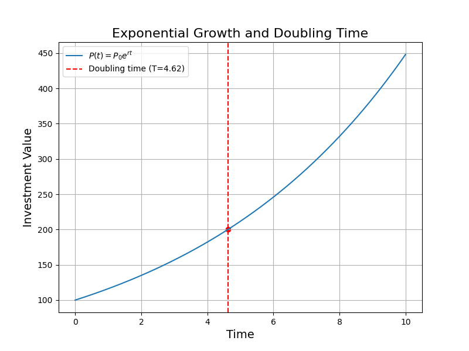

## Introduction to Logarithms and Their Properties

Logarithms are the inverse operation of exponentiation. They answer the question: To what power must the base be raised to produce a given number? In symbols, if

$$
b^c = a,
$$

then

$$
\log_b(a)=c.
$$

This lesson explains the definition of logarithms and their key properties. These properties are essential in simplifying expressions and solving equations in many real-world applications such as financial calculations, engineering analysis, and scientific measurements.

### Defining Logarithms

A logarithm is defined for a positive number $a$ and a positive base $b$ (where $b \neq 1$). The notation

$$
\log_b(a)=c
$$

means that the base $b$ raised to the power $c$ equals $a$. For example, if we know that

$$
2^3 = 8,
$$

then by definition, we have

$$
\log_2(8)=3.
$$

### Fundamental Properties of Logarithms

Logarithms have several useful properties that make them powerful tools for simplifying and solving problems:

> **Product Property:**
>
> $$
> \log_b(MN) = \log_b(M) + \log_b(N).
> $$

This property allows the logarithm of a product to be expressed as the sum of the logarithms of its factors.

> **Quotient Property:**
>
> $$
> \log_b\left(\frac{M}{N}\right) = \log_b(M) - \log_b(N).
> $$

This property lets you express the logarithm of a quotient as the difference of two logarithms.

> **Power Property:**
>
> $$
> \log_b(M^p)= p\,\log_b(M).
> $$

This property is useful when an exponent is present inside the logarithm. It can be brought out as a multiplier.

> **Change of Base Formula:**
>
> $$
> \log_b(a)= \frac{\log_k(a)}{\log_k(b)}.
> $$

This formula allows you to convert a logarithm with one base to another base, which is particularly useful when using calculators or changing to the natural logarithm (base \(e\)).

### Example 1: Basic Evaluation

Evaluate the logarithm $\log_2(8)$.

Step 1. Write the definition:

$$
\log_2(8)=c \quad\Longleftrightarrow\quad 2^c=8.
$$

Step 2. Recognize that $2^3=8$. Therefore, 

$$
\log_2(8)=3.
$$

### Example 2: Using the Product Property

Simplify the expression $\log_2(8)+\log_2(4)$.

Step 1. Apply the product property:

$$
\log_2(8)+\log_2(4)=\log_2(8 \times 4)=\log_2(32).
$$

Step 2. Recognize that $2^5=32$. Thus, 

$$
\log_2(32)=5.
$$

### Example 3: Using the Quotient and Power Properties

Simplify and evaluate the expression $\log_3(81)-2\,\log_3(3)$.

Step 1. Notice that $81$ can be written as $3^4$, so by the power property:

$$
\log_3(81)=\log_3(3^4)=4.
$$

Step 2. Evaluate $\log_3(3)$ since $3^1=3$, meaning

$$
\log_3(3)=1.
$$

Step 3. Substitute into the expression:

$$
4 - 2\,(1)=4-2=2.
$$

### Real-World Application: Financial Growth

In financial calculations, logarithms are used to determine the time needed for an investment to grow. For example, if an investment doubles in value and the growth is exponential, the time can be calculated using the logarithmic form of the growth equation. 

Let the growth formula be:

$$
P(t)=P_0\,e^{rt},
$$

where $P_0$ is the initial investment, $r$ is the rate, and $t$ is time. To find the doubling time $T$, set $P(T)=2P_0$:

$$
2P_0=P_0\,e^{rT}.
$$

Divide both sides by $P_0$:

$$
2=e^{rT}.
$$

Take the natural logarithm of both sides:

$$
\ln(2)=rT.
$$

Thus, 

$$
T=\frac{\ln(2)}{r}.
$$

This formula shows how logarithms help determine the time required for exponential growth, a common calculation in finance.

### Summary

Understanding logarithms and their properties equips you with tools to simplify expressions and solve equations involving exponential forms. This knowledge is foundational for advanced studies in engineering, computer science, and other fields that rely on exponential growth and decay models.