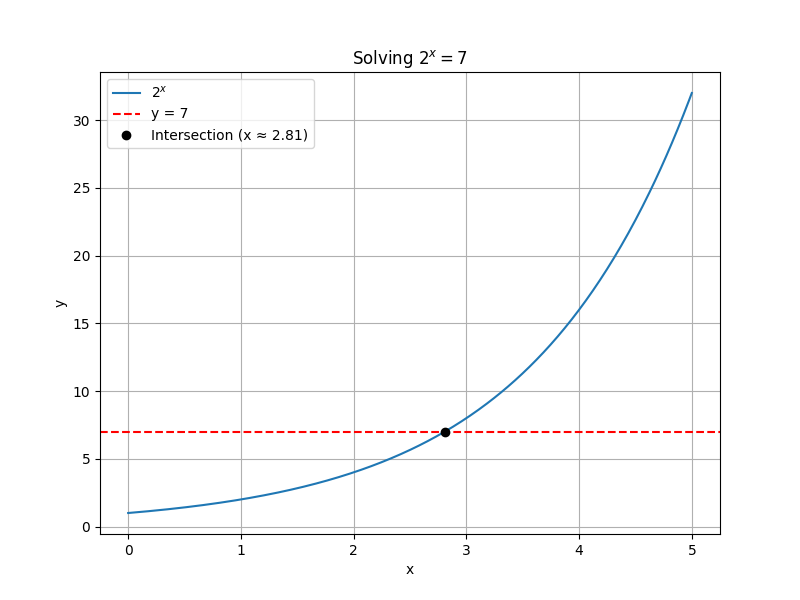
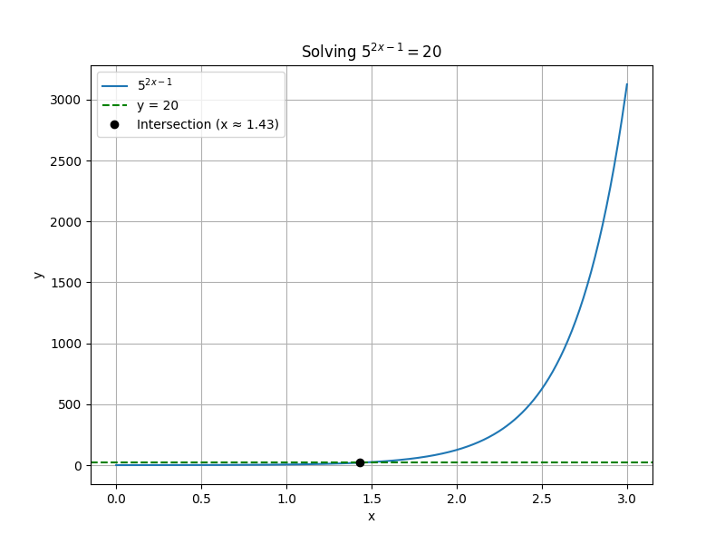

## Solving Exponential Equations Using Logarithms

Exponential equations are equations where the variable appears in the exponent. When the bases cannot be easily rewritten as the same number, logarithms provide a method to solve these equations. This lesson explains how to use logarithms step by step to find the value of the unknown exponent in real-world problems.

### Understanding the Process

An exponential equation has the form

$$
a^{f(x)} = b,
$$

where $a$ and $b$ are positive constants and $f(x)$ is an expression involving the variable. To solve for $x$, follow these steps:

1. Isolate the exponential expression.
2. Apply a logarithm to both sides (common choices are the natural logarithm $\ln$ or the common logarithm $\log$).
3. Use the logarithm power rule: $$\log(a^c) = c\log(a).$$
4. Solve the resulting linear equation for $x$.

> Logarithms are the inverse of exponentiation. They let you bring down exponents and simplify equations.

### Example 1: Solving a Basic Exponential Equation

Solve the equation:

$$
2^x = 7.
$$

#### Step 1: Apply the natural logarithm

Take the natural logarithm of both sides:

$$
\ln(2^x) = \ln(7).
$$

#### Step 2: Use the Power Rule

Using the power rule of logarithms:

$$
x\ln(2) = \ln(7).
$$

#### Step 3: Solve for $x$

Divide both sides by $\ln(2)$:

$$
x = \frac{\ln(7)}{\ln(2)}.
$$

This is the exact solution. For a numerical approximation, you may calculate the values of $\ln(7)$ and $\ln(2)$.

### Example 2: Solving a More Involved Equation

Consider the equation:

$$
5^{2x-1} = 20.
$$

#### Step 1: Apply the logarithm

Take the natural logarithm on both sides:

$$
\ln(5^{2x-1}) = \ln(20).
$$

#### Step 2: Use the Power Rule

Bring the exponent down:

$$
(2x-1)\ln(5) = \ln(20).
$$

#### Step 3: Isolate the variable term

Divide both sides by $\ln(5)$:

$$
2x - 1 = \frac{\ln(20)}{\ln(5)}.
$$

#### Step 4: Solve for $x$

Add 1 to both sides and then divide by 2:

$$
2x = \frac{\ln(20)}{\ln(5)} + 1,
$$

$$
x = \frac{1}{2}\left(\frac{\ln(20)}{\ln(5)} + 1\right).
$$

### Real-World Application

Exponential equations often appear in financial calculations, such as compound interest problems. For example, in the formula for continuous compound interest:

$$
A = Pe^{rt},
$$

if you need to solve for the time $t$ it takes for an investment to grow to a certain amount $A$, you rearrange the equation as follows:

1. Divide both sides by $P$:

$$
e^{rt} = \frac{A}{P}.
$$

2. Apply the natural logarithm:

$$
\ln(e^{rt}) = \ln\left(\frac{A}{P}\right).
$$

3. Use the power rule:

$$
rt = \ln\left(\frac{A}{P}\right).
$$

4. Solve for $t$:

$$
t = \frac{\ln\left(\frac{A}{P}\right)}{r}.
$$

This process uses the same logarithmic properties to solve for the variable in the exponent.

### Summary of Key Steps

- Isolate the exponential expression on one side.
- Take the logarithm of both sides of the equation.
- Use the property $\log(a^c) = c\log(a)$ to simplify.
- Solve the resulting linear equation for the variable.

This method is a powerful tool for solving exponential equations when direct comparison of bases is not possible.