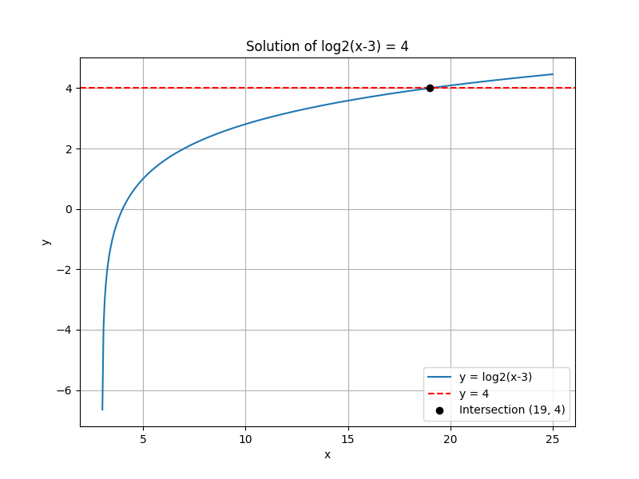
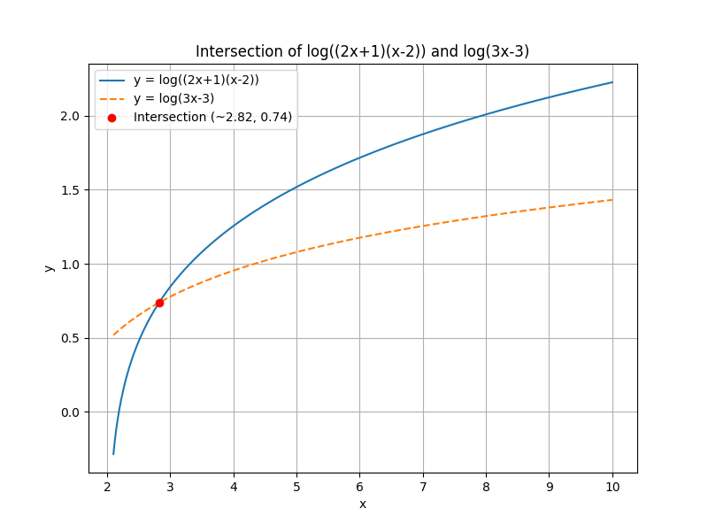

## Solving Logarithmic Equations and Applications

This lesson focuses on solving equations that involve logarithms and applying these methods to real-world scenarios. We will review the properties of logarithms, learn to solve equations step by step, and check for domain restrictions.

### Key Concepts

> Logarithms are the inverses of exponential functions. They help us determine the power to which a base must be raised to obtain a given number.

In solving logarithmic equations:

- The argument (input) of any logarithm must be positive.
- It is often useful to combine logarithms using the product, quotient, and power rules.
- Converting from logarithmic to exponential form can simplify the equation.

### Example 1: Single Logarithm Equation

Solve the equation

$$
\log_2(x - 3) = 4
$$

**Step 1: Convert to exponential form.**

Recall that $\log_b(a) = c$ is equivalent to

$$
x - 3 = b^c
$$

Here, $b = 2$ and $c = 4$, so

$$
x - 3 = 2^4
$$

**Step 2: Simplify and solve for $x$.**

$$
x - 3 = 16 \quad\Longrightarrow\quad x = 16 + 3 = 19
$$

**Step 3: Check the domain.**

Since the argument, $x - 3$, must be positive, we require:

$$
x - 3 > 0 \quad\Longrightarrow\quad x > 3
$$

Since $x = 19$ satisfies this condition, it is the valid solution.

### Example 2: Combining Logarithms

Solve the equation

$$
\log(2x + 1) + \log(x - 2) = \log(3x - 3)
$$

**Step 1: Combine the logarithms.**

Use the product rule: $\log(a) + \log(b) = \log(ab)$.

$$
\log((2x + 1)(x - 2)) = \log(3x - 3)
$$

**Step 2: Equate the arguments.**

Since the logarithm function is one-to-one, if

$$
\log(A) = \log(B) \quad\text{then}\quad A = B
$$

So,

$$
(2x + 1)(x - 2) = 3x - 3
$$

**Step 3: Expand and simplify the equation.**

First, expand the left side:

$$
(2x + 1)(x - 2) = 2x^2 - 4x + x - 2 = 2x^2 - 3x - 2
$$

Now set the equation equal to the right side:

$$
2x^2 - 3x - 2 = 3x - 3
$$

Bring all terms to one side:

$$
2x^2 - 3x - 2 - 3x + 3 = 0 \quad\Longrightarrow\quad 2x^2 - 6x + 1 = 0
$$

**Step 4: Solve the quadratic equation.**

Use the quadratic formula:

$$
x = \frac{-b \pm \sqrt{b^2 - 4ac}}{2a}
$$

For $2x^2 - 6x + 1 = 0$, $a=2$, $b=-6$, and $c=1$, so

$$
x = \frac{6 \pm \sqrt{(-6)^2 - 4(2)(1)}}{2(2)} = \frac{6 \pm \sqrt{36 - 8}}{4} = \frac{6 \pm \sqrt{28}}{4}
$$

Simplify $\sqrt{28}$:

$$
\sqrt{28} = 2\sqrt{7}
$$

Thus,

$$
x = \frac{6 \pm 2\sqrt{7}}{4} = \frac{3 \pm \sqrt{7}}{2}
$$

**Step 5: Check the domain restrictions.**

For the logarithms to be defined:

- $2x+1 > 0 \quad\Longrightarrow\quad x > -\frac{1}{2}$
- $x-2 > 0 \quad\Longrightarrow\quad x > 2$
- $3x-3 > 0 \quad\Longrightarrow\quad x > 1$

The most restrictive is $x > 2$. 

Now, evaluate the solutions:

- $x = \frac{3 + \sqrt{7}}{2} \approx \frac{3 + 2.65}{2} \approx 2.82$, which satisfies $x > 2$.
- $x = \frac{3 - \sqrt{7}}{2} \approx \frac{3 - 2.65}{2} \approx 0.18$, which does not satisfy $x > 2$.

Thus, the only valid solution is

$$
x = \frac{3 + \sqrt{7}}{2}
$$

### Example 3: Real-World Application Using pH

The pH of a solution is given by the formula:

$$
pH = -\log [H^+]
$$

where $[H^+]$ is the concentration of hydrogen ions. 

**Problem:** Given a solution with a pH of 3, find the hydrogen ion concentration $[H^+]$.

**Step 1: Write the equation.**

$$
-\log [H^+] = 3 \quad\Longrightarrow\quad \log [H^+] = -3
$$

**Step 2: Convert to exponential form.**

$$
[H^+] = 10^{-3}
$$

Thus, the hydrogen ion concentration is

$$
[H^+] = 0.001\;M
$$

This calculation is useful in chemistry for determining the acidity of solutions.

### Conclusion

This lesson demonstrated how to solve logarithmic equations by converting to exponential form, combining logarithms, and checking domain restrictions. These methods also have practical applications in fields like chemistry and engineering. Continue practicing these techniques to build confidence in solving logarithmic equations and applying them to real-world problems.