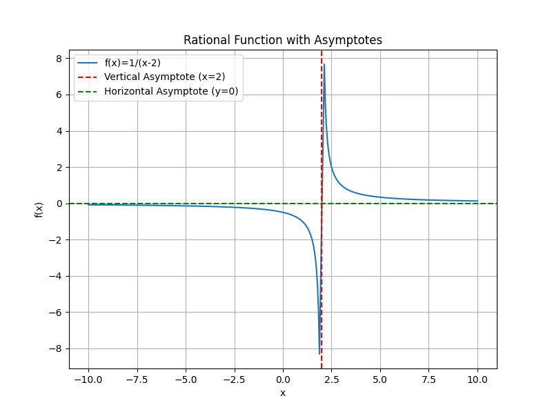
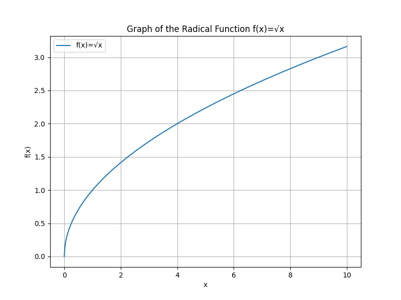

# Rational and Radical Functions

This unit introduces rational and radical functions, focusing on their definitions, key properties, and applications. In studying these functions, you will learn to determine domains, identify asymptotes in rational functions, and simplify and graph radical functions. These topics are essential for analyzing behaviors of functions in both theoretical and applied contexts.

Understanding rational functions involves examining expressions that are ratios of two polynomials. For example, a rational function can be written in the form $R(x)=\frac{P(x)}{Q(x)}$, where $P(x)$ and $Q(x)$ are polynomials. It is crucial to note that $Q(x)$ must not equal zero, since division by zero is undefined. This restriction leads to determining the domain of the function and identifying vertical asymptotes. Horizontal asymptotes describe the behavior of the function as $x$ tends to infinity or negative infinity. By factoring and simplifying these expressions, you gain intuition about limits and growth trends in many real-world contexts, such as population models, financial calculations, and engineering systems.

Radical functions involve expressions with roots. A general radical function can be expressed as $g(x)=\sqrt[n]{f(x)}$, where $n$ is the index of the root. When $n$ is even, the expression inside the radical (the radicand) must be non-negative, thus restricting the domain. In contrast, when $n$ is odd, the radicand can be any real number. Mastering radical functions means understanding the rules for simplifying radicals, rationalizing denominators, and determining valid input values. These skills are crucial when analyzing physical phenomena, such as measuring distances, computing areas, and solving problems in physics and engineering.

These concepts matter because they bridge abstract mathematics and practical modeling. A solid understanding of rational and radical functions allows you to analyze situations ranging from cost efficiencies in economics to stress distributions in engineering. Recognizing the balance between algebraic structure and real-world behavior helps you build a strong foundation for further studies and applications in science and technology.

> Rational functions reveal the elegant balance between finite divisions and infinite limits, while radical functions unearth the hidden roots of complexity, together crafting a story of balance and transformation in mathematics.