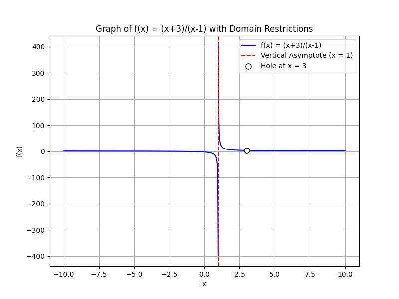

## Simplifying Rational Expressions and Identifying Domain Restrictions

In this lesson we will learn two important ideas:

1. How to simplify rational expressions by factoring and canceling common factors.

2. How to determine domain restrictions, which are the values of the variable that make the denominator zero.

Rational expressions are fractions where the numerator and the denominator are polynomials. Simplifying these expressions often makes problems easier to solve by reducing complexity and clarifying their behavior.

### Key Concepts

> A domain restriction is a value for the variable that is not allowed because it makes a denominator equal to zero. Avoiding these values ensures that the expression remains defined.

> Simplifying a rational expression involves factoring both the numerator and denominator and canceling any common factors. It is important to remember that, even after canceling, the values that originally caused the denominator to be zero remain excluded from the domain.

### Step-by-Step Process

1. **Factor the Numerator and Denominator:** Write each polynomial as a product of its factors. This step reveals potential common factors.

2. **Identify Domain Restrictions:** Set each factor in the denominator equal to zero and solve for the variable. These are the values that are not allowed because they make the denominator zero.

3. **Cancel Common Factors:** Cancel any factor that appears in both the numerator and denominator. Note that even when a factor cancels, the restriction on the variable remains.

4. **Write the Simplified Expression:** Express the final simplified form along with any domain restrictions.

Understanding these steps helps build intuition about why certain values must be excluded and how canceling factors simplifies the structure of an expression.

### Example 1

Simplify the expression: 

$$
\frac{6x^2 - 12x}{3x}
$$

**Step 1: Factor the Numerator**

The numerator has a common factor that can be factored out. Here, $6x^2 - 12x$ is factored as follows:

$$
6x^2 - 12x = 6x(x - 2)
$$

The denominator is already in a simple form:

$$
3x
$$

**Step 2: Identify Domain Restrictions**

The denominator must not be zero. Set $3x = 0$ and solve for $x$:

$$
3x = 0 \quad\Longrightarrow\quad x = 0
$$

Thus, $x \neq 0$.

**Step 3: Cancel Common Factors**

The factor $3x$ is present in both the numerator and the denominator. Note that $6x = 3x \cdot 2$, so you can cancel $3x$, keeping the domain restriction in mind:

$$
\frac{6x(x - 2)}{3x} = 2(x - 2) \quad \text{for } x \neq 0
$$

**Final Simplified Expression:**

$$
2(x - 2) \quad \text{with } x \neq 0
$$

This process shows that factoring not only simplifies the expression but also highlights the values where the expression is undefined.

### Example 2

Simplify the expression:

$$
\frac{x^2 - 9}{x^2 - 4x + 3}
$$

**Step 1: Factor Both Polynomials**

The numerator $x^2 - 9$ is a difference of squares and factors as:

$$
x^2 - 9 = (x - 3)(x + 3)
$$

For the denominator, factor $x^2 - 4x + 3$. Find two numbers that multiply to $3$ and add to $-4$. The numbers are $-1$ and $-3$, so:

$$
x^2 - 4x + 3 = (x - 1)(x - 3)
$$

**Step 2: Identify Domain Restrictions**

Set the denominator equal to zero:

$$
(x - 1)(x - 3) = 0 \quad\Longrightarrow\quad x = 1 \text{ or } x = 3
$$

This means $x \neq 1$ and $x \neq 3$.

**Step 3: Cancel Common Factors**

The factor $(x - 3)$ appears in both the numerator and the denominator. Cancel it with the understanding that $x \neq 3$:

$$
\frac{(x - 3)(x + 3)}{(x - 1)(x - 3)} = \frac{x + 3}{x - 1} \quad \text{for } x \neq 1 \text{ and } x \neq 3
$$

**Final Simplified Expression:**

$$
\frac{x + 3}{x - 1} \quad \text{with } x \neq 1 \text{ and } x \neq 3
$$

This example reinforces the idea that when a common factor is canceled, the original restrictions on the variable continue to apply. The process of factoring provides an insight into which values must be excluded for the expression to remain valid.

### Important Notes

- Always factor completely. Incomplete factoring might hide domain restrictions or lead to mistakes in cancellation.

- Even after canceling common factors, the original restrictions (where the denominator equals zero) must be maintained. This ensures the expression is defined only for permissible values of the variable.

- It is helpful to test the behavior of the function near the restricted values to understand the nature of discontinuities in the expression.

---

**Figure Description:** 2D line plot of $f(x)=\frac{x+3}{x-1}$ showing a vertical asymptote at $x=1$ and a removable discontinuity at $x=3$.

This lesson provides a detailed framework for simplifying rational expressions and identifying the values where the expression is undefined. By mastering these techniques, you improve your ability to solve complex algebraic problems and deepen your understanding of domain restrictions.