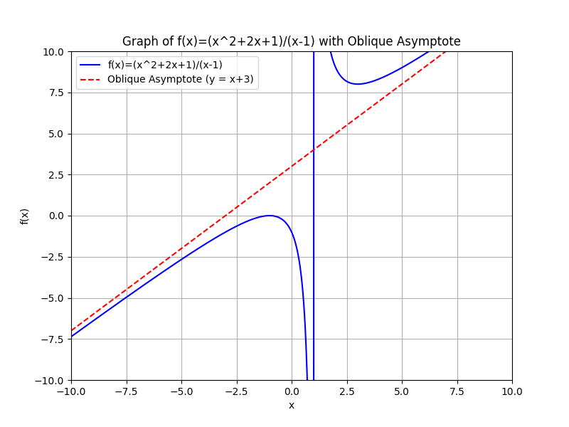
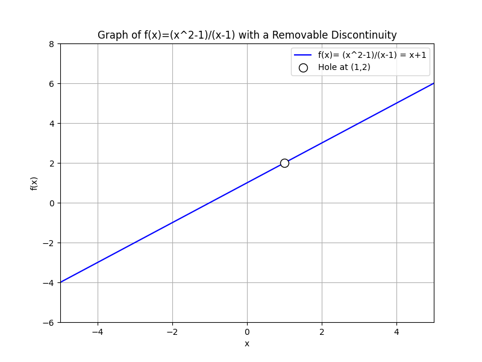
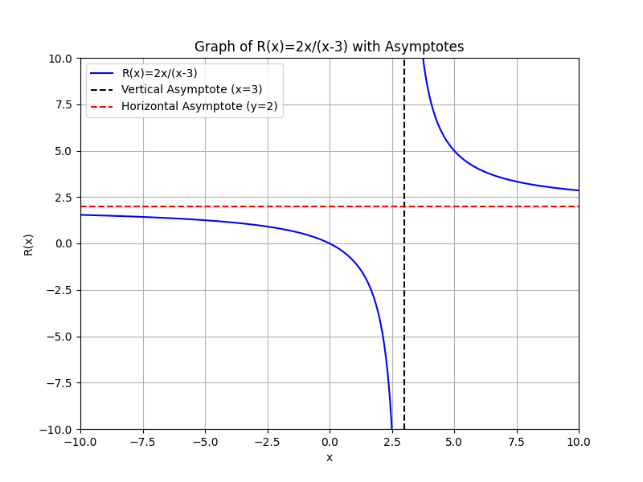

## Graphing Rational Functions and Understanding Asymptotes

Rational functions are ratios of two polynomials. They have a form

$$
R(x) = \frac{P(x)}{Q(x)}
$$

where both $P(x)$ and $Q(x)$ are polynomials and $Q(x)$ is not zero. In these functions, the denominator being zero creates restrictions in the domain and can lead to unique features on the graph such as holes and asymptotes.

> An asymptote is a line that the graph of a function approaches but never touches.

This concept helps you understand limits and the behavior of functions when the input values get very large or approach undefined points.

### 1. Understanding Domain Restrictions and Holes

Before graphing a rational function, identify the values of $x$ that make the denominator zero. These values are not part of the domain because division by zero is undefined. Sometimes, a factor in the numerator cancels with a factor in the denominator. When this occurs, the graph has a hole at that $x$ value rather than a vertical asymptote.

For example, consider the function

$$
f(x) = \frac{x^2 - 1}{x - 1}.
$$

Factor the numerator:

$$
x^2 - 1 = (x - 1)(x + 1).
$$

Then, the function becomes

$$
f(x) = \frac{(x - 1)(x + 1)}{x - 1}, \quad x \neq 1.
$$

Cancel the common factor $x-1$:

$$
f(x) = x + 1 \quad \text{with a hole at } x = 1.
$$

*Intuition:* When a factor cancels out, it signals that the discontinuity at that point is removable. The graph will show a small gap, often marked by an open circle, where the function is not actually defined.

### 2. Vertical Asymptotes

A vertical asymptote occurs where the function grows without bound. It occurs when the denominator of the rational function becomes zero (after canceling any common factors). The graph approaches this line but never crosses it.

**Example:**

Examine the function

$$
R(x) = \frac{2x}{x - 3}.
$$

- **Domain:** $x \neq 3$ because $x - 3 = 0$ when $x = 3$.
- **Vertical asymptote:** $x = 3$, since the function becomes unbounded as $x$ approaches 3.

To provide more detail on what happens near $x=3$:

- As $x \to 3^-$, the denominator $(x - 3)$ is slightly negative while the numerator remains near $6$, so $R(x)$ tends to $-\infty$.
- As $x \to 3^+$, the denominator is slightly positive, making $R(x)$ tend to $+\infty$.

*Intuition:* The vertical line $x=3$ acts as a boundary that the graph cannot cross, and its effect is seen as the function values spike to very large positive or negative numbers.

### 3. Horizontal Asymptotes

Horizontal asymptotes describe the behavior of a function as $x$ tends to $\pm\infty$. They provide information on the end behavior of the function and are determined by comparing the degrees of the numerator (degree $n$) and the denominator (degree $m$):

- If $n < m$, the horizontal asymptote is $y = 0$.
- If $n = m$, the horizontal asymptote is the ratio of the leading coefficients.
- If $n > m$, there is no horizontal asymptote (although an oblique or slant asymptote may be present).

**Example:** (Using the function from before)

$$
R(x) = \frac{2x}{x - 3}.
$$

Both the numerator and denominator are of degree 1. The ratio of the leading coefficients is:

$$
y = \frac{2}{1} = 2.
$$

Thus, the horizontal asymptote is $y = 2$.

*Intuition:* The horizontal asymptote tells us where the function settles as $x$ moves far away from the origin. It gives a sense of long-term behavior, indicating that the ratio of polynomials stabilizes at a constant value.

### 4. Oblique (Slant) Asymptotes

When the degree of the numerator is one more than that of the denominator ($n = m + 1$), the function may have an oblique asymptote. To find this asymptote, perform polynomial long division of the numerator by the denominator. The quotient (ignoring any remainder) represents the slant asymptote.

**Example:**

Consider the function

$$
R(x) = \frac{x^2 + 2x + 1}{x - 1}.
$$

- **Step 1:** Identify the domain by setting $x - 1 = 0$, which gives $x \neq 1$.

- **Step 2:** Perform polynomial long division of $x^2 + 2x + 1$ by $x - 1$:

   1. Divide the leading term: $x^2 / x = x$.
   2. Multiply: $x(x - 1) = x^2 - x$.
   3. Subtract: $(x^2 + 2x + 1) - (x^2 - x) = 3x + 1$.
   4. Divide again: $3x / x = 3$.
   5. Multiply: $3(x - 1) = 3x - 3$.
   6. Subtract: $(3x + 1) - (3x - 3) = 4$.
   7. The remainder is $4$.
   8. The quotient is $x + 3$.
   9. The function can be expressed as $R(x) = x + 3 + \frac{4}{x - 1}$.
   10. As $x \to \pm\infty$, the term $\frac{4}{x - 1}$ approaches $0$.
   11. Thus, the function approaches $x + 3$.
   12. The oblique asymptote is $y = x + 3$.

- **Step 3:** The quotient $x + 3$ is taken as the oblique asymptote.

Thus, as $x \to \pm\infty$, the graph of $R(x)$ approaches the line

$$
y = x + 3.
$$

*Intuition:* The slant asymptote indicates that while the function does not level off to a constant value, it grows approximately like a linear function. The remainder does not affect the end behavior of the function as $x$ becomes very large.

### 5. Graphing Steps Summary

When graphing a rational function, follow these systematic steps:

1. **Determine the Domain:** Solve $Q(x)=0$ to find and exclude those $x$ values.
2. **Find Holes:** Look for common factors in $P(x)$ and $Q(x)$; if they are present, there is a removable discontinuity or hole.
3. **Identify Vertical Asymptotes:** After canceling any common factors, set the remaining denominator factors equal to zero.
4. **Determine Horizontal or Oblique Asymptotes:** Compare the degrees of the numerator and denominator; use polynomial long division if necessary.
5. **Plot Key Points:** Identify intercepts and choose values on either side of asymptotes to understand the graph's behavior.
6. **Sketch the Graph:** Draw the asymptotes as dashed lines and graph the function, marking holes where they occur.

*Intuition:* Each step builds a comprehensive picture of the function’s behavior. By understanding restrictions, asymptotic behavior, and key intercepts, you can predict how the graph will look and how it behaves near critical points and as $x$ approaches infinity.

### 6. Real-World Applications

Graphing rational functions is useful in many disciplines:

- **Engineering:** Rational functions can model systems where outputs are proportionate to inputs within certain limits, such as feedback loops in control systems.
- **Economics:** They assist in representing cost functions or market rates, where the relationships between variables have boundaries.
- **Architecture:** Ratios of dimensions and load distributions in design can follow rational function behavior.

Understanding asymptotes helps predict long-term behavior and identify limits, even when precise values are difficult to compute.

*Intuition:* These real-world examples demonstrate that rational functions are not abstract; they are practical tools for solving problems in various fields, providing insight into trends and constraints.

### 7. Visualizing the Concept

Below is an example plot of the function

$$
R(x) = \frac{2x}{x - 3}
$$

with its vertical asymptote at $x=3$ and horizontal asymptote at $y=2$. This visual representation enhances understanding by showing how the graph behaves near the asymptotes and how it approaches these lines as $x$ moves further from the center.

Use similar steps for other rational functions to reveal their behavior and approach. Each graph will show how the function behaves near its discontinuities and how it stabilizes when $x$ is very large or very small.

*Final Intuition:* By breaking the process into clear steps and adding markers like asymptotes and holes, you transform a complicated rational expression into a visual story of how the function behaves, aiding memory and comprehension for the College Algebra CLEP exam.