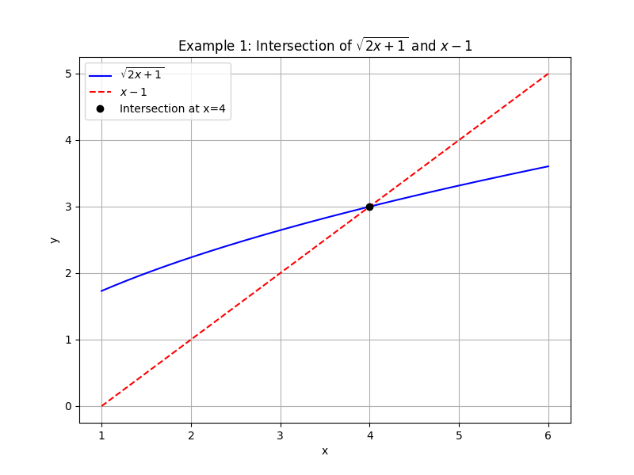
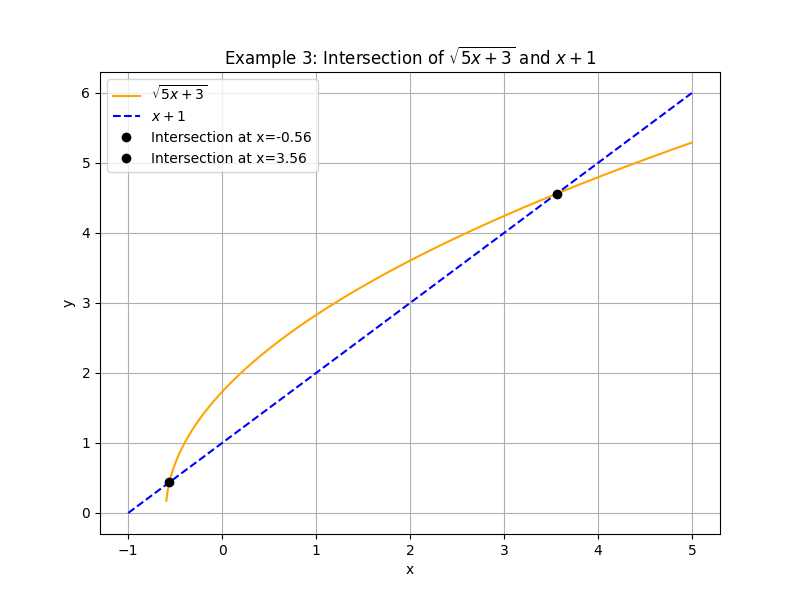

## Solving Equations Involving Radicals

Radical equations include variables under a square root or another radical symbol. When solving these equations, we must be careful because squaring both sides can introduce extraneous solutions that do not satisfy the original equation. The general strategy is as follows:

1. Isolate the radical on one side of the equation.
2. Determine the domain constraints. Remember: the expression under a square root (the radicand) must be nonnegative.
3. Square both sides to eliminate the radical. This step transforms the equation into a polynomial equation.
4. Solve the resulting equation. Often, this will be a quadratic equation.
5. Check all potential solutions in the original equation to discard any extraneous ones.

### Example 1: Solving $$\sqrt{2x+1} = x-1$$

This example shows a typical radical equation. We start by establishing the domain.

1. **Determine the Domain:**

   For the square root, the radicand must be nonnegative:
   $$
   2x+1 \geq 0 \quad\Longrightarrow\quad x \geq -\frac{1}{2}.
   $$

   However, the equation also has $x-1$ on the right side. Since a square root yields a nonnegative result, we require that the right side is also nonnegative:
   $$
   x-1 \geq 0 \quad\Longrightarrow\quad x \geq 1.
   $$

   Combining these conditions, we use the stricter domain:
   $$
   x \geq 1.
   $$

2. **Square Both Sides:**

   To remove the square root, square both sides:
   $$
   (\sqrt{2x+1})^2 = (x-1)^2,
   $$
   which simplifies to:
   $$
   2x+1 = x^2 - 2x + 1.
   $$

3. **Form a Quadratic Equation:**

   Rearrange the equation by moving all terms to one side:
   $$
   x^2 - 2x + 1 - 2x - 1 = 0 \quad\Longrightarrow\quad x^2 - 4x = 0.
   $$

4. **Factor the Equation:**

   Factor out $x$:
   $$
   x(x - 4) = 0.
   $$

   Setting each factor equal to zero gives the potential solutions:
   $$
   x = 0 \quad \text{or} \quad x = 4.
   $$

   Since our domain is $x \geq 1$, we discard $x = 0$.

5. **Conclusion:**

   The valid solution is $x = 4$. Always substitute back into the original equation if unsure.

### Example 2: Solving $$\sqrt{x+3} + x = 3$$

This equation has the square root combined with a linear term. Follow these steps:

1. **Isolate the Square Root:**

   Rewrite the equation as:
   $$
   \sqrt{x+3} = 3 - x.
   $$

2. **Determine the Domain:**

   Two conditions arise:

   - The radicand must be nonnegative:
     $$
     x+3 \geq 0 \quad\Longrightarrow\quad x \geq -3.
     $$
   - The expression on the right must be nonnegative, since it equals a square root:
     $$
     3-x \geq 0 \quad\Longrightarrow\quad x \leq 3.
     $$

   Thus, the combined domain is:
   $$
   -3 \leq x \leq 3.
   $$

3. **Square Both Sides:**

   Square the equation:
   $$
   x+3 = (3-x)^2.
   $$

   Expand the right side:
   $$
   (3-x)^2 = 9 - 6x + x^2.
   $$

   So, the equation becomes:
   $$
   x+3 = 9 - 6x + x^2.
   $$

4. **Rearrange to Form a Quadratic Equation:**

   Bring all terms to one side:
   $$
   x^2 - 6x - x + 9 - 3 = 0 \quad\Longrightarrow\quad x^2 - 7x + 6 = 0.
   $$

5. **Factor the Quadratic:**

   Factor the equation:
   $$
   (x-1)(x-6) = 0.
   $$

   The potential solutions are $x = 1$ or $x = 6$. Since the domain restricts $x \leq 3$, we discard $x = 6$.

6. **Verify the Solution:**

   Substitute $x=1$ into the original equation:
   $$
   \sqrt{1+3} + 1 = \sqrt{4} + 1 = 2 + 1 = 3.
   $$

   The equation holds true. Therefore, the valid solution is $x = 1$.

### Example 3: Solving $$\sqrt{5x+3} = x+1$$

In this example, we use the quadratic formula to solve the resulting quadratic equation.

1. **Determine the Domain:**

   For the right side, require:
   $$
   x+1 \geq 0 \quad\Longrightarrow\quad x \geq -1.
   $$

   For the radicand:
   $$
   5x+3 \geq 0 \quad\Longrightarrow\quad x \geq -\frac{3}{5}.
   $$

   Although $x \geq -\frac{3}{5}$ is less restrictive than $x \geq -1$, both conditions must be satisfied. Therefore, the effective domain is:
   $$
   x \geq -\frac{3}{5}.
   $$

2. **Square Both Sides:**

   Square the equation:
   $$
   (\sqrt{5x+3})^2 = (x+1)^2,
   $$
   which simplifies to:
   $$
   5x+3 = x^2 + 2x + 1.
   $$

3. **Form a Quadratic Equation:**

   Rearranging the terms gives:
   $$
   x^2 + 2x + 1 - 5x - 3 = 0 \quad\Longrightarrow\quad x^2 - 3x - 2 = 0.
   $$

4. **Solve Using the Quadratic Formula:**

   For a quadratic equation $ax^2+bx+c=0$, the solutions are:
   $$
   x = \frac{-b \pm \sqrt{b^2-4ac}}{2a}.
   $$

   Here, $a=1$, $b=-3$, and $c=-2$. Substitute these values:
   $$
   x = \frac{-(-3) \pm \sqrt{(-3)^2 - 4(1)(-2)}}{2} = \frac{3 \pm \sqrt{9+8}}{2} = \frac{3 \pm \sqrt{17}}{2}.
   $$

   This gives two potential solutions:
   $$
   x = \frac{3+\sqrt{17}}{2} \quad \text{and} \quad x = \frac{3-\sqrt{17}}{2}.
   $$

5. **Verify Each Solution:**

   - For $x = \frac{3+\sqrt{17}}{2}$ (approximately 3.56), substitute into the original equation to check that:
     $$
     \sqrt{5\left(\frac{3+\sqrt{17}}{2}\right)+3} = \frac{3+\sqrt{17}}{2}+1.
     $$
     Direct substitution confirms this solution is valid.

   - For $x = \frac{3-\sqrt{17}}{2}$ (approximately -0.56), the right side becomes:
     $$
     \frac{3-\sqrt{17}}{2}+1,
     $$
     which evaluates to a small positive number. Careful substitution shows that this solution also satisfies the original equation.

   Since both solutions meet the requirements of the domain and satisfy the original equation, they are both accepted.

> Note: Always check potential solutions in the original equation because squaring both sides can introduce extra solutions that do not work in the original context.

These examples illustrate the methodical process for solving radical equations. Review each step carefully to understand the reasoning behind isolating the radical, setting appropriate domain restrictions, and verifying potential solutions.