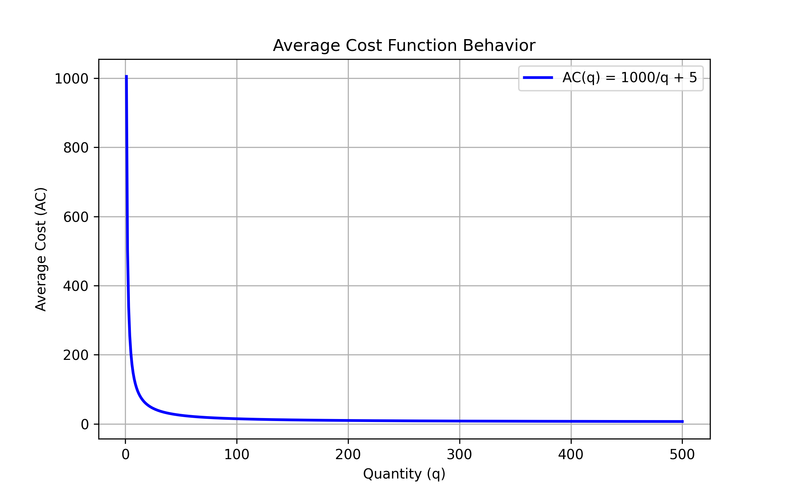
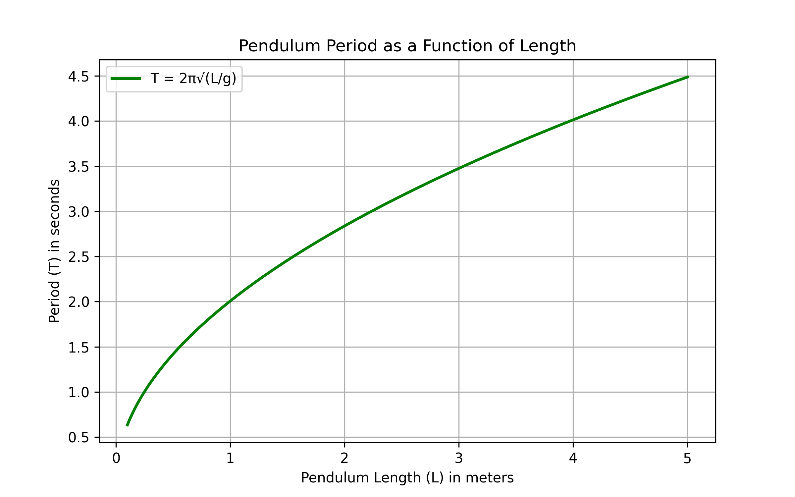

## Real-World Applications of Rational and Radical Functions

This lesson explains how rational and radical functions model real-world situations. These functions capture relationships where one quantity depends on another in ways that include rates, limits, and growth.

### Rational Functions in Real-Life Models

A rational function is a ratio of two polynomials. They are useful for describing processes that approach a limit or have natural restrictions. A common example is an average cost function in economics. Consider the function:

$$
AC(q) = \frac{1000 + 5q}{q}
$$

This function can be simplified to:

$$
AC(q) = \frac{1000}{q} + 5
$$

Here, $q$ represents the number of units produced and $AC(q)$ is the average cost. As production increases, the term $\frac{1000}{q}$ decreases, so the average cost approaches $5$. This reflects economies of scale where fixed costs are spread over more units.

#### Example: Analyzing an Average Cost Function

1. Begin with the function:

   $$
   AC(q) = \frac{1000}{q} + 5
   $$

2. Calculate the cost when $q = 50$:

   $$
   AC(50) = \frac{1000}{50} + 5 = 20 + 5 = 25
   $$

3. Calculate the cost when $q = 200$:

   $$
   AC(200) = \frac{1000}{200} + 5 = 5 + 5 = 10
   $$

4. Notice the behavior as $q$ increases. The term $\frac{1000}{q}$ approaches $0$ and $AC(q)$ gets closer to $5$.

This example shows how rational functions can model diminishing effects of fixed costs in production.

### Radical Functions in Real-Life Models

Radical functions involve roots and are used when relationships require a non-linear scaling. They appear in calculations involving areas, lengths, and even physical phenomena like wave motion.

A classic example is the period of a simple pendulum. The period $T$ is given by:

$$
T = 2\pi\sqrt{\frac{L}{g}}
$$

Here, $L$ is the length of the pendulum and $g$ is the acceleration due to gravity (approximately 9.8 m/s$^2$). This equation shows that the period grows with the square root of the length.

#### Example: Calculating the Period of a Pendulum

1. Write the pendulum period formula:

   $$
   T = 2\pi\sqrt{\frac{L}{g}}
   $$

2. Suppose the length of the pendulum is $L = 1$ meter. Substitute $g = 9.8$ m/s$^2$:

   $$
   T = 2\pi\sqrt{\frac{1}{9.8}}
   $$

3. Calculate the square root:

   $$
   \sqrt{\frac{1}{9.8}} \approx 0.32
   $$

4. Multiply by $2\pi$:

   $$
   T \approx 2\pi \times 0.32 \approx 2.01 \text{ seconds}
   $$

This example shows how radical functions are used to model time periods in physical systems.

### Integrating Concepts in Applications

In many industries, both rational and radical functions appear together. For instance, in engineering design, one might use a rational function to model cost efficiency while a radical function determines physical dimensions or tolerances. When combined, these models help optimize design and performance under real-world constraints.

> Key Insight: Rational functions are ideal for modeling relationships with fixed overhead or asymptotic behavior, while radical functions capture non-linear scaling. Both are essential in optimization and design problems.

By understanding and applying these functions, learners can tackle complex, real-world problems in economics, engineering, physics, and more.