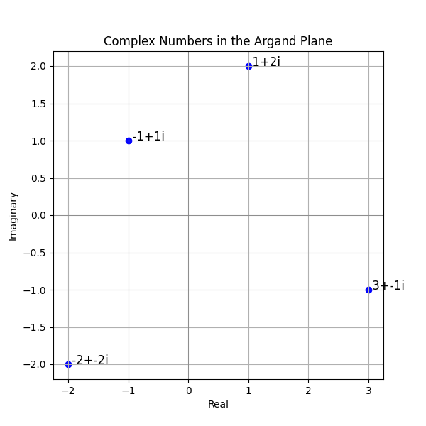
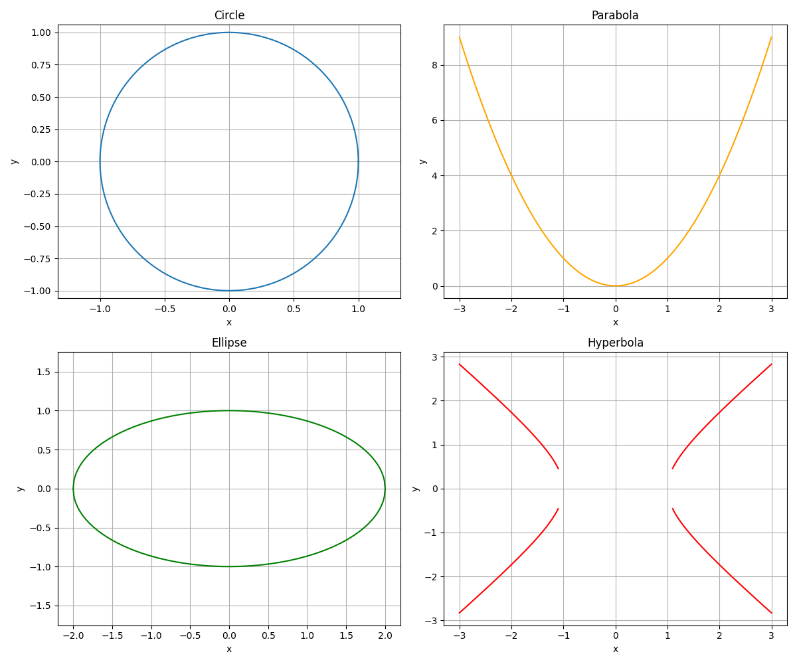

# Complex Numbers and Conic Sections

This unit introduces two major topics in advanced algebra: complex numbers and conic sections.

Complex numbers extend our number system, allowing us to solve equations that have no real solutions. A complex number is written in the form $a+bi$, where $a$ represents the real part and $b$ represents the imaginary part. Learning to work with these numbers helps in solving equations that cannot be solved using only real numbers, and this skill is crucial in areas such as engineering and physics.

Conic sections are curves formed by the intersection of a plane and a double-napped cone. They include circles, parabolas, ellipses, and hyperbolas. Each conic section is defined by a unique set of equations and properties. These curves are not just theoretical; they model real-world phenomena such as the orbits of planets, the paths followed by projectiles, and even design elements in architecture.

Understanding complex numbers involves mastering operations such as addition, subtraction, multiplication, and division of numbers in the form $a+bi$. Each of these operations follows specific rules that differ slightly from operations with real numbers, but with practice, they become intuitive tools for solving more complicated problems.

Similarly, studying conic sections deepens your understanding of quadratic equations and geometric transformations. For example, knowing the standard form of a circle, $$(x-h)^2+(y-k)^2=r^2,$$ helps you quickly identify its center and radius. Intuition about the shape and symmetry of each conic section aids in solving problems and understanding the underlying principles of algebra and geometry.

By studying these topics, you gain useful mathematical tools that appear in many real-world applications. Whether you are analyzing electronic circuits or exploring the paths of satellites, these concepts give you a framework for understanding and solving complex problems.

> Complex numbers open portals to unseen dimensions, where the imaginary breathes life into profound truths.