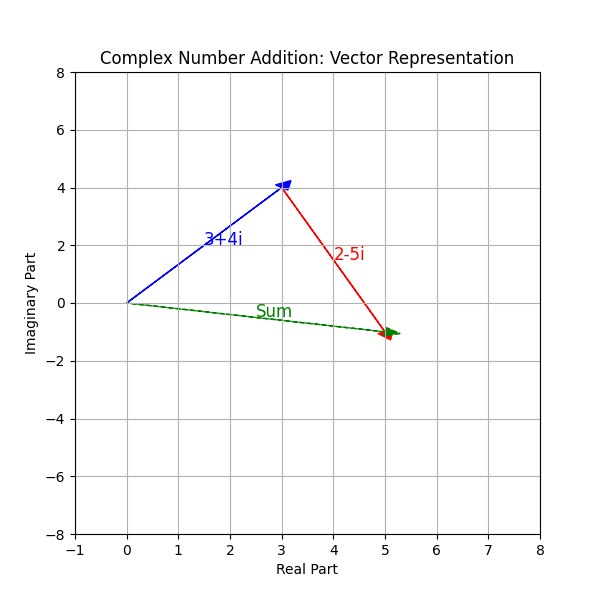
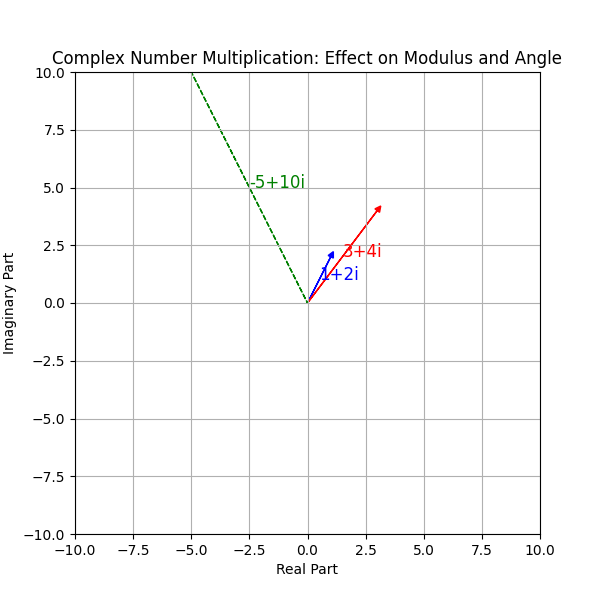

## Understanding Complex Numbers and Basic Operations

Complex numbers extend the idea of the one-dimensional number line to the two-dimensional complex plane. A complex number is written in the form

$$
a + bi
$$

where $a$ is the real part, $b$ is the imaginary part, and $i$ is the imaginary unit with the property

$$
i^2 = -1.
$$

This lesson explains how to perform basic operations with complex numbers including addition, subtraction, multiplication, and division. Each operation involves handling the real and imaginary parts independently and applying fundamental algebraic techniques.

### Addition and Subtraction

When adding or subtracting complex numbers, focus on combining the real parts and the imaginary parts separately. This separation ensures that each component is treated with its proper value.

For example, consider the addition:

$$
(3 + 4i) + (2 - 5i).
$$

Step 1: Group the real parts together and the imaginary parts together:

$$
(3 + 2) + (4i - 5i).
$$

Step 2: Compute the sums of each group:

$$
5 - i.
$$

Thus, the sum is $5 - i$.

For subtraction, consider the example:

$$
(6 + 3i) - (4 + 5i).
$$

Step 1: Group the real parts and the imaginary parts separately:

$$
(6 - 4) + (3i - 5i).
$$

Step 2: Compute each group:

$$
2 - 2i.
$$

So, the result of the subtraction is $2 - 2i$.

These operations illustrate that each component of a complex number is handled independently, preserving its structure in the two-dimensional plane.

### Multiplication

To multiply complex numbers, use the distributive property (often remembered by the FOIL method, where FOIL stands for First, Outer, Inner, Last) and apply the rule $i^2 = -1$.

Consider the product:

$$
(1 + 2i)(3 + 4i).
$$

Step 1: Multiply using FOIL:

$$
1\cdot3 + 1\cdot4i + 2i\cdot3 + 2i\cdot4i.
$$

This expands to:

$$
3 + 4i + 6i + 8i^2.
$$

Step 2: Combine like terms and replace $i^2$ with $-1$:

$$
3 + (4i + 6i) + 8(-1) = 3 + 10i - 8.
$$

Step 3: Simplify the real parts:

$$
-5 + 10i.
$$

Thus, the product is $-5 + 10i$.

This process shows that multiplication of complex numbers not only scales the numbers but also rotates them in the complex plane.

### Division

Dividing complex numbers involves eliminating the imaginary part from the denominator. This is done by multiplying both the numerator and the denominator by the complex conjugate of the denominator. The complex conjugate of a complex number $a + bi$ is $a - bi$, and when multiplied together, their product is a real number.

For example, evaluate the division:

$$
\frac{2 + 3i}{1 - 2i}.
$$

Step 1: Multiply the numerator and the denominator by the conjugate of the denominator:

$$
\frac{2 + 3i}{1 - 2i} \times \frac{1 + 2i}{1 + 2i}.
$$

Step 2: Multiply the numerator using the FOIL method:

$$
(2 + 3i)(1 + 2i) = 2\cdot1 + 2\cdot2i + 3i\cdot1 + 3i\cdot2i.
$$

This gives:

$$
2 + 4i + 3i + 6i^2.
$$

Replace $i^2$ with $-1$:

$$
2 + 7i - 6 = -4 + 7i.
$$

Step 3: Multiply the denominator using the difference of squares formula:

$$
(1 - 2i)(1 + 2i) = 1^2 - (2i)^2 = 1 - 4i^2.
$$

Substitute $i^2 = -1$:

$$
1 - 4(-1) = 1 + 4 = 5.
$$

Step 4: Express the result as separate real and imaginary parts:

$$
\frac{-4 + 7i}{5} = -\frac{4}{5} + \frac{7}{5}i.
$$

Thus, the division gives the result $-\frac{4}{5} + \frac{7}{5}i$.

This method illustrates how multiplying by the conjugate rationalizes the denominator, ensuring that the result is expressed in the standard form of a complex number.

### Real-World Applications

Complex numbers are widely used in various fields of science and engineering. For instance, in electrical engineering, complex numbers model alternating current (AC) circuits. The real part represents resistance and the imaginary part represents reactance, helping engineers analyze circuit behavior in terms of both magnitude and phase.

In mechanical and civil engineering, complex numbers help model vibrations and oscillations. By representing both amplitude and phase, they simplify the analysis of systems where directional components are essential.

Understanding these basic operations with complex numbers provides a foundation for more advanced topics such as complex functions, signal processing, and quantum mechanics. Developing a solid grasp of these operations also builds intuition for solving problems in two dimensions, bridging abstract concepts with practical applications.

Practice these operations to build a solid foundation for more advanced algebraic concepts.