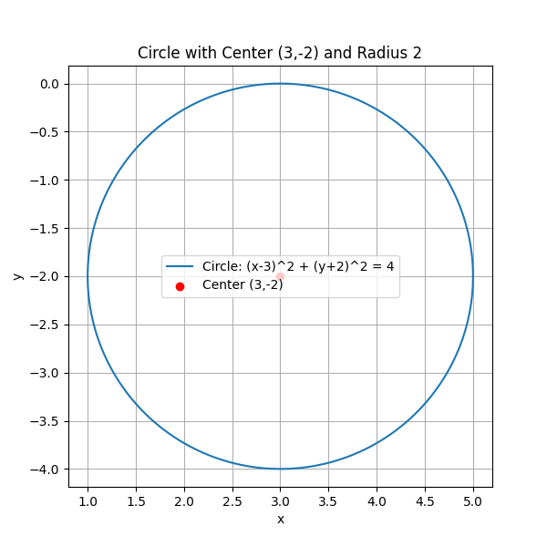
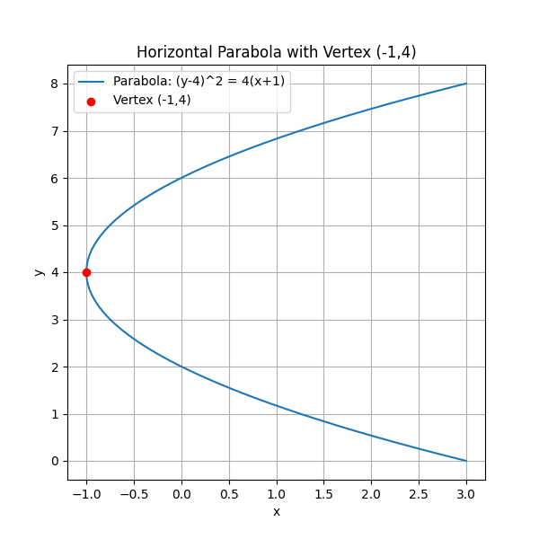

## Introduction to Conic Sections and Standard Equations

Conic sections are curves formed by the intersection of a plane with a double-napped cone. The four main types are the circle, parabola, ellipse, and hyperbola. Each type has a unique standard equation that describes its shape and key features. These equations are used in various real-world applications including engineering designs, physics, astronomy, and even sports analytics.

### Overview of Conic Sections

A conic section can be obtained by slicing a cone at different angles. The resulting curves include:

- **Circle:** All points equidistant from a fixed point (the center).
- **Parabola:** A set of points equidistant from a fixed point (the focus) and a line (the directrix).
- **Ellipse:** The set of points for which the sum of the distances to two fixed points (the foci) is constant.
- **Hyperbola:** The set of points where the difference of the distances to two fixed points is constant.

Each conic section has a standard form equation that makes it easier to identify its key characteristics.

### Standard Equations of Conic Sections

#### Circle

The standard equation of a circle centered at $(h,k)$ with radius $r$ is given by:

$$
(x-h)^2 + (y-k)^2 = r^2
$$

*Example:*

Consider the equation:

$$
x^2 + y^2 - 6x + 4y + 9 = 0
$$

**Step 1:** Group the $x$ and $y$ terms:

$$
(x^2 - 6x) + (y^2 + 4y) = -9
$$

**Step 2:** Complete the square for each group.

For $x^2 - 6x$, half of $-6$ is $-3$ and $(-3)^2 = 9$. 
For $y^2 + 4y$, half of $4$ is $2$ and $2^2 = 4$.

Add these values to both sides:

$$
(x^2 - 6x + 9) + (y^2 + 4y + 4) = -9 + 9 + 4
$$

**Step 3:** Write in standard form:

$$
(x-3)^2 + (y+2)^2 = 4
$$

This represents a circle with center $(3,-2)$ and radius $2$.

#### Parabola

A vertical parabola has a standard equation of the form:

$$
(y-k) = a(x-h)^2
$$

A horizontal parabola is expressed as:

$$
(x-h) = a(y-k)^2
$$

Where $(h,k)$ is the vertex and $a$ determines the width and direction of the opening.

*Example:*

Convert the equation:

$$
y^2 - 4x - 8y + 12 = 0
$$

**Step 1:** Rearrange the equation grouping the $y$ terms:

$$
y^2 - 8y = 4x - 12
$$

**Step 2:** Complete the square for the $y$ terms. Half of $-8$ is $-4$ and $(-4)^2 = 16$.

Add 16 to both sides:

$$
y^2 - 8y + 16 = 4x - 12 + 16
$$

**Step 3:** Rewrite the squared term and simplify the right side:

$$
(y-4)^2 = 4x + 4
$$

**Step 4:** Factor the right-hand side:

$$
(y-4)^2 = 4(x+1)
$$

This is the standard form of a horizontal parabola with vertex $(-1,4)$.

#### Ellipse

The standard equation of an ellipse centered at $(h,k)$ is:

$$
\frac{(x-h)^2}{a^2} + \frac{(y-k)^2}{b^2} = 1
$$

Here, $a$ and $b$ denote the distances from the center to the ellipse along the horizontal and vertical axes, respectively.

*Real-World Note:* Ellipses are used in planetary orbits and optics.

#### Hyperbola

The standard equation of a hyperbola depends on its orientation. For a hyperbola with a horizontal transverse axis:

$$
\frac{(x-h)^2}{a^2} - \frac{(y-k)^2}{b^2} = 1
$$

For a vertical transverse axis:

$$
\frac{(y-k)^2}{a^2} - \frac{(x-h)^2}{b^2} = 1
$$

*Real-World Note:* Hyperbolas appear in the paths of certain astronomical objects and in navigation systems.

### Summary

Identifying the type of conic section involves rewriting the equation into its standard form. Completing the square is an essential tool, especially when the equation is not already in standard form. Once in standard form, the key features such as the center, vertex, foci, and axes become clear.

Understanding these standard equations and methods of conversion helps in analyzing and graphing conic sections, skills that are valuable in many fields of study.