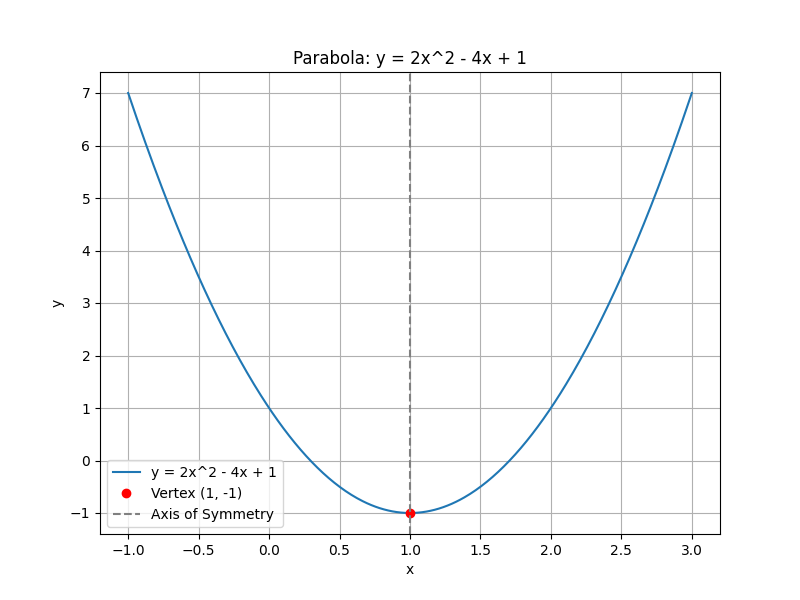
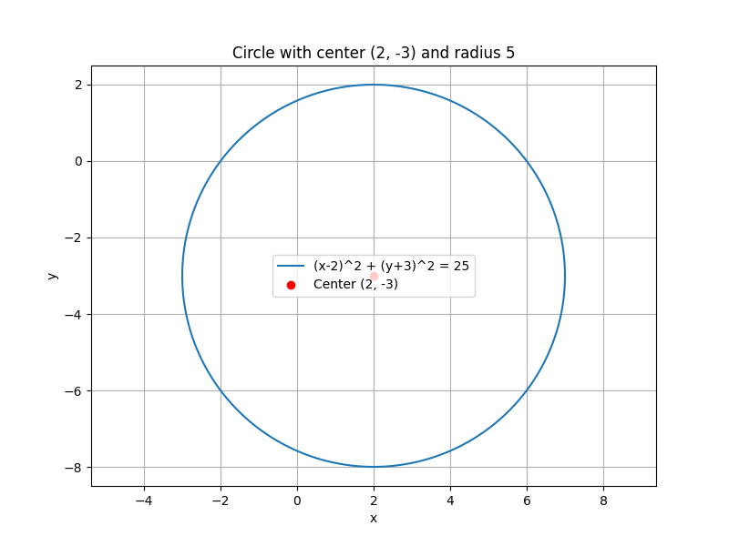
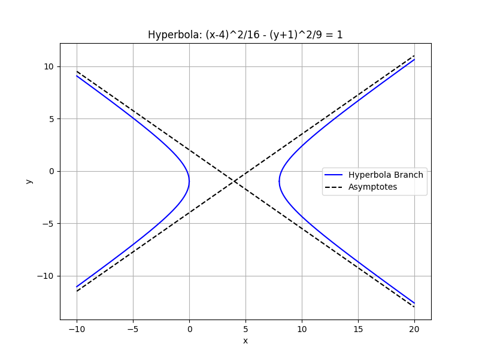

## Graphing Parabolas, Circles, Ellipses, and Hyperbolas

In this lesson, you will learn how to graph four important types of conic sections: parabolas, circles, ellipses, and hyperbolas. Understanding these conic sections is essential in scientific and engineering applications, such as satellite dish design and planetary orbits.

### Parabolas

A parabola is a U-shaped curve that can open upward, downward, leftward, or rightward. The standard equation for a parabola is given by:

- **Vertical Parabola:** $y = ax^2 + bx + c$
- **Horizontal Parabola:** $x = ay^2 + by + c$

These forms allow you to determine the direction of opening. A vertical parabola opens up or down, while a horizontal one opens left or right.

**Example:** Graph the parabola $y = 2x^2 - 4x + 1$.

1. **Identify the Vertex:**

   The vertex of a parabola is the turning point of the curve. For a vertical parabola, the $x$-coordinate of the vertex is found using

   $$
   x = \frac{-b}{2a}
   $$

   For $a = 2$ and $b = -4$, calculate

   $$
   x = \frac{-(-4)}{2 \times 2} = 1.
   $$

   Substitute $x = 1$ into the equation to find $y$:

   $$
   y = 2(1)^2 - 4(1) + 1 = -1.
   $$

   Thus, the vertex is $(1, -1)$.

2. **Find the Axis of Symmetry:**

   The axis of symmetry is a vertical line that passes through the vertex. For this parabola, it is $x = 1$.

3. **Calculate Additional Points:**

   Select $x$-values near the vertex, for example, $x = 0$ and $x = 2$, then compute the corresponding $y$-values:

   - For $x = 0$: 

     $$
     y = 2(0)^2 - 4(0) + 1 = 1.
     $$

   - For $x = 2$: 

     $$
     y = 2(2)^2 - 4(2) + 1 = 1.
     $$

4. **Plot and Draw the Parabola:**

   Plot the vertex $(1, -1)$ and the additional points $(0, 1)$ and $(2, 1)$. Sketch the smooth U-shaped curve, ensuring it is symmetric about the line $x = 1$.

### Circles

A circle is defined as the set of all points equidistant from a fixed center point. Its standard equation is:

$$
(x - h)^2 + (y - k)^2 = r^2,
$$

where $(h, k)$ is the center of the circle and $r$ is the radius.

**Example:** Graph the circle with center $(2, -3)$ and radius $5$.

1. **Use the Standard Form Equation:**

   Substitute $h = 2$, $k = -3$, and $r = 5$ into the equation:

   $$
   (x - 2)^2 + (y + 3)^2 = 25.
   $$

2. **Identify Key Points:**

   Start at the center $(2, -3)$. The radius of $5$ provides key points:
   - Rightmost point: $(2+5, -3)$.
   - Leftmost point: $(2-5, -3)$.
   - Top point: $(2, -3+5)$.
   - Bottom point: $(2, -3-5)$.

3. **Plot the Points and Draw the Circle:**

   Plot the center and the four key points. Draw the circle as a smooth curve connecting these points, ensuring it is evenly spaced around the center.

### Ellipses

An ellipse is a stretched circle with two focal points. Its standard equation differs depending on its orientation:

- **Horizontal Ellipse:** 

  $$
  \frac{(x - h)^2}{a^2} + \frac{(y - k)^2}{b^2} = 1.
  $$

- **Vertical Ellipse:** 

  $$
  \frac{(x - h)^2}{b^2} + \frac{(y - k)^2}{a^2} = 1.
  $$

Here, $(h, k)$ is the center, $a$ is the semi-major axis, and $b$ is the semi-minor axis.

**Example:** Graph the ellipse 

$$
\frac{(x - 1)^2}{9} + \frac{(y + 2)^2}{4} = 1.
$$

1. **Identify Center and Axes:**

   The center is $(1, -2)$. Since $a^2 = 9$, $a = 3$, and $b^2 = 4$, $b = 2$.

2. **Plot Focal Points and Axes:**

   For a horizontal ellipse, the major axis lies along the $x$-direction:
   - Major axis endpoints: $(1 \pm 3, -2)$.
   - Minor axis endpoints: $(1, -2 \pm 2)$.
   
   The distance from the center to each focus is 

   $$
   c = \sqrt{a^2 - b^2} = \sqrt{9 - 4} = \sqrt{5}.
   $$

3. **Draw the Ellipse:**

   Draw an oval shape that extends $3$ units horizontally and $2$ units vertically from the center, ensuring it is smooth and centered at $(1, -2)$.

### Hyperbolas

Hyperbolas consist of two separate curves (branches) that mirror each other across a center point. Their standard equations depend on their orientation:

- **Horizontal Hyperbola:** 

  $$
  \frac{(x - h)^2}{a^2} - \frac{(y - k)^2}{b^2} = 1.
  $$

- **Vertical Hyperbola:** 

  $$
  \frac{(y - k)^2}{a^2} - \frac{(x - h)^2}{b^2} = 1.
  $$

**Example:** Graph the hyperbola 

$$
\frac{(x - 4)^2}{16} - \frac{(y + 1)^2}{9} = 1.
$$

1. **Identify Center and Orientation:**

   The center of the hyperbola is $(4, -1)$. Since the $x$-term is positive, it is a horizontal hyperbola.

2. **Calculate the Asymptotes:**

   The asymptotes are lines that the hyperbola approaches but never touches. They are given by

   $$
   y = k \pm \frac{b}{a}(x - h).
   $$

   For this hyperbola, $a^2 = 16$ so $a = 4$, and $b^2 = 9$ so $b = 3$. Thus, the asymptotes are

   $$
   y = -1 \pm \frac{3}{4}(x - 4).
   $$

3. **Plot and Sketch the Hyperbola:**

   Identify the vertices, which lie $a$ units left and right from the center at $(4 \pm 4, -1)$, and sketch the branches opening along the horizontal direction. Draw the asymptotes as dashed lines to guide the shape of the hyperbola.

These detailed methods show how to analyze and graph conic sections accurately. Understanding the structure and key components, such as vertices, centers, and axes, is essential for constructing these curves. This knowledge is applicable in various fields like engineering and physics, where precise graphing of conic sections plays a crucial role.