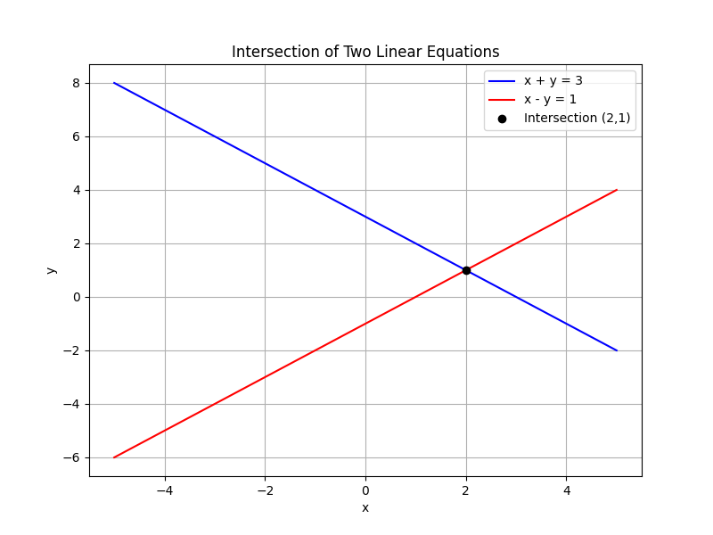

# Systems of Equations and Matrix Methods

This unit introduces systems of equations and the matrix methods used to solve them.

Systems of equations consist of two or more equations that share common variables. They represent situations where multiple conditions must be satisfied at the same time. Each equation acts as a condition or constraint, and the solution is the set of values that satisfy every constraint simultaneously.

There are several methods to solve systems:

- **Substitution Method:** Solve one of the equations for one variable, and substitute this expression into the other equation. This reduces the system to one equation with one variable, making it easier to solve.

- **Elimination Method:** Add or subtract the equations to cancel out one of the variables. This method simplifies the system, allowing you to solve for the remaining variable directly.

- **Matrix Methods:** Write the system in matrix form and use techniques such as Gaussian elimination, determinants, or inverse matrices. Matrix methods are especially useful when dealing with systems that have many equations and variables.

Understanding these techniques is important because systems of equations frequently model real-world problems. For example, in engineering, systems of equations are used to analyze forces acting on structures. In economics, they are applied to determine market equilibriums where supply equals demand. Learning these methods equips you with a toolkit to approach complex scenarios and solve problems systematically.

Matrix methods introduce key concepts such as:

- **Matrices:** Rectangular arrays of numbers that represent the coefficients of a system.

- **Determinants:** Values computed from a matrix that indicate whether a unique solution exists for the system. A non-zero determinant means the system has a unique solution.

- **Inverse Matrices:** The matrix that, when multiplied by the original matrix, yields the identity matrix. If the inverse exists, it offers a direct method to solve the system.

In this unit, you will learn how to convert real-world problems into systems of equations and apply these systematic approaches to find solutions quickly and accurately. The detailed methods covered here will help you work through both simple and complex systems, making the process efficient and logical.

> "The formulation of a problem is often more essential than its solution." – Albert Einstein