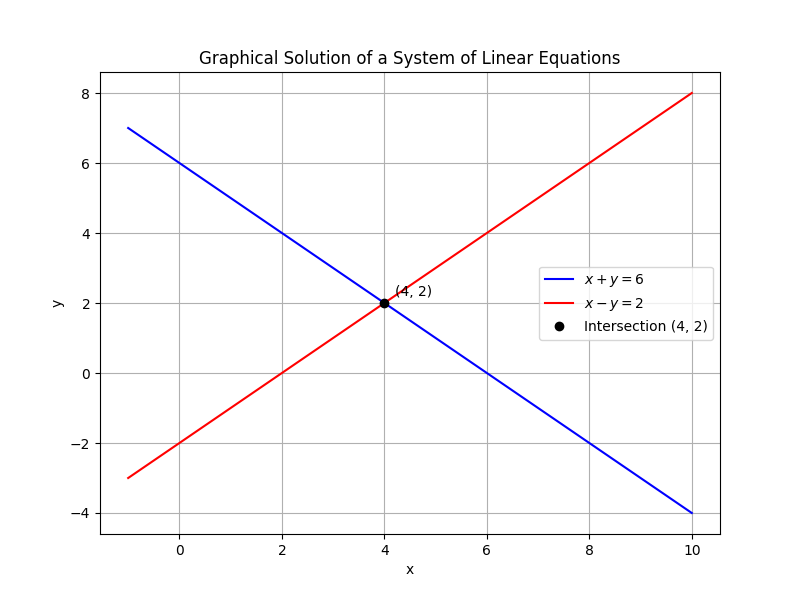

## Solving Systems of Linear Equations by Substitution

This lesson explains a method for solving systems of two linear equations by substitution. In this method, you first solve one equation for one variable and then substitute that expression into the other equation. This process reduces the system to a single equation with one unknown, which you can solve directly.

### Step 1: Write the Equations in Standard Form

Begin by writing both equations in standard form, aligning like terms. A common format is:

$$
a_1x + b_1y = c_1
$$

$$
a_2x + b_2y = c_2
$$

This form helps to clearly see the coefficients of each variable, making the next steps easier.

### Step 2: Isolate One Variable

Choose one of the equations and solve for one variable in terms of the other. For instance, if you have:

$$
x + y = 6,
$$

you can solve for $y$ by subtracting $x$ from both sides:

$$
y = 6 - x.
$$

This new expression shows $y$ in terms of $x$ and will be substituted into the other equation.

### Step 3: Substitute into the Other Equation

Take the expression for the isolated variable and substitute it into the other equation. For example, if the second equation is:

$$
x - y = 2,
$$

replace $y$ with $6 - x$ to obtain:

$$
x - (6 - x) = 2.
$$

It is important to carefully distribute any negative signs during substitution. The parentheses ensure that the subtraction applies correctly to the entire expression.

### Step 4: Solve for the Remaining Variable

Now simplify the substituted equation. Continuing the example:

$$
x - 6 + x = 2.
$$

Combine like terms:

$$
2x - 6 = 2.
$$

Next, isolate $x$ by adding $6$ to both sides:

$$
2x = 8.
$$

Divide both sides by $2$:

$$
x = 4.
$$

This step-by-step approach allows you to systematically reduce the complexity of the system.

### Step 5: Substitute Back to Find the Other Variable

Use the value of $x$ found in the previous step and substitute it back into the expression obtained in Step 2. In our example, with $x = 4$, substitute into $y = 6 - x$:

$$
y = 6 - 4 = 2.
$$

This gives the value of $y$.

### Step 6: Verify the Solution

It is essential to check that the proposed solution satisfies both original equations. Substitute $x = 4$ and $y = 2$ into each equation:

1. In the first equation:

   $$
   x + y = 4 + 2 = 6,
   $$
   which is correct.

2. In the second equation:

   $$
   x - y = 4 - 2 = 2.
   $$

Since both equations are true, the solution is verified.

### Summary Example

The complete process for the example is as follows:

1. Start with the system:

   $$
x + y = 6,
   $$

   $$
x - y = 2.
   $$

2. Isolate $y$ in the first equation:

   $$
y = 6 - x.
   $$

3. Substitute into the second equation:

   $$
x - (6 - x) = 2.
   $$

4. Simplify and solve for $x$:

   $$
   2x - 6 = 2,
   $$

   $$
   2x = 8,
   $$

   $$
x = 4.
   $$

5. Substitute $x = 4$ back to find $y$:

   $$
y = 6 - 4 = 2.
   $$

6. Verify the solution in both equations:

   $$
   4 + 2 = 6 
   $$

   $$
   4 - 2 = 2.
   $$

This method effectively reduces the system to one variable at a time, thereby simplifying the problem.

### Additional Example

Consider another system of equations:

$$
2x + 3y = 12,
$$

$$
x - y = 1.
$$

This example illustrates the substitution method with a slight variation in the approach.

**Step 1:** Isolate $x$ in the second equation by adding $y$ to both sides:

$$
x = 1 + y.
$$

**Step 2:** Substitute $x = 1 + y$ into the first equation:

$$
2(1 + y) + 3y = 12.
$$

Expand the parentheses:

$$
2 + 2y + 3y = 12.
$$

**Step 3:** Combine like terms:

$$
5y + 2 = 12.
$$

Subtract $2$ from both sides to isolate the term with $y$:

$$
5y = 10.
$$

Divide by $5$:

$$
y = 2.
$$

**Step 4:** Substitute $y = 2$ back into the expression $x = 1 + y$:

$$
x = 1 + 2 = 3.
$$

**Step 5:** Verify the solution by substituting into both original equations:

1. Check the first equation:

   $$
   2(3) + 3(2) = 6 + 6 = 12.
   $$

2. Check the second equation:

   $$
   3 - 2 = 1.
   $$

Both equations hold true, so the solution is $x = 3$ and $y = 2$.

### Conceptual Intuition

Substitution is like replacing a part of a puzzle to simplify the problem. By expressing one variable in terms of the other, you reduce the overall complexity. This method is particularly useful when one of the equations is easy to solve for one variable. Always ensure every arithmetic operation is mirrored on both sides to maintain the balance of the equation.

Keep in mind:

- Write equations in standard form for clarity.
- Carefully distribute negative signs when substituting.
- Verify your solution in both original equations to avoid errors.

This systematic approach makes solving systems of linear equations more manageable and builds the skills necessary for more complex algebra problems.